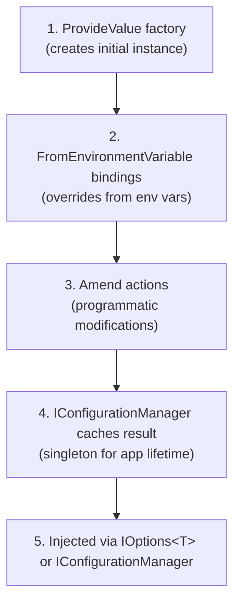

# Configuration System

Hardened's configuration system uses **interface-based models with compile-time implementations**. You define a configuration shape as an interface decorated with `[ConfigurationModel]`, and the source generator produces a concrete class, a configuration provider, and DI registration code. At runtime, configuration values can be supplied from environment variables, code-based providers, and amenders -- all without reflection.

---

## Core Concepts

### Configuration Model Interfaces

A configuration model starts as an interface with the `[ConfigurationModel]` attribute:

```csharp
using Hardened.Shared.Runtime.Attributes;

[ConfigurationModel]
public partial interface IDatabaseConfig {
    string ConnectionString { get; }
    int MaxPoolSize { get; }
    int TimeoutSeconds { get; }
}
```

!!! warning "Must Be Partial"
    The interface must be declared as `partial` so the source generator can extend it with the generated implementation class.

### What Gets Generated

For the `IDatabaseConfig` interface above, the source generator produces:

**1. A concrete implementation class:**

```csharp
// Generated: ConfigurationModels_DatabaseConfig.Properties.cs
public partial interface IDatabaseConfig {
    string ConnectionString { get; }
    int MaxPoolSize { get; }
    int TimeoutSeconds { get; }
}

public partial class DatabaseConfig : IDatabaseConfig {
    public string ConnectionString {
        get => _connectionString;
        set => _connectionString = value;
    }

    public int MaxPoolSize {
        get => _maxPoolSize;
        set => _maxPoolSize = value;
    }

    public int TimeoutSeconds {
        get => _timeoutSeconds;
        set => _timeoutSeconds = value;
    }
}
```

The implementation class name is derived from the interface name by removing the leading `I` prefix (e.g., `IDatabaseConfig` produces `DatabaseConfig`). Both the interface and the class are `partial`, so you can add additional members in your own code.

**2. A configuration provider** registered as `IConfigurationPackage`:

```csharp
// Generated inside {EntryPoint}.Configuration.cs
public class ConfigurationProvider : IConfigurationPackage {
    public IEnumerable<IConfigurationValueProvider> ConfigurationValueProviders(
        IHardenedEnvironment environment) {
        yield return new NewConfigurationValueProvider<IDatabaseConfig, DatabaseConfig>(null);
    }

    public IEnumerable<IConfigurationValueAmender> ConfigurationValueAmenders(
        IHardenedEnvironment environment) {
        yield break;
    }
}
```

**3. DI registrations** including `IOptions<T>` support:

```csharp
// Generated inside {EntryPoint}.DependencyInjection.cs
serviceCollection.AddSingleton<IOptions<IDatabaseConfig>>(serviceProvider =>
    Options.Create(serviceProvider
        .GetRequiredService<IConfigurationManager>()
        .GetConfiguration<IDatabaseConfig>()));
serviceCollection.AddSingleton<IConfigurationPackage, ConfigurationProvider>();
```

---

## Environment Variables: `[FromEnvironmentVariable]`

Bind configuration properties to environment variables:

```csharp
[ConfigurationModel]
public partial interface IDatabaseConfig {
    [FromEnvironmentVariable("DB_CONNECTION_STRING")]
    string ConnectionString { get; }

    [FromEnvironmentVariable("DB_MAX_POOL_SIZE")]
    int MaxPoolSize { get; }

    int TimeoutSeconds { get; }
}
```

The source generator creates an initialization method that reads from `IHardenedEnvironment.Value<T>()`:

```csharp
// Generated
private static void ConfigureDatabaseConfig(
    IHardenedEnvironment environment, DatabaseConfig model) {
    model.ConnectionString = environment.Value("DB_CONNECTION_STRING", model.ConnectionString)!;
    model.MaxPoolSize = environment.Value("DB_MAX_POOL_SIZE", model.MaxPoolSize)!;
}
```

This method is passed to the `NewConfigurationValueProvider` as the initialization callback:

```csharp
yield return new NewConfigurationValueProvider<IDatabaseConfig, DatabaseConfig>(
    ConfigureDatabaseConfig);
```

The `Value<T>()` method uses the second parameter as a default value, so environment variable binding gracefully falls back to whatever default was set by code-based configuration.

---

## Hiding Fields: `[HideConfigurationField]`

Use `[HideConfigurationField]` to exclude a property from the generated interface while keeping it on the implementation class. This is useful for internal configuration that should not be exposed to consumers:

```csharp
[ConfigurationModel]
public partial interface IAppSettings {
    string ApiBaseUrl { get; }

    [HideConfigurationField]
    string InternalSecret { get; }
}
```

The `InternalSecret` property will exist on the `AppSettings` implementation class but will not appear on the `IAppSettings` interface.

---

## IAppConfig: Programmatic Configuration

The `IAppConfig` interface provides a fluent API for supplying and amending configuration values in code:

```csharp
public interface IAppConfig {
    IAppConfig ProvideValue<TInterface, TImpl>(
        Func<IHardenedEnvironment, TImpl> valueProvider)
        where TImpl : class, TInterface;

    IAppConfig Amend<TImpl>(
        Action<TImpl> amendAction, string environment = "")
        where TImpl : class;

    IAppConfig Amend<TImpl>(
        Func<IHardenedEnvironment, TImpl, TImpl> amendFunc)
        where TImpl : class;
}
```

### Using IAppConfig in the Module

Define a `Configure` method on your `[HardenedModule]` class:

```csharp
[HardenedModule]
[AspNetCoreRuntime.Module]
public partial class Application {
    public void Configure(IAppConfig config) {
        config
            .ProvideValue<IDatabaseConfig, DatabaseConfig>(env => new DatabaseConfig {
                ConnectionString = "Server=localhost;Database=mydb",
                MaxPoolSize = 10,
                TimeoutSeconds = 30
            })
            .Amend<DatabaseConfig>(db => {
                db.MaxPoolSize = 20;  // Override the default
            });
    }
}
```

The source generator detects the `Configure` method and calls it during DI setup:

```csharp
// Generated
var fluentConfig = new AppConfig();
entryPoint.Configure(fluentConfig);
serviceCollection.AddSingleton<IConfigurationPackage>(fluentConfig);
```

### Environment-Aware Configure

The `Configure` method can also accept `IHardenedEnvironment`:

```csharp
public void Configure(IHardenedEnvironment environment, IAppConfig config) {
    config.ProvideValue<IDatabaseConfig, DatabaseConfig>(env => new DatabaseConfig {
        ConnectionString = "Server=localhost;Database=mydb",
        MaxPoolSize = 10,
        TimeoutSeconds = 30
    });

    if (environment.Matches("Production")) {
        config.Amend<DatabaseConfig>(db => {
            db.MaxPoolSize = 100;
            db.TimeoutSeconds = 60;
        });
    }
}
```

---

## ProvideValue vs. Amend

Understanding the difference between `ProvideValue` and `Amend` is key to using the configuration system effectively.

### ProvideValue

`ProvideValue<TInterface, TImpl>` supplies the **initial instance** of a configuration model:

```csharp
config.ProvideValue<IDatabaseConfig, DatabaseConfig>(env => new DatabaseConfig {
    ConnectionString = "Server=localhost",
    MaxPoolSize = 10,
    TimeoutSeconds = 30
});
```

- The factory function receives `IHardenedEnvironment` so it can vary by environment.
- Only one `ProvideValue` should be registered per configuration interface. If multiple are registered, the last one wins.
- If no `ProvideValue` is registered, the framework creates a default instance using the parameterless constructor.

### Amend

`Amend<TImpl>` modifies a configuration instance **after** it has been provided:

```csharp
// Simple amend -- modify in place
config.Amend<DatabaseConfig>(db => {
    db.TimeoutSeconds = 60;
});

// Environment-scoped amend -- only applies in matching environments
config.Amend<DatabaseConfig>(db => {
    db.MaxPoolSize = 200;
}, environment: "Production");

// Full amend with environment access
config.Amend<DatabaseConfig>((env, db) => {
    if (env.Matches("Production")) {
        db.MaxPoolSize = 200;
    }
    return db;
});
```

Amenders run in registration order after the initial value is provided and after `[FromEnvironmentVariable]` bindings are applied.

---

## Configuration Resolution Order

When the application starts, configuration values are resolved in this order:



1. **ProvideValue** -- Creates the initial configuration instance
2. **`[FromEnvironmentVariable]`** -- Overrides properties with environment variable values (falls back to existing values)
3. **Amend** -- Applies any registered amend actions/functions
4. **Cache** -- The `IConfigurationManager` caches the final configuration instance as a singleton
5. **Inject** -- Services receive the configuration via `IOptions<T>` or by resolving `IConfigurationManager` directly

---

## IConfigurationPackage

The `IConfigurationPackage` interface is the low-level extension point for the configuration system:

```csharp
public interface IConfigurationPackage {
    IEnumerable<IConfigurationValueProvider> ConfigurationValueProviders(
        IHardenedEnvironment env);

    IEnumerable<IConfigurationValueAmender> ConfigurationValueAmenders(
        IHardenedEnvironment env);
}
```

The source generator automatically produces `IConfigurationPackage` implementations, but you can also implement it manually for advanced scenarios like loading configuration from external sources.

### IConfigurationValueProvider

```csharp
public interface IConfigurationValueProvider {
    Type InterfaceType { get; }
    Type ImplementationType { get; }
    object ProvideValue(
        IHardenedEnvironment environment,
        Action<IHardenedEnvironment, object> amender);
}
```

### IConfigurationValueAmender

```csharp
public interface IConfigurationValueAmender {
    object ApplyConfiguration(
        IHardenedEnvironment environment,
        object configurationValue);
}
```

---

## Consuming Configuration

### Via Constructor Injection

The most common pattern is injecting `IOptions<T>`:

```csharp
public class OrderService {
    private readonly IDatabaseConfig _dbConfig;

    public OrderService(IOptions<IDatabaseConfig> dbConfig) {
        _dbConfig = dbConfig.Value;
    }

    public async Task<Order> GetOrder(string id) {
        using var conn = new SqlConnection(_dbConfig.ConnectionString);
        // ...
    }
}
```

### Via IConfigurationManager

For direct access without `IOptions<T>`:

```csharp
public class Startup : IStartupService {
    private readonly IConfigurationManager _configManager;

    public Startup(IConfigurationManager configManager) {
        _configManager = configManager;
    }

    public Task<bool> Startup(IServiceProvider provider) {
        var dbConfig = _configManager.GetConfiguration<IDatabaseConfig>();
        // Use dbConfig...
        return Task.FromResult(true);
    }
}
```

---

## Complete Example

Putting it all together:

```csharp
// 1. Define the configuration model
[ConfigurationModel]
public partial interface IDatabaseConfig {
    [FromEnvironmentVariable("DB_CONNECTION_STRING")]
    string ConnectionString { get; }

    [FromEnvironmentVariable("DB_MAX_POOL")]
    int MaxPoolSize { get; }

    int TimeoutSeconds { get; }
}

// 2. Provide defaults and overrides in the module
[HardenedModule]
[AspNetCoreRuntime.Module]
public partial class Application {
    public void Configure(IHardenedEnvironment environment, IAppConfig config) {
        config.ProvideValue<IDatabaseConfig, DatabaseConfig>(env =>
            new DatabaseConfig {
                ConnectionString = "Server=localhost;Database=dev",
                MaxPoolSize = 10,
                TimeoutSeconds = 30
            });

        config.Amend<DatabaseConfig>(db => {
            db.TimeoutSeconds = 60;
        }, environment: "Production");
    }
}

// 3. Consume in a service
[Expose(typeof(IDataAccess))]
public class DataAccess : IDataAccess {
    private readonly IDatabaseConfig _config;

    public DataAccess(IOptions<IDatabaseConfig> config) {
        _config = config.Value;
        // In Production with DB_CONNECTION_STRING set:
        //   ConnectionString = <from env var>
        //   MaxPoolSize = <from env var or 10>
        //   TimeoutSeconds = 60 (from Amend)
    }
}
```

---

## Next Steps

- [Module System](module-system.md) -- How `Configure()` integrates with the module lifecycle
- [Dependency Injection](dependency-injection.md) -- How configuration models are registered in the DI container
- [Source Generators](source-generators.md) -- How the configuration generator produces implementation classes
- [Environment reference](../framework/shared/environment.md) -- `IHardenedEnvironment` and environment variable access
- [Configuration reference](../framework/shared/configuration.md) -- Full configuration API reference
