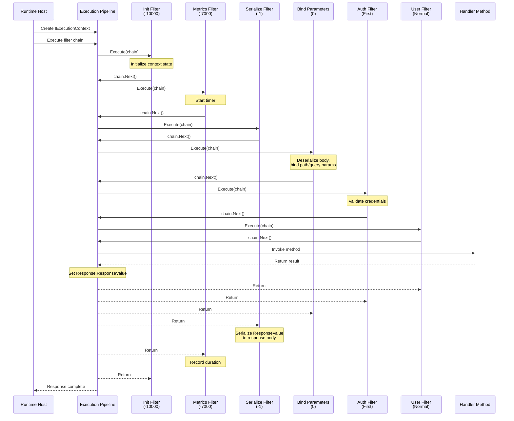

# Execution Pipeline

The execution pipeline is the central request-processing mechanism in Hardened. Every request -- whether it originates from an HTTP call, a Lambda invocation, an SQS message, or a DynamoDB stream event -- flows through the same chain of `IExecutionFilter` instances before reaching the handler method. This architecture provides a single, consistent place for cross-cutting concerns like logging, metrics, serialization, retry logic, and authorization.

---

## Core Interfaces

### IExecutionContext

The `IExecutionContext` is the object that carries all state for a single request through the pipeline:

```csharp
public interface IExecutionContext {
    /// <summary>Root service provider for the application.</summary>
    IServiceProvider RootServiceProvider { get; }

    /// <summary>Known services resolved for the current request.</summary>
    IKnownServices KnownServices { get; }

    /// <summary>Scoped service provider for the lifetime of this request.</summary>
    IServiceProvider RequestServices { get; }

    /// <summary>The inbound request data.</summary>
    IExecutionRequest Request { get; }

    /// <summary>The outbound response data.</summary>
    IExecutionResponse Response { get; }

    /// <summary>The handler instance (e.g., the controller class), null for middleware.</summary>
    object? HandlerInstance { get; set; }

    /// <summary>Metadata about the handler being invoked.</summary>
    IExecutionRequestHandlerInfo? HandlerInfo { get; set; }

    /// <summary>Default output function (used for template rendering).</summary>
    DefaultOutputFunc? DefaultOutput { get; set; }

    /// <summary>Metric logger scoped to this request.</summary>
    IMetricLogger RequestMetrics { get; }

    /// <summary>When the request started.</summary>
    MachineTimestamp StartTime { get; }

    /// <summary>Cancellation token (platform-dependent).</summary>
    CancellationToken CancellationToken { get; }

    /// <summary>Clone the context with optional overrides.</summary>
    IExecutionContext Clone(
        IExecutionRequest? request = null,
        IExecutionResponse? response = null,
        IServiceProvider? serviceProvider = null,
        IMetricLogger? metricLogger = null);
}
```

Key points:

- **`RequestServices`** is a scoped `IServiceProvider` -- services resolved from it are disposed when the request completes.
- **`RootServiceProvider`** is the application-level provider for singletons and long-lived services.
- **`HandlerInstance`** is set during the pipeline to the resolved handler class (e.g., your controller). It is `null` during early pipeline stages.
- **`Clone()`** creates a copy of the context, useful for the `Fork()` pattern described below.

### IExecutionRequest

Represents the inbound request data:

```csharp
public interface IExecutionRequest {
    string Method { get; }
    string Path { get; }
    string? ContentType { get; }
    string? Accept { get; }
    IExecutionRequestParameters? Parameters { get; set; }
    Stream Body { get; set; }
    IDictionary<string, StringValues> Headers { get; }
    IQueryStringCollection QueryString { get; }
    IPathTokenCollection PathTokens { get; set; }
    IReadOnlyList<string> Cookies { get; }
}
```

### IExecutionResponse

Represents the outbound response:

```csharp
public interface IExecutionResponse {
    string? ContentType { get; set; }
    object? ResponseValue { get; set; }
    string? TemplateName { get; set; }
    int? Status { get; set; }
    bool ShouldCompress { get; set; }
    Stream Body { get; set; }
    IDictionary<string, StringValues> Headers { get; }
    Exception? ExceptionValue { get; set; }
    bool ResponseStarted { get; }
    bool IsBinary { get; set; }
    ICookieSetCollection Cookies { get; }
    bool ShouldSerialize { get; set; }
}
```

The `ResponseValue` property holds the return value from your handler method. The serialization filter (running at `BeforeSerialize` order) converts this into the response `Body` based on `ContentType`.

### IExecutionFilter

The filter interface is intentionally minimal:

```csharp
public interface IExecutionFilter {
    Task Execute(IExecutionChain chain);
}
```

A filter receives the execution chain and must call `chain.Next()` to continue processing. It can perform work before and after calling `Next()`, and it can short-circuit the pipeline by not calling `Next()` at all.

### IExecutionChain

The chain manages progression through the filter list:

```csharp
public interface IExecutionChain {
    /// <summary>Execute the next filter in the chain.</summary>
    Task Next();

    /// <summary>The execution context for this chain.</summary>
    IExecutionContext Context { get; }

    /// <summary>Create a copy of the chain from this point forward.</summary>
    IExecutionChain Fork(IExecutionContext context);

    /// <summary>True if this is the last filter before the handler.</summary>
    bool IsLastFilter { get; }
}
```

---

## Filter Ordering

Filters execute in a defined order controlled by the `ExecutionFilterOrder` enum:

```csharp
public enum ExecutionFilterOrder {
    Init           = -10000,
    FullRequestMetrics = -7000,
    RetryFilter    = -5000,
    BeforeSerialize = -1,
    BindParameters = 0,
    First          = 1,
    Second         = 2,
    Third          = 3,
    Normal         = 100,
    Last           = int.MaxValue,
}
```

### Order Semantics

| Order | Purpose | Typical Use |
|---|---|---|
| `Init` (-10000) | Very first stage, before anything else | Context initialization, early logging |
| `FullRequestMetrics` (-7000) | Wraps the entire request for timing | Metrics collection, tracing spans |
| `RetryFilter` (-5000) | Retry logic wrapping downstream filters | Transient fault retry |
| `BeforeSerialize` (-1) | Runs just before parameter binding | Response serialization, content negotiation |
| `BindParameters` (0) | Deserialize and bind request parameters | Built-in parameter binding filter |
| `First` (1) | First user-defined filter slot | Authentication, authorization |
| `Second` (2) | Second user-defined filter slot | Validation |
| `Third` (3) | Third user-defined filter slot | Transformation |
| `Normal` (100) | Default for user filters | General cross-cutting concerns |
| `Last` (int.MaxValue) | Runs last, closest to the handler | Final modifications |

!!! info "Negative Orders Are Framework-Reserved"
    Filter orders below 0 are used by the framework for infrastructure concerns (metrics, serialization, parameter binding). User-defined filters should generally use `First` through `Last`.

---

## Execution Flow

The following diagram shows the complete execution flow for a typical web request:



---

## Writing Filters

### Basic Filter

```csharp
[SingletonService(As = typeof(IExecutionFilter))]
public class RequestLoggingFilter : IExecutionFilter {
    private readonly ILogger<RequestLoggingFilter> _logger;

    public RequestLoggingFilter(ILogger<RequestLoggingFilter> logger) {
        _logger = logger;
    }

    public async Task Execute(IExecutionChain chain) {
        var request = chain.Context.Request;
        _logger.LogInformation("Incoming: {Method} {Path}", request.Method, request.Path);

        await chain.Next();

        var response = chain.Context.Response;
        _logger.LogInformation("Outgoing: {Status}", response.Status);
    }
}
```

### Short-Circuiting

A filter can terminate the pipeline early by setting the response and not calling `chain.Next()`:

```csharp
[SingletonService(As = typeof(IExecutionFilter))]
public class ApiKeyFilter : IExecutionFilter {
    public Task Execute(IExecutionChain chain) {
        var apiKey = chain.Context.Request.Headers["X-Api-Key"].FirstOrDefault();

        if (string.IsNullOrEmpty(apiKey) || !IsValid(apiKey)) {
            chain.Context.Response.Status = 401;
            chain.Context.Response.ResponseValue = new { Error = "Invalid API key" };
            return Task.CompletedTask; // Do NOT call chain.Next()
        }

        return chain.Next();
    }

    private bool IsValid(string key) => key == "expected-key";
}
```

### Using IsLastFilter

The `IsLastFilter` property tells you whether the next call to `Next()` will invoke the actual handler method. This is useful for filters that need to behave differently when they are the final filter:

```csharp
public async Task Execute(IExecutionChain chain) {
    if (chain.IsLastFilter) {
        // This filter is the last one before the handler
        // Set up any handler-specific state
    }

    await chain.Next();
}
```

---

## The Fork Pattern

`IExecutionChain.Fork()` creates a copy of the remaining filter chain with a new (or cloned) execution context. This enables patterns like:

### Retry Logic

```csharp
public async Task Execute(IExecutionChain chain) {
    for (int attempt = 0; attempt < 3; attempt++) {
        try {
            if (attempt == 0) {
                await chain.Next();
            } else {
                // Fork creates a fresh chain from this point forward
                var fork = chain.Fork(chain.Context.Clone());
                await fork.Next();
            }
            return; // Success
        } catch (TransientException) {
            if (attempt == 2) throw;
            await Task.Delay(100 * (attempt + 1));
        }
    }
}
```

### Parallel Execution

```csharp
public async Task Execute(IExecutionChain chain) {
    var fork1 = chain.Fork(chain.Context.Clone(request: requestA));
    var fork2 = chain.Fork(chain.Context.Clone(request: requestB));

    await Task.WhenAll(fork1.Next(), fork2.Next());

    // Merge results from both forks
}
```

!!! warning "Fork Creates Independent Chains"
    Each forked chain has its own `IExecutionContext`. Changes to one context do not affect the other. The scoped `IServiceProvider` is also independent.

---

## How Handlers Connect to the Pipeline

When the source generator processes a `[Get("/path")]` or `[HardenedFunction("name")]` method, it generates an **invocation class** that becomes the final step in the filter chain. This class:

1. Resolves the handler class from `RequestServices`
2. Sets `Context.HandlerInstance` to the resolved instance
3. Reads bound parameters from `Context.Request.Parameters`
4. Invokes the handler method
5. Sets `Context.Response.ResponseValue` to the return value

```csharp
// Conceptual generated code (simplified)
public class HelloController_Hello_Invoker {
    public async Task Invoke(IExecutionContext context) {
        var handler = context.RequestServices
            .GetRequiredService<HelloController>();
        context.HandlerInstance = handler;

        var name = context.Request.PathTokens["name"];
        var result = handler.Hello(name);

        context.Response.ResponseValue = result;
    }
}
```

The parameter binding filter (at order `BindParameters = 0`) deserializes the request body and binds path tokens, query strings, and headers before the handler is invoked.

---

## Pipeline in Different Runtimes

The execution pipeline is the same across all runtimes. What differs is how the `IExecutionContext` is created:

| Runtime | Context Creation |
|---|---|
| **ASP.NET Core** | Maps `HttpContext` to `IExecutionRequest`/`IExecutionResponse` |
| **Lambda Function** | Maps the Lambda event payload to `IExecutionRequest` |
| **Lambda Web** | Maps API Gateway event to `IExecutionRequest` with HTTP semantics |
| **DDB Stream** | Maps each DynamoDB stream record to an `IExecutionRequest` |
| **SQS** | Maps each SQS message to an `IExecutionRequest` |

Once the context is created, the same filter chain executes regardless of the hosting runtime. This means your `IExecutionFilter` implementations work identically in local development (ASP.NET Core) and production (Lambda).

---

## Next Steps

- [Dependency Injection](dependency-injection.md) -- How filters and handlers are registered and resolved
- [Source Generators](source-generators.md) -- How invocation classes and route tables are generated
- [Filters reference](../framework/requests/filters.md) -- Practical guide to writing and registering filters
- [Parameter Binding reference](../framework/requests/parameter-binding.md) -- How `[FromBody]`, `[FromHeader]`, and path tokens work
