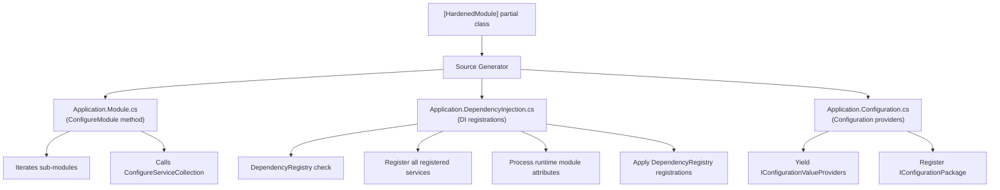
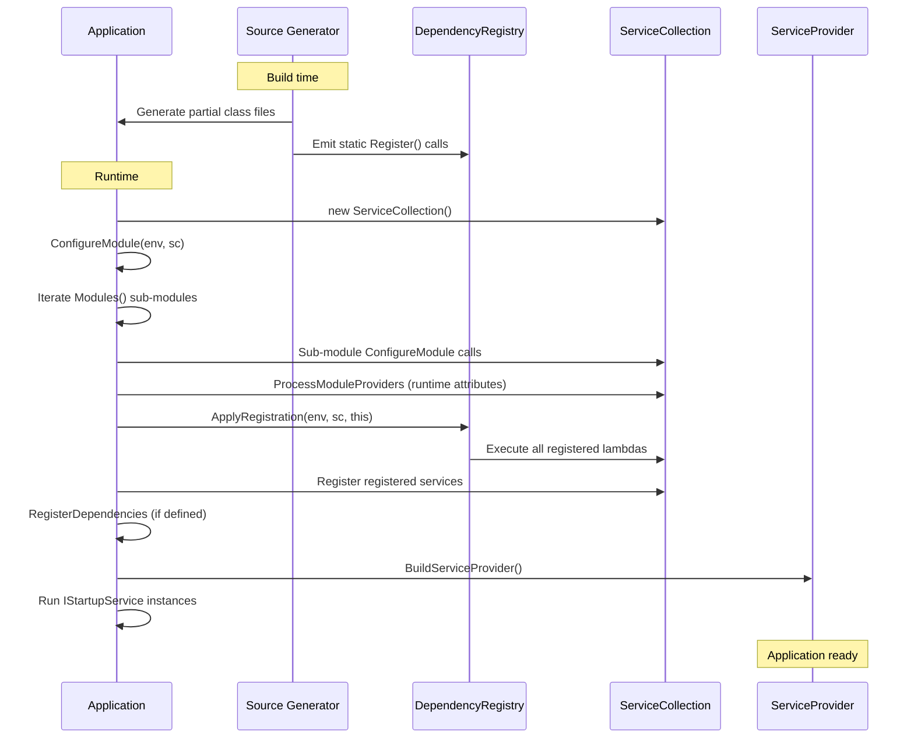

# Module System

The module system is the composition mechanism at the heart of Hardened. It defines how applications are assembled from reusable pieces, how dependency injection is wired, and how the source generators know what code to produce.

---

## Core Concepts

### The Entry Point: `[HardenedModule]`

Every Hardened application starts with a **partial class** decorated with `[HardenedModule]`:

```csharp
using Hardened.Shared.Runtime.Attributes;

[HardenedModule]
public partial class Application { }
```

The `partial` keyword is essential. The source generator extends this class at build time, generating:

- An implementation of `IApplicationModule.ConfigureModule()`
- A `CreateServiceProvider()` method that builds the DI container
- A `ConfigurationProvider` nested class for configuration management
- DI registration code for all attributed services in the project

!!! warning "Must Be Partial"
    If you forget the `partial` keyword, the source generator cannot extend the class and compilation will fail. The class must always be declared as `public partial class`.

### IApplicationModule

The `IApplicationModule` interface is the contract that every module fulfills:

```csharp
public interface IApplicationModule {
    void ConfigureModule(
        IHardenedEnvironment environment,
        IServiceCollection serviceCollection);
}
```

When the source generator processes your `[HardenedModule]` class, it generates a `ConfigureModule` method that:

1. Iterates over any sub-modules returned by a `Modules()` method (if defined)
2. Calls `ConfigureModule` on each sub-module
3. Calls a generated `ConfigureServiceCollection` method that registers all discovered services

### IApplicationRoot

The `IApplicationRoot` interface represents a fully bootstrapped application:

```csharp
public interface IApplicationRoot : IAsyncDisposable {
    IServiceProvider Provider { get; }
}
```

The source generator creates an implementation of this interface on your entry point class. It holds the root `IServiceProvider` built from all the module registrations and supports `IAsyncDisposable` for clean shutdown.

---

## Runtime Module Attributes

A `[HardenedModule]` class typically also carries one or more **runtime module attributes** that bring in the framework-level services for a specific hosting model:

=== "ASP.NET Core Web"

    ```csharp
    [HardenedModule]
    [AspNetCoreRuntime.Module]
    public partial class Application { }
    ```

=== "Lambda Function"

    ```csharp
    [HardenedModule]
    [FunctionLambda.Module]
    public partial class Application { }
    ```

=== "Lambda Web (API Gateway)"

    ```csharp
    [HardenedModule]
    [WebLambda.Module]
    public partial class Application { }
    ```

=== "SQS Processing"

    ```csharp
    [HardenedModule]
    [SqsLambda.Module]
    public partial class Application { }
    ```

=== "DDB Stream Processing"

    ```csharp
    [HardenedModule]
    [DdbStreamLambda.Module]
    public partial class Application { }
    ```

Each runtime module attribute implements `IApplicationModuleProvider`, which returns a set of `IApplicationModule` instances. The generated code calls `ProcessModuleProviders` during `ConfigureModule`, which discovers and applies these runtime-specific modules.

---

## How Module Generation Works

When the source generator encounters a `[HardenedModule]` class, it produces several partial class files. Here is the conceptual flow:



### Generated: Application.Module.cs

This file provides the `ConfigureModule` implementation:

```csharp
// Generated code (simplified)
public partial class Application : IApplicationModule {
    public void ConfigureModule(
        IHardenedEnvironment environment,
        IServiceCollection serviceCollection) {
        // If the user defined a Modules() method, iterate it:
        foreach (var module in Modules()) {
            module.ConfigureModule(environment, serviceCollection);
        }

        ConfigureServiceCollection(environment, serviceCollection);
    }
}
```

### Generated: Application.DependencyInjection.cs

This file provides the DI wiring:

```csharp
// Generated code (simplified)
public partial class Application : IApplicationModule {
    // Nested attribute class for runtime module discovery
    public class ModuleAttribute : Attribute, IApplicationModuleProvider {
        public IEnumerable<IApplicationModule> ProvideModules() {
            var appInstance = new Application();
            yield return appInstance;
        }
    }

    public void ConfigureModule(
        IHardenedEnvironment environment,
        IServiceCollection serviceCollection) {
        if (DependencyRegistry<Application>.ShouldRegisterModule(serviceCollection)) {
            // Register framework dependencies
            StandardDependencies.Register(environment, serviceCollection);

            // Process runtime module attributes ([AspNetCoreRuntime.Module], etc.)
            StandardDependencies.ProcessModuleProviders(
                environment, serviceCollection,
                new AspNetCoreRuntime.Module());

            // Apply compile-time DependencyRegistry registrations
            DependencyRegistry<Application>.ApplyRegistration(
                environment, serviceCollection, this);

            // Register discovered registered services
            serviceCollection.AddTransient(typeof(IMyService), typeof(MyService));
            serviceCollection.AddSingleton(typeof(ICacheService), typeof(CacheService));

            // Call user-defined RegisterDependencies if present
            RegisterDependencies(serviceCollection);
        }
    }

    public ServiceProvider CreateServiceProvider(
        IHardenedEnvironment environment,
        Action<IHardenedEnvironment, IServiceCollection>? overrideDependencies,
        Action<ILoggingBuilder>? loggingBuilderAction,
        Action<IHardenedEnvironment, IServiceCollection>? initDependencies = null) {
        var serviceCollection = new ServiceCollection();
        serviceCollection.AddLogging(loggingBuilderAction ?? (b => {}));
        serviceCollection.AddSingleton(environment);

        initDependencies?.Invoke(environment, serviceCollection);
        ConfigureModule(environment, serviceCollection);
        overrideDependencies?.Invoke(environment, serviceCollection);

        return serviceCollection.BuildServiceProvider();
    }
}
```

---

## DependencyRegistry&lt;T&gt;

The `DependencyRegistry<T>` class is the compile-time registration backbone. It is a static class that holds a list of registration functions keyed by the entry point type `T`.

```csharp
public class DependencyRegistry<T> where T : class {
    public static int Register(DependencyRegistrationFunc func);

    public static void ApplyRegistration(
        IHardenedEnvironment environment,
        IServiceCollection serviceCollection,
        T entryPoint);

    public static bool ShouldRegisterModule(IServiceCollection serviceCollection);

    public delegate void DependencyRegistrationFunc(
        IHardenedEnvironment environment,
        IServiceCollection serviceCollection,
        T entryPoint);
}
```

### How It Works

1. **At compile time**, source generators emit static field initializers that call `DependencyRegistry<Application>.Register(...)` with a lambda containing DI registrations.
2. **At runtime startup**, when `ConfigureModule` runs, it calls `DependencyRegistry<Application>.ApplyRegistration(...)`, which invokes all registered lambdas.
3. **Deduplication** via `ShouldRegisterModule` -- uses `WeakReference<IServiceCollection>` to ensure the same service collection is not configured twice (important when modules are composed).

```csharp
// Example generated static initializer
public partial class Application {
    private static int _configDi =
        DependencyRegistry<Application>.Register(ConfigurationDI);

    private static void ConfigurationDI(
        IHardenedEnvironment environment,
        IServiceCollection serviceCollection,
        Application entryPoint) {
        serviceCollection.AddSingleton<IConfigurationPackage, ConfigurationProvider>();
    }
}
```

This pattern allows library modules to register their own services with the consuming application's `DependencyRegistry`, enabling true composition without reflection.

---

## Composing Modules

### The Modules() Method

You can define a `Modules()` method on your entry point class to compose sub-modules:

```csharp
[HardenedModule]
[AspNetCoreRuntime.Module]
public partial class Application {
    public IEnumerable<IApplicationModule> Modules() {
        yield return new SharedServicesModule();
        yield return new DataAccessModule();
    }
}
```

The source generator detects this method and generates a `foreach` loop in `ConfigureModule` that calls `ConfigureModule` on each yielded module before registering the application's own services.

You can also accept the environment to conditionally compose modules:

```csharp
public IEnumerable<IApplicationModule> Modules(IHardenedEnvironment environment) {
    yield return new CoreModule();

    if (environment.Matches("Production")) {
        yield return new ProductionMonitoringModule();
    }
}
```

### The RegisterDependencies() Method

For manual DI registrations that cannot be expressed through attributes, define a `RegisterDependencies` method:

```csharp
[HardenedModule]
[AspNetCoreRuntime.Module]
public partial class Application {
    private void RegisterDependencies(IServiceCollection services) {
        services.AddHttpClient();
        services.AddMemoryCache();
    }
}
```

The source generator detects this method and calls it at the end of the generated `ConfigureModule`. The method can accept `IServiceCollection` alone, or both `IHardenedEnvironment` and `IServiceCollection`:

```csharp
private void RegisterDependencies(
    IHardenedEnvironment environment,
    IServiceCollection services) {
    if (environment.Matches("Development")) {
        services.AddSingleton<IEmailSender, FakeEmailSender>();
    }
}
```

### Library Modules

Library projects use `[HardenedModule]` with the `Hardened.Library.SourceGenerator` NuGet package instead of the core `Hardened.SourceGenerator`. This generates the same DI and configuration wiring, but the module is designed to be consumed by an application module rather than serving as an entry point itself.

```csharp
// In a shared library project
[HardenedModule]
public partial class SharedServicesModule { }
```

Library modules participate in the same `DependencyRegistry<T>` pattern, so their registered services are automatically registered when the library is referenced.

---

## IHardenedEnvironment

The `IHardenedEnvironment` interface is threaded through all module configuration, enabling environment-aware behavior:

```csharp
public interface IHardenedEnvironment {
    string Name { get; }
    IReadOnlyList<string> Arguments { get; }
    T? Value<T>(string name, T? defaultValue = default);
    T? CustomData<T>(string name, T? defaultValue = default);
}
```

Extension methods provide convenience checks:

```csharp
// Check if the environment matches one or more names
if (environment.Matches("Production", "Staging")) { ... }

// Check a specific variable value
if (environment.MatchesVariable("Region", "us-east-1")) { ... }
```

---

## IStartupService

For initialization logic that needs to run after the DI container is built but before the application begins handling requests, implement `IStartupService`:

```csharp
public interface IStartupService {
    Task<bool> Startup(IServiceProvider rootProvider);
}
```

Register it as any other service using `[SingletonService]`. The framework calls all registered `IStartupService` implementations during application bootstrap, passing the root service provider.

```csharp
[SingletonService(As = typeof(IStartupService))]
public class DatabaseMigrationService : IStartupService {
    public async Task<bool> Startup(IServiceProvider rootProvider) {
        var db = rootProvider.GetRequiredService<IDatabase>();
        await db.MigrateAsync();
        return true; // return false to signal failure
    }
}
```

---

## Module Lifecycle Summary



---

## Next Steps

- [Dependency Injection](dependency-injection.md) -- Deep dive into `[TransientService]`, `[SingletonService]`, `[ScopedService]`
- [Configuration System](configuration-system.md) -- How `Configure()` and `IAppConfig` integrate with modules
- [Source Generators](source-generators.md) -- Details on what each generator produces
