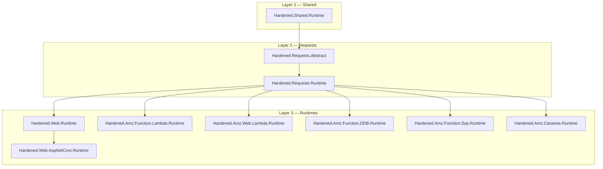
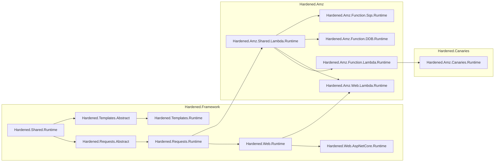
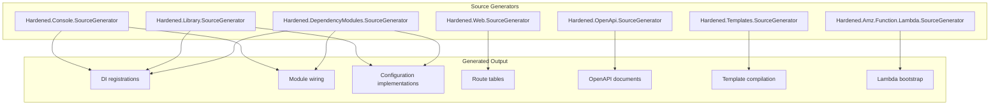
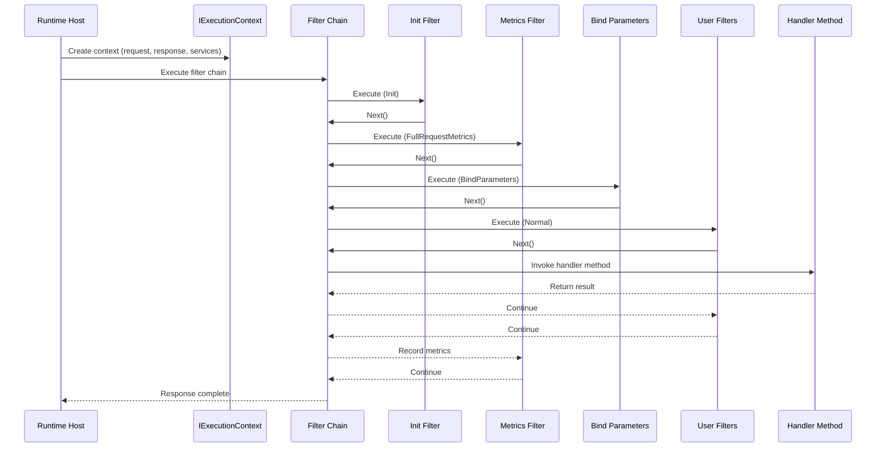

# Architecture Overview

Hardened is a **compile-time, source-generated .NET framework** that eliminates runtime reflection by shifting dependency injection, routing, configuration, and module wiring into the build step. The result is fast startup, small binaries, and strong type safety -- properties that matter most in serverless environments like AWS Lambda, but that benefit any .NET application.

---

## Design Philosophy

Traditional .NET frameworks rely heavily on runtime reflection to discover controllers, scan assemblies for services, and bind configuration. This works well for long-running servers where startup cost is amortized, but it creates measurable overhead in cold-start scenarios.

Hardened takes a different approach:

| Concern | Traditional Approach | Hardened Approach |
|---|---|---|
| DI Registration | Assembly scanning at startup | Source generator emits `AddTransient`/`AddSingleton`/`AddScoped` calls at build time |
| Route Discovery | Reflection over controller types | Source generator builds a route table as compiled code |
| Configuration Binding | Runtime property mapping | Source generator creates concrete implementation classes |
| Module Composition | Convention-based discovery | Explicit `[HardenedModule]` with generated `ConfigureModule` |

!!! info "Compile-time vs. Runtime"
    Every attribute you place in Hardened code (`[Expose]`, `[Get]`, `[ConfigurationModel]`, etc.) is consumed by a source generator at build time. By the time your application runs, all wiring is expressed as plain C# method calls -- no `Activator.CreateInstance`, no `Type.GetCustomAttributes`, no assembly scanning.

---

## Layer Architecture

Hardened is organized as a stack of layers. Each higher layer builds on the abstractions provided by the layer below it.

### Layer 1: Shared

**Packages:** `Hardened.Shared.Runtime`

The foundation layer provides:

- **Dependency Injection attributes** -- `[Expose]`, `[Singleton]`, `[Scoped]`, `[ForEnvironment]`
- **Configuration system** -- `[ConfigurationModel]`, `[FromEnvironmentVariable]`, `IAppConfig`
- **Module system** -- `[HardenedModule]`, `IApplicationModule`, `IApplicationRoot`
- **Environment abstraction** -- `IHardenedEnvironment` for environment-aware behavior
- **Application lifecycle** -- `IStartupService` for initialization logic
- **DependencyRegistry&lt;T&gt;** -- the static registration mechanism used by all source generators

This layer has no dependency on HTTP, Lambda, or any specific runtime. It is the shared contract that all higher layers rely on.

### Layer 2: Requests

**Packages:** `Hardened.Requests.Abstract`, `Hardened.Requests.Runtime`

The requests layer introduces the **execution pipeline** -- a chain-of-responsibility pattern for processing any kind of request:

- **`IExecutionContext`** -- holds the request, response, service provider, handler instance, and metrics
- **`IExecutionFilter`** -- cross-cutting concerns (logging, serialization, retry, auth) that wrap handler execution
- **`IExecutionChain`** -- the mechanism for calling `Next()` through the filter chain
- **`IExecutionRequest` / `IExecutionResponse`** -- abstractions for input and output

This layer is runtime-agnostic. Whether a request comes from an HTTP call, a Lambda invocation, or an SQS message, it flows through the same pipeline.

### Layer 3: Runtimes

The runtime layer provides concrete hosting implementations:

| Runtime | Package | Purpose |
|---|---|---|
| **ASP.NET Core** | `Hardened.Web.Runtime` + `Hardened.Web.AspNetCore.Runtime` | HTTP APIs on ASP.NET Core |
| **Lambda Function** | `Hardened.Amz.Function.Lambda.Runtime` | Generic Lambda handlers |
| **Lambda Web** | `Hardened.Amz.Web.Lambda.Runtime` | HTTP APIs on API Gateway + Lambda |
| **DDB Streams** | `Hardened.Amz.Function.DDB.Runtime` | DynamoDB Streams processing |
| **SQS** | `Hardened.Amz.Function.Sqs.Runtime` | SQS batch message processing |
| **Canaries** | `Hardened.Amz.Canaries.Runtime` | Automated health check functions |

Each runtime bridges between its hosting environment and the shared execution pipeline.

---

## Package Dependency Graph

The following diagram shows the full dependency graph across all three repositories.

---

## Source Generator Architecture

Hardened uses **C# source generators** that run during compilation. Each generator targets a specific layer and emits code that would otherwise need to be written by hand or resolved at runtime. The diagram below shows the most commonly referenced ones.

All generators are **incremental source generators** (`IIncrementalGenerator`), meaning they only regenerate code when the relevant source inputs change. This keeps IDE responsiveness high even in large projects.

For a detailed breakdown, see [Source Generators](source-generators.md).

---

## Request Lifecycle

Regardless of the hosting runtime, every request in Hardened follows the same lifecycle:

For a deep dive, see [Execution Pipeline](execution-pipeline.md).

---

## Compile-Time vs. Runtime Trade-offs

Hardened's compile-time approach comes with specific trade-offs to understand:

### Advantages

- **No cold-start reflection** -- DI registrations, route tables, and configuration bindings are pre-compiled
- **Smaller deployment size** -- No need to ship reflection-heavy libraries or metadata
- **Build-time error detection** -- Missing service registrations and invalid routes are caught at compile time
- **AOT compatibility** -- Generated code is AOT-friendly since it avoids reflection
- **Deterministic behavior** -- The same source always produces the same wiring; no ordering surprises

### Considerations

- **Build time** -- Source generators add to compilation time (mitigated by incremental generation)
- **Partial classes** -- The `[HardenedModule]` entry point must be a `partial class` so the generator can extend it
- **Generated code debugging** -- When troubleshooting, you may need to inspect generated `.cs` files under `obj/`
- **Attribute-driven** -- The programming model uses attributes rather than fluent builder APIs for most configuration

!!! tip "Inspecting Generated Code"
    To see what the source generators produce, look under `obj/Debug/net8.0/generated/` in your project directory, or enable `<EmitCompilerGeneratedFiles>true</EmitCompilerGeneratedFiles>` in your `.csproj`.

---

## Next Steps

- [Module System](module-system.md) -- How `[HardenedModule]` and `IApplicationModule` compose applications
- [Dependency Injection](dependency-injection.md) -- Compile-time DI with `[Expose]`, `[Singleton]`, `[Scoped]`
- [Execution Pipeline](execution-pipeline.md) -- The filter chain that processes every request
- [Source Generators](source-generators.md) -- What each of the 7 generators produces
- [Configuration System](configuration-system.md) -- `[ConfigurationModel]` and environment-aware configuration
