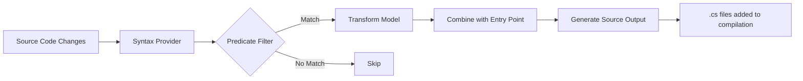

# Source Generators

Hardened uses **seven C# incremental source generators** to shift framework concerns from runtime to build time. Each generator targets a specific aspect of the framework and emits plain C# code that replaces what would otherwise require reflection, assembly scanning, or manual boilerplate.

---

## Generator Overview

| Generator | NuGet Package | What It Generates | When to Use |
|---|---|---|---|
| **Core** | `Hardened.SourceGenerator` | DI registrations, module wiring, configuration implementations | Every application project |
| **Library** | `Hardened.Library.SourceGenerator` | DI registrations, configuration for library modules | Shared library projects consumed by applications |
| **Console** | `Hardened.Console.SourceGenerator` | Console app entry point, command definitions | Console applications |
| **Web** | `Hardened.Web.SourceGenerator` | Route tables, request handler invocation classes | Projects using `[Get]`, `[Post]`, etc. |
| **ASP.NET Core** | `Hardened.Web.AspNetCore.SourceGenerator` | ASP.NET Core middleware bridge code | Projects hosted on ASP.NET Core |
| **Templates** | `Hardened.Templates.SourceGenerator` | Compiled Mustache templates, helper bindings | Projects using `[TemplatePackage]` |
| **Lambda** | `Hardened.Amz.Function.Lambda.SourceGenerator` | Lambda bootstrap, function handler wiring | AWS Lambda function projects |

---

## How Incremental Source Generators Work

All Hardened generators implement `IIncrementalGenerator`, the modern .NET source generator API. Unlike the older `ISourceGenerator` interface, incremental generators only re-execute when their specific inputs change.



The general pattern across all Hardened generators is:

1. **Syntax predicate** -- Quickly filter syntax nodes (e.g., "does this class have a `[HardenedModule]` attribute?")
2. **Transform** -- Convert matching syntax nodes into a lightweight model
3. **Compare** -- A custom `IEqualityComparer` determines if the model actually changed (avoids regeneration on whitespace edits)
4. **Combine** -- Merge per-file models with the application entry point model
5. **Generate** -- Emit C# source code using the `CSharpAuthor` library

!!! info "CSharpAuthor"
    Hardened generators use the `CSharpAuthor` library to construct C# code programmatically rather than concatenating strings. This ensures correct formatting, namespace imports, and type references in all generated output.

---

## Generator Details

### 1. Core Generator (`Hardened.SourceGenerator`)

**Package:** `Hardened.SourceGenerator`

The core generator is the foundation. It runs in every Hardened application project and produces three categories of output.

#### DI Registrations (`{EntryPoint}.DependencyInjection.cs`)

Scans for all classes with `[Expose]` attributes and generates direct `IServiceCollection` registration calls:

```csharp
// Your code
[Expose(typeof(IOrderService))]
[Singleton]
public class OrderService : IOrderService { }

// Generated
serviceCollection.AddSingleton(typeof(IOrderService), typeof(OrderService));
```

The generator respects `[Singleton]`, `[Scoped]`, `Try`, and `[ForEnvironment]` to produce the appropriate method call and conditional wrapping.

#### Module Wiring (`{EntryPoint}.Module.cs`)

Generates the `ConfigureModule` method on the `[HardenedModule]` partial class:

- Iterates sub-modules from `Modules()` if defined
- Calls `ConfigureServiceCollection` with all registrations
- Processes runtime module attributes (e.g., `[AspNetCoreRuntime.Module]`)

#### Configuration (`{EntryPoint}.Configuration.cs`)

For each `[ConfigurationModel]` interface found in the project:

- Generates a concrete implementation class with property accessors
- Creates a `ConfigurationProvider` nested class implementing `IConfigurationPackage`
- Registers the provider as a singleton in the DI container
- Wires `[FromEnvironmentVariable]` bindings

See [Configuration System](configuration-system.md) for full details.

---

### 2. Library Generator (`Hardened.Library.SourceGenerator`)

**Package:** `Hardened.Library.SourceGenerator`

A subset of the core generator designed for **shared library projects**. It produces DI registrations and configuration implementations, but does not generate module entry point code (since libraries are consumed by applications, not run directly).

```csharp
// In a library project
[HardenedModule]
public partial class DataAccessModule { }

[Expose(typeof(IRepository))]
[Singleton]
public class SqlRepository : IRepository { }
```

The library generator registers services via `DependencyRegistry<DataAccessModule>`, so they are automatically applied when the consuming application's module system processes its dependencies.

!!! tip "Library vs. Core Generator"
    Use `Hardened.Library.SourceGenerator` when building a reusable NuGet package or shared project. Use `Hardened.SourceGenerator` for your application entry point.

---

### 3. Console Generator (`Hardened.Console.SourceGenerator`)

**Package:** `Hardened.Console.SourceGenerator`

Generates entry point bootstrapping for console applications, including:

- `Main` method generation
- Command definition parsing
- DI container setup for console commands

---

### 4. Web Generator (`Hardened.Web.SourceGenerator`)

**Package:** `Hardened.Web.SourceGenerator`

The web generator is responsible for two major outputs:

#### Route Tables (`{EntryPoint}.Routes.cs`)

Scans for methods decorated with `[Get]`, `[Post]`, `[Put]`, `[Delete]`, and `[Patch]` and builds a compiled route table:

```csharp
// Your code
[BasePath("/api/orders")]
public class OrderController {
    [Get("/{id}")]
    public Task<Order> GetOrder(string id) { ... }

    [Post("/")]
    public Task<Order> CreateOrder([FromBody] CreateOrderRequest request) { ... }
}
```

The generator produces a tree-based route matching structure that maps HTTP method + path to the appropriate handler invocation class. This replaces the runtime route resolution that frameworks like ASP.NET MVC perform on every request.

#### Handler Invocation Classes

For each route handler method, the generator creates an invocation class that:

1. Resolves the handler class from the scoped service provider
2. Binds request parameters (path tokens, query strings, headers, body)
3. Invokes the handler method
4. Sets the response value

```csharp
// Conceptual generated code (simplified)
public class OrderController_GetOrder_Handler {
    public async Task Invoke(IExecutionContext context) {
        var handler = context.RequestServices.GetRequiredService<OrderController>();
        context.HandlerInstance = handler;

        var id = context.Request.PathTokens["id"];
        var result = await handler.GetOrder(id);

        context.Response.ResponseValue = result;
    }
}
```

The generator also produces a **parameters class** for each handler that holds the bound parameter values, and a **handler info class** with metadata about the handler (method name, path, HTTP method).

---

### 5. ASP.NET Core Generator (`Hardened.Web.AspNetCore.SourceGenerator`)

**Package:** `Hardened.Web.AspNetCore.SourceGenerator`

Generates the bridge code that connects Hardened's execution pipeline to the ASP.NET Core middleware pipeline:

- Maps `HttpContext` to `IExecutionRequest` and `IExecutionResponse`
- Creates the `UseHardened()` extension method
- Bridges ASP.NET Core's `IServiceProvider` with Hardened's scoped services
- Handles response writing back to the ASP.NET Core response stream

---

### 6. Templates Generator (`Hardened.Templates.SourceGenerator`)

**Package:** `Hardened.Templates.SourceGenerator`

Compiles Mustache-style templates into C# code at build time:

- Parses `.mustache` template files embedded in the project
- Generates strongly-typed template rendering classes
- Wires `[TemplateHelper]` methods as template functions
- Registers template packages via `[TemplatePackage]`

This means template rendering has zero parsing overhead at runtime -- templates are compiled into direct `StringBuilder` append calls.

---

### 7. Lambda Generator (`Hardened.Amz.Function.Lambda.SourceGenerator`)

**Package:** `Hardened.Amz.Function.Lambda.SourceGenerator`

Generates the Lambda function bootstrap code:

- Creates the Lambda handler entry point class
- Wires the `[HardenedFunction]` methods as Lambda invocation targets
- Bridges the Lambda `ILambdaContext` with `IExecutionContext`
- Handles serialization/deserialization of Lambda event payloads

---

## Generated File Naming

Each generator follows a consistent naming pattern for its output files:

| Generator | Output File Pattern |
|---|---|
| Core (DI) | `{EntryPoint}.DependencyInjection.cs` |
| Core (Module) | `{EntryPoint}.Module.cs` |
| Core (Config) | `{EntryPoint}.Configuration.cs` |
| Core (Config Models) | `ConfigurationModels_{ModelName}.Properties.cs` |
| Web (Routes) | `{EntryPoint}.Routes.cs` |
| Web (Handlers) | `{Controller}_{Method}_Handler.cs` |

---

## Viewing Generated Code

You can inspect the generated code in several ways:

=== "File System"

    Generated files appear under:
    ```
    obj/Debug/net8.0/generated/{GeneratorAssembly}/{GeneratorType}/
    ```

=== "MSBuild Property"

    Add to your `.csproj` to emit generated files to a visible directory:
    ```xml
    <PropertyGroup>
        <EmitCompilerGeneratedFiles>true</EmitCompilerGeneratedFiles>
        <CompilerGeneratedFilesOutputPath>
            Generated
        </CompilerGeneratedFilesOutputPath>
    </PropertyGroup>
    ```

=== "IDE"

    In Visual Studio and Rider, expand the **Analyzers** node under your project in Solution Explorer to see generated files grouped by generator.

---

## Which Generators Do You Need?

The generators you reference depend on your project type:

=== "ASP.NET Core Web API"

    ```xml
    <PackageReference Include="Hardened.SourceGenerator" />
    <PackageReference Include="Hardened.Web.SourceGenerator" />
    <PackageReference Include="Hardened.Web.AspNetCore.SourceGenerator" />
    ```

=== "Lambda Function"

    ```xml
    <PackageReference Include="Hardened.SourceGenerator" />
    <PackageReference Include="Hardened.Amz.Function.Lambda.SourceGenerator" />
    ```

=== "Lambda Web API"

    ```xml
    <PackageReference Include="Hardened.SourceGenerator" />
    <PackageReference Include="Hardened.Web.SourceGenerator" />
    <PackageReference Include="Hardened.Amz.Function.Lambda.SourceGenerator" />
    ```

=== "Shared Library"

    ```xml
    <PackageReference Include="Hardened.Library.SourceGenerator" />
    ```

=== "With Templates"

    Add to any of the above:
    ```xml
    <PackageReference Include="Hardened.Templates.SourceGenerator" />
    ```

!!! note "Analyzer References"
    Source generator packages should be referenced with `OutputItemType="Analyzer"` and `ReferenceOutputAssembly="false"` in the NuGet package metadata. The Hardened packages handle this automatically.

---

## Next Steps

- [Module System](module-system.md) -- How the core generator wires modules together
- [Dependency Injection](dependency-injection.md) -- How `[Expose]` becomes `AddTransient`/`AddSingleton`
- [Configuration System](configuration-system.md) -- How `[ConfigurationModel]` gets a generated implementation
- [Execution Pipeline](execution-pipeline.md) -- How generated handler invocation classes fit into the filter chain
