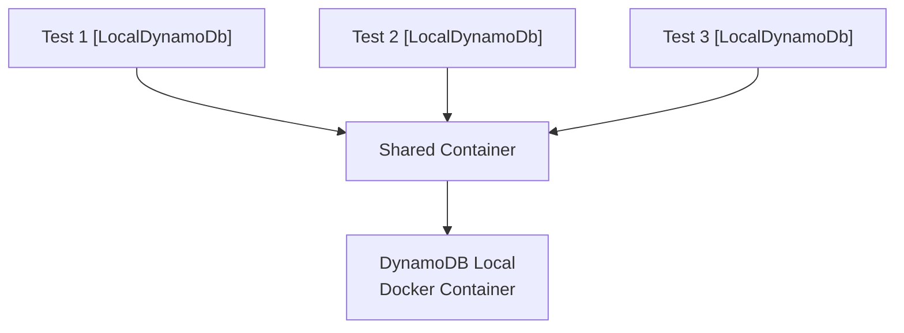

# DynamoDB Testing

The `Hardened.Amz.DynamoDbClient.Testing` package provides the `[LocalDynamoDb]` test attribute, which spins up a local DynamoDB instance using [Testcontainers](https://dotnet.testcontainers.org/) and registers a test-specific `IDynamoDbClientProvider`. This enables integration tests that run against a real DynamoDB-compatible database without connecting to AWS.

---

## Setup

```bash
dotnet add package Hardened.Amz.DynamoDbClient.Testing --prerelease
```

!!! warning "Prerequisites"
    The `[LocalDynamoDb]` attribute uses Testcontainers to run the `amazon/dynamodb-local:latest` Docker image. **Docker must be installed and running** in your test environment.

---

## [LocalDynamoDb] Attribute

The `[LocalDynamoDb]` attribute is a test attribute that:

1. Starts a local DynamoDB container (shared across all tests in the test run)
2. Registers a `TestDynamoDbClientProvider` as `IDynamoDbClientProvider` in the test DI container
3. Calls the virtual `DdbSetup()` method for table creation and seed data
4. Provides clients configured to connect to the local container

### Basic Usage

Apply `[LocalDynamoDb]` to your test method alongside `[HardenedTest]`:

```csharp
using Hardened.Shared.Testing.Attributes;
using Hardened.Amz.DynamoDbClient;

public class ProductRepositoryTests
{
    [HardenedTest]
    [LocalDynamoDb]
    public async Task SaveAndGet_RoundTrips(
        IProductRepository repository,
        IDynamoDbClientProvider clientProvider)
    {
        var product = new Product
        {
            ProductId = "PROD-001",
            Name = "Widget",
            Price = 9.99m
        };

        await repository.SaveProduct(product);

        var result = await repository.GetProduct("PROD-001");

        Assert.NotNull(result);
        Assert.Equal("Widget", result.Name);
        Assert.Equal(9.99m, result.Price);
    }
}
```

---

## How It Works

The `[LocalDynamoDb]` attribute implements two Hardened testing interfaces:

### IHardenedTestDependencyRegistrationAttribute

Registers a `TestDynamoDbClientProvider` as a singleton `IDynamoDbClientProvider` in the test DI container. This provider creates `AmazonDynamoDBClient` instances that connect to the local DynamoDB container using fake credentials.

### IHardenedTestStartupAttribute

Calls `DdbSetup()` during test startup, giving you a hook to create tables and seed data before the test runs.

### Shared Container

The DynamoDB container is shared across all tests in the test run via a static `ConcurrentDictionary`. This means:

- The first test that uses `[LocalDynamoDb]` starts the container
- All subsequent tests reuse the same container
- The container is not stopped between tests (it persists for the test process lifetime)

This design makes test runs fast -- the container startup cost is paid only once.



---

## Table Setup with DdbSetup

To create tables before your tests run, create a custom attribute that extends `LocalDynamoDbAttribute` and overrides `DdbSetup()`:

```csharp title="Testing/LocalDynamoDbWithTables.cs"
using Amazon.DynamoDBv2;
using Amazon.DynamoDBv2.Model;
using Hardened.Amz.DynamoDbClient;
using Hardened.Amz.DynamoDbClient.Testing;
using Hardened.Shared.Runtime.Application;
using Microsoft.Extensions.DependencyInjection;
using System.Reflection;

public class LocalDynamoDbWithTablesAttribute : LocalDynamoDbAttribute
{
    protected override async Task DdbSetup(
        AttributeCollection attributeCollection,
        MethodInfo methodInfo,
        IHardenedEnvironment environment,
        IServiceProvider serviceProvider)
    {
        var clientProvider = serviceProvider.GetRequiredService<IDynamoDbClientProvider>();
        var client = clientProvider.GetClient();

        await CreateProductsTable(client);
    }

    private async Task CreateProductsTable(AmazonDynamoDBClient client)
    {
        try
        {
            await client.CreateTableAsync(new CreateTableRequest
            {
                TableName = "Products",
                KeySchema = new List<KeySchemaElement>
                {
                    new("PK", KeyType.HASH)
                },
                AttributeDefinitions = new List<AttributeDefinition>
                {
                    new("PK", ScalarAttributeType.S)
                },
                BillingMode = BillingMode.PAY_PER_REQUEST
            });
        }
        catch (ResourceInUseException)
        {
            // Table already exists (shared container)
        }
    }
}
```

Then use your custom attribute in tests:

```csharp
public class ProductRepositoryTests
{
    [HardenedTest]
    [LocalDynamoDbWithTables]
    public async Task SaveProduct_Succeeds(IProductRepository repository)
    {
        await repository.SaveProduct(new Product
        {
            ProductId = "PROD-001",
            Name = "Widget",
            Price = 9.99m
        });

        var result = await repository.GetProduct("PROD-001");
        Assert.NotNull(result);
    }
}
```

!!! tip
    Wrap `CreateTableAsync` calls in a `try/catch` for `ResourceInUseException` since the shared container persists tables across tests. This makes the setup idempotent.

---

## Table with Sort Key

For tables with both a partition key and sort key:

```csharp
private async Task CreateOrdersTable(AmazonDynamoDBClient client)
{
    try
    {
        await client.CreateTableAsync(new CreateTableRequest
        {
            TableName = "Orders",
            KeySchema = new List<KeySchemaElement>
            {
                new("PK", KeyType.HASH),
                new("SK", KeyType.RANGE)
            },
            AttributeDefinitions = new List<AttributeDefinition>
            {
                new("PK", ScalarAttributeType.S),
                new("SK", ScalarAttributeType.S)
            },
            BillingMode = BillingMode.PAY_PER_REQUEST
        });
    }
    catch (ResourceInUseException)
    {
        // Table already exists
    }
}
```

---

## Clearing Tables Between Tests

Since the container is shared, data from one test can affect another. To clear tables between tests, add a cleanup step in your `DdbSetup()` override or use a helper method:

```csharp
public static class DynamoDbTestHelper
{
    public static async Task ClearTable(AmazonDynamoDBClient client, string tableName, string pkName = "PK")
    {
        var scanResponse = await client.ScanAsync(new ScanRequest
        {
            TableName = tableName,
            ProjectionExpression = pkName
        });

        foreach (var item in scanResponse.Items)
        {
            await client.DeleteItemAsync(tableName, new Dictionary<string, AttributeValue>
            {
                [pkName] = item[pkName]
            });
        }
    }

    public static async Task ClearTable(
        AmazonDynamoDBClient client,
        string tableName,
        string pkName,
        string skName)
    {
        var scanResponse = await client.ScanAsync(new ScanRequest
        {
            TableName = tableName,
            ProjectionExpression = $"{pkName}, {skName}"
        });

        foreach (var item in scanResponse.Items)
        {
            await client.DeleteItemAsync(tableName, new Dictionary<string, AttributeValue>
            {
                [pkName] = item[pkName],
                [skName] = item[skName]
            });
        }
    }
}
```

Usage in a custom setup attribute:

```csharp
protected override async Task DdbSetup(
    AttributeCollection attributeCollection,
    MethodInfo methodInfo,
    IHardenedEnvironment environment,
    IServiceProvider serviceProvider)
{
    var client = serviceProvider
        .GetRequiredService<IDynamoDbClientProvider>()
        .GetClient();

    await CreateProductsTable(client);
    await DynamoDbTestHelper.ClearTable(client, "Products");
}
```

---

## Direct Client Access in Tests

You can inject `IDynamoDbClientProvider` directly into test methods to set up data or verify results:

```csharp
[HardenedTest]
[LocalDynamoDbWithTables]
public async Task DeleteProduct_RemovesFromTable(
    IProductRepository repository,
    IDynamoDbClientProvider clientProvider)
{
    var client = clientProvider.GetClient();

    // Seed data directly
    await client.PutItemAsync("Products", new Dictionary<string, AttributeValue>
    {
        ["PK"] = new AttributeValue("PROD-001"),
        ["Name"] = new AttributeValue("Widget"),
        ["Price"] = new AttributeValue { N = "9.99" }
    });

    // Execute the operation under test
    await repository.DeleteProduct("PROD-001");

    // Verify directly against DynamoDB
    var response = await client.GetItemAsync("Products", new Dictionary<string, AttributeValue>
    {
        ["PK"] = new AttributeValue("PROD-001")
    });

    Assert.Empty(response.Item);
}
```

---

## Complete Example

```csharp title="Bootstrap.cs"
using Hardened.Shared.Testing.Attributes;

[assembly: HardenedTestEntryPoint(typeof(Application))]
```

```csharp title="Testing/LocalDynamoDbWithTables.cs"
using Amazon.DynamoDBv2;
using Amazon.DynamoDBv2.Model;
using Hardened.Amz.DynamoDbClient;
using Hardened.Amz.DynamoDbClient.Testing;
using Hardened.Shared.Runtime.Application;
using Microsoft.Extensions.DependencyInjection;
using System.Reflection;

public class LocalDynamoDbWithTablesAttribute : LocalDynamoDbAttribute
{
    protected override async Task DdbSetup(
        AttributeCollection attributeCollection,
        MethodInfo methodInfo,
        IHardenedEnvironment environment,
        IServiceProvider serviceProvider)
    {
        var client = serviceProvider
            .GetRequiredService<IDynamoDbClientProvider>()
            .GetClient();

        try
        {
            await client.CreateTableAsync(new CreateTableRequest
            {
                TableName = "Products",
                KeySchema = new List<KeySchemaElement> { new("PK", KeyType.HASH) },
                AttributeDefinitions = new List<AttributeDefinition> { new("PK", ScalarAttributeType.S) },
                BillingMode = BillingMode.PAY_PER_REQUEST
            });
        }
        catch (ResourceInUseException) { }
    }
}
```

```csharp title="ProductRepositoryTests.cs"
using Hardened.Shared.Testing.Attributes;
using Hardened.Amz.DynamoDbClient;
using Amazon.DynamoDBv2.Model;

public class ProductRepositoryTests
{
    [HardenedTest]
    [LocalDynamoDbWithTables]
    public async Task SaveAndRetrieve_RoundTrips(IProductRepository repository)
    {
        await repository.SaveProduct(new Product
        {
            ProductId = "PROD-001",
            Name = "Widget",
            Price = 9.99m
        });

        var result = await repository.GetProduct("PROD-001");

        Assert.NotNull(result);
        Assert.Equal("PROD-001", result.ProductId);
        Assert.Equal("Widget", result.Name);
        Assert.Equal(9.99m, result.Price);
    }

    [HardenedTest]
    [LocalDynamoDbWithTables]
    public async Task GetProduct_NotFound_ReturnsNull(IProductRepository repository)
    {
        var result = await repository.GetProduct("DOES-NOT-EXIST");

        Assert.Null(result);
    }
}
```

---

## Next Steps

- [DynamoDB Client](dynamodb.md) -- `IDynamoDbClientProvider` API reference and configuration
- [Lambda Testing](../lambda/testing.md) -- test Lambda functions with `LambdaTestApp`
- [HardenedTest](../../framework/testing/hardened-test.md) -- test framework fundamentals
- [Custom Attributes](../../framework/testing/custom-attributes.md) -- building custom test attributes
