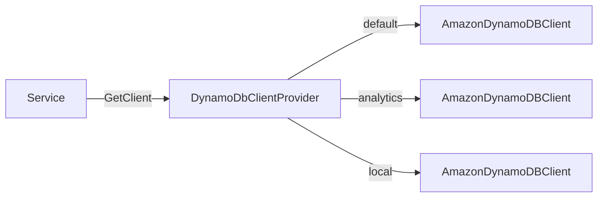

# DynamoDB Client

The `Hardened.Amz.DynamoDbClient` package provides `IDynamoDbClientProvider` -- a managed provider for `AmazonDynamoDBClient` instances with support for named clients and configuration via the Hardened configuration system.

---

## Setup

```bash
dotnet add package Hardened.Amz.DynamoDbClient --prerelease
```

The package registers `IDynamoDbClientProvider` as a singleton in the DI container automatically via the Hardened source generator.

---

## IDynamoDbClientProvider

The core interface provides access to configured `AmazonDynamoDBClient` instances:

```csharp
public interface IDynamoDbClientProvider
{
    /// <summary>
    /// Get configured DynamoDB client.
    /// </summary>
    /// <param name="clientName">
    /// Get client by name. If null or empty, returns the default client.
    /// </param>
    AmazonDynamoDBClient GetClient(string clientName = "");
}
```

### Basic Usage

Inject `IDynamoDbClientProvider` into your services and call `GetClient()` to obtain a client:

```csharp
using Amazon.DynamoDBv2;
using Amazon.DynamoDBv2.Model;
using Hardened.Amz.DynamoDbClient;
using Hardened.Shared.Runtime.Attributes;

[Expose]
public class UserRepository : IUserRepository
{
    private readonly AmazonDynamoDBClient _client;

    public UserRepository(IDynamoDbClientProvider clientProvider)
    {
        _client = clientProvider.GetClient();
    }

    public async Task<GetItemResponse> GetUser(string userId)
    {
        return await _client.GetItemAsync("Users", new Dictionary<string, AttributeValue>
        {
            ["PK"] = new AttributeValue(userId)
        });
    }

    public async Task PutUser(string userId, string name, string email)
    {
        await _client.PutItemAsync("Users", new Dictionary<string, AttributeValue>
        {
            ["PK"] = new AttributeValue(userId),
            ["Name"] = new AttributeValue(name),
            ["Email"] = new AttributeValue(email)
        });
    }
}
```

!!! tip
    The `DynamoDbClientProvider` implementation caches clients as singletons. Calling `GetClient()` multiple times returns the same `AmazonDynamoDBClient` instance, so it is safe and efficient to call it in constructors.

---

## Named Clients

You can configure multiple DynamoDB clients with different configurations and retrieve them by name:

```csharp
// Default client (connects to the default region)
var defaultClient = clientProvider.GetClient();

// Named client with custom configuration
var analyticsClient = clientProvider.GetClient("analytics");
```

Named clients must be configured via `DynamoDbClientConfiguration` (see [Configuration](#configuration) below). Requesting an unconfigured name throws an exception.

---

## Configuration

The `DynamoDbClientConfiguration` is a `[ConfigurationModel]` that allows you to customize the `AmazonDynamoDBConfig` used to construct clients:

```csharp
[ConfigurationModel]
public partial class DynamoDbClientConfiguration
{
    private Func<IServiceProvider, AmazonDynamoDBConfig>? _defaultClientConfig;
    private Dictionary<string, Func<IServiceProvider, AmazonDynamoDBConfig>> _namedConfigs = new();
}
```

### Configuring the Default Client

Override the default client configuration in your module:

```csharp
using Amazon.DynamoDBv2;
using Hardened.Amz.DynamoDbClient;
using Hardened.Shared.Runtime.Attributes;
using Microsoft.Extensions.DependencyInjection;

[HardenedModule]
public partial class Application
{
    public void ConfigureServices(IServiceCollection services)
    {
        services.Configure<IDynamoDbClientConfiguration>(config =>
        {
            config.DefaultClientConfig = _ => new AmazonDynamoDBConfig
            {
                RegionEndpoint = Amazon.RegionEndpoint.USWest2
            };
        });
    }
}
```

### Configuring Named Clients

Add named configurations for connecting to different DynamoDB endpoints or regions:

```csharp
services.Configure<IDynamoDbClientConfiguration>(config =>
{
    config.NamedConfigs["analytics"] = _ => new AmazonDynamoDBConfig
    {
        RegionEndpoint = Amazon.RegionEndpoint.EUWest1
    };

    config.NamedConfigs["local"] = _ => new AmazonDynamoDBConfig
    {
        ServiceURL = "http://localhost:8000"
    };
});
```

---

## Extension Methods

The package includes convenience extension methods on `AmazonDynamoDBClient` for common operations.

### Get

A simplified `GetItemAsync` wrapper that handles key construction for tables using `PK` and optional `SK` attributes:

```csharp
using Hardened.Amz.DynamoDbClient;

// Get by partition key only
var response = await client.Get("Users", "USER#123");

// Get by partition key and sort key (string)
var response = await client.Get("Orders", "USER#123", "ORDER#456");

// Get by partition key and sort key (number)
var response = await client.Get("Events", "USER#123", 1704067200);

// Get by partition key and sort key (DateTime, converted to epoch)
var response = await client.Get("Events", "USER#123", DateTime.UtcNow);
```

The `Get` extension method:

- Uses `"PK"` as the partition key attribute name
- Uses `"SK"` as the sort key attribute name (when provided)
- Automatically converts the sort key value to the appropriate `AttributeValue` type:
    - `bool` values use `BOOL`
    - Numeric types (`decimal`, `double`, `int`, `long`) use `N`
    - `DateTime` values are converted to epoch seconds and use `N`
    - All other types are converted to strings with `S`

---

## Client Lifecycle

The `DynamoDbClientProvider` is registered as a singleton. It manages client instances internally:

- The **default client** is lazily created on first access and cached for the application lifetime
- **Named clients** are stored in a `ConcurrentDictionary` and lazily created on first access
- All clients are reused across invocations (important for Lambda warm starts)



---

## Complete Example

```csharp title="Application.cs"
using Hardened.Shared.Runtime.Attributes;

[HardenedModule]
public partial class Application { }
```

```csharp title="Repositories/ProductRepository.cs"
using Amazon.DynamoDBv2;
using Amazon.DynamoDBv2.Model;
using Hardened.Amz.DynamoDbClient;
using Hardened.Shared.Runtime.Attributes;

[Expose]
public class ProductRepository : IProductRepository
{
    private const string TableName = "Products";
    private readonly AmazonDynamoDBClient _client;

    public ProductRepository(IDynamoDbClientProvider clientProvider)
    {
        _client = clientProvider.GetClient();
    }

    public async Task<Product?> GetProduct(string productId)
    {
        var response = await _client.Get(TableName, productId);

        if (response.Item == null || response.Item.Count == 0)
        {
            return null;
        }

        return new Product
        {
            ProductId = response.Item["PK"].S,
            Name = response.Item["Name"].S,
            Price = decimal.Parse(response.Item["Price"].N)
        };
    }

    public async Task SaveProduct(Product product)
    {
        await _client.PutItemAsync(TableName, new Dictionary<string, AttributeValue>
        {
            ["PK"] = new AttributeValue(product.ProductId),
            ["Name"] = new AttributeValue(product.Name),
            ["Price"] = new AttributeValue { N = product.Price.ToString() }
        });
    }

    public async Task DeleteProduct(string productId)
    {
        await _client.DeleteItemAsync(TableName, new Dictionary<string, AttributeValue>
        {
            ["PK"] = new AttributeValue(productId)
        });
    }
}
```

---

## Next Steps

- [DynamoDB Testing](dynamodb-testing.md) -- integration testing with `[LocalDynamoDb]` and Testcontainers
- [SQS Client](sqs.md) -- send SQS messages with `ISqsClient`
- [Lambda Function Runtime](../lambda/function-runtime.md) -- build Lambda functions that use DynamoDB
