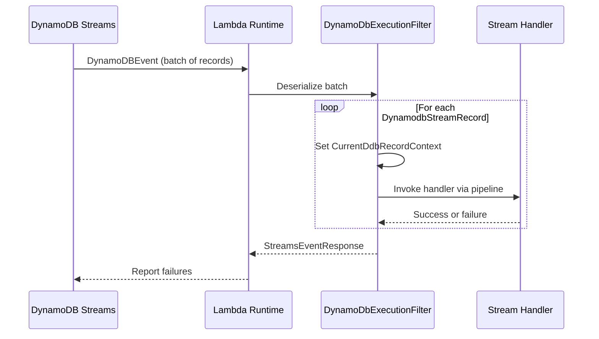

# DynamoDB Stream Processing

The DynamoDB Stream runtime (`Hardened.Amz.Function.DDB.Runtime`) enables you to process DynamoDB Streams events in a Lambda function using the Hardened execution pipeline. The runtime handles batch iteration, per-record processing, and partial failure reporting, while `[OldImage]` and `[NewImage]` parameter binding attributes give you direct access to the changed data.

---

## Setup

Add the Lambda source generator and the DDB Stream runtime:

```bash
dotnet add package Hardened.Amz.Function.Lambda.SourceGenerator --prerelease
dotnet add package Hardened.Amz.Function.DDB.Runtime --prerelease
```

---

## Application Module

Apply `[DynamoStreamLambda.Module]` alongside `[HardenedModule]` to configure the DynamoDB Stream processing pipeline:

```csharp title="Application.cs"
using Hardened.Shared.Runtime.Attributes;
using Hardened.Amz.Function.DDB.Runtime;

[HardenedModule]
[DynamoStreamLambda.Module]
public partial class Application { }
```

The `[DynamoStreamLambda.Module]` attribute registers the DynamoDB-specific execution filter and batch processing infrastructure, including the `IBatchProcessorExceptionHandler` for error handling.

---

## Defining a Stream Handler

A DynamoDB Stream handler is a class with a `[HardenedFunction]` method that receives the old and new images of the changed DynamoDB item:

```csharp title="Handlers/StreamHandler.cs"
using Amazon.Lambda.DynamoDBEvents;
using Hardened.Amz.Function.DDB.Runtime.Attributes;
using Hardened.Requests.Abstract.Attributes;

public class StreamHandler
{
    private readonly IAuditService _auditService;

    public StreamHandler(IAuditService auditService)
    {
        _auditService = auditService;
    }

    [HardenedFunction]
    public async Task ProcessRecord(
        [OldImage] Dictionary<string, DynamoDBEvent.AttributeValue> oldImage,
        [NewImage] Dictionary<string, DynamoDBEvent.AttributeValue> newImage)
    {
        await _auditService.RecordChange(oldImage, newImage);
    }
}
```

### Parameter Binding Attributes

The `[OldImage]` and `[NewImage]` attributes are custom binding attributes (`ICustomBindingAttribute`) that extract data from the current DynamoDB Stream record:

| Attribute | Description | DynamoDB Event Type |
|---|---|---|
| `[OldImage]` | The item's attribute values **before** the change | `INSERT`: empty, `MODIFY`: previous values, `REMOVE`: deleted values |
| `[NewImage]` | The item's attribute values **after** the change | `INSERT`: new values, `MODIFY`: updated values, `REMOVE`: empty |

Both parameters must be typed as `Dictionary<string, DynamoDBEvent.AttributeValue>`.

!!! warning
    Whether old and new images are available depends on your DynamoDB table's stream configuration. Set `StreamViewType` to `NEW_AND_OLD_IMAGES` to receive both. With `KEYS_ONLY`, the image dictionaries will be empty or contain only key attributes.

---

## How Batch Processing Works

DynamoDB Streams delivers events in batches. The runtime processes each record individually through the Hardened execution pipeline:



1. The `DynamoDbExecutionFilter` deserializes the incoming `DynamoDBEvent`
2. For each `DynamodbStreamRecord`, it sets the current record context and invokes the handler through a forked execution chain
3. `[OldImage]` and `[NewImage]` attributes read from the `CurrentDdbRecordContext` to bind parameters
4. Results are collected and any failures are reported as `BatchItemFailure` entries in the `StreamsEventResponse`

---

## Partial Failure Handling

The runtime automatically tracks success and failure for each record. When a record's handler throws an exception or returns a failure status, it is included in the `StreamsEventResponse.BatchItemFailures` list. This enables DynamoDB Streams to retry only the failed records.

To use partial failure reporting, ensure your Lambda event source mapping has `BisectBatchOnFunctionError` and `ReportBatchItemFailures` configured:

```json
{
  "FunctionResponseTypes": ["ReportBatchItemFailures"],
  "BisectBatchOnFunctionError": true
}
```

---

## Custom Exception Handling

The runtime registers a default `IBatchProcessorExceptionHandler` that logs exceptions and marks the record as failed. You can override this behavior by registering your own implementation:

```csharp
using Hardened.Amz.Function.Lambda.Runtime.Filter;
using Hardened.Requests.Abstract.Execution;
using Hardened.Shared.Runtime.Attributes;
using Microsoft.Extensions.Logging;

[Expose]
[Singleton]
public class CustomExceptionHandler : IBatchProcessorExceptionHandler
{
    public Task<bool> HandleException(
        IExecutionContext context,
        ILogger logger,
        Exception exception)
    {
        logger.LogError(exception, "Stream record processing failed");

        // Return true to mark as success (skip), false to mark as failure (retry)
        return Task.FromResult(false);
    }
}
```

---

## Working with Attribute Values

The DynamoDB Stream record uses `DynamoDBEvent.AttributeValue` (from the `Amazon.Lambda.DynamoDBEvents` package), which is different from the `Amazon.DynamoDBv2.Model.AttributeValue` used by the DynamoDB SDK. Here is an example of extracting values:

```csharp
[HardenedFunction]
public async Task ProcessRecord(
    [OldImage] Dictionary<string, DynamoDBEvent.AttributeValue> oldImage,
    [NewImage] Dictionary<string, DynamoDBEvent.AttributeValue> newImage)
{
    // String attribute
    var userId = newImage.TryGetValue("UserId", out var userIdAttr)
        ? userIdAttr.S
        : null;

    // Number attribute
    var amount = newImage.TryGetValue("Amount", out var amountAttr)
        ? decimal.Parse(amountAttr.N)
        : 0m;

    // Boolean attribute
    var isActive = newImage.TryGetValue("IsActive", out var isActiveAttr)
        && isActiveAttr.BOOL;

    // Detect operation type by comparing old and new images
    if (oldImage.Count == 0)
    {
        // INSERT -- no old image
        await HandleInsert(newImage);
    }
    else if (newImage.Count == 0)
    {
        // REMOVE -- no new image
        await HandleRemove(oldImage);
    }
    else
    {
        // MODIFY -- both images present
        await HandleModify(oldImage, newImage);
    }
}
```

---

## Complete Example

```csharp title="Application.cs"
using Hardened.Shared.Runtime.Attributes;
using Hardened.Amz.Function.DDB.Runtime;

[HardenedModule]
[DynamoStreamLambda.Module]
public partial class Application { }
```

```csharp title="Services/ChangeLogService.cs"
using Hardened.Shared.Runtime.Attributes;

[Expose]
public class ChangeLogService : IChangeLogService
{
    private readonly ILogger<ChangeLogService> _logger;

    public ChangeLogService(ILogger<ChangeLogService> logger)
    {
        _logger = logger;
    }

    public Task LogChange(string entityId, string changeType)
    {
        _logger.LogInformation("Entity {EntityId}: {ChangeType}", entityId, changeType);
        return Task.CompletedTask;
    }
}
```

```csharp title="Handlers/ChangeStreamHandler.cs"
using Amazon.Lambda.DynamoDBEvents;
using Hardened.Amz.Function.DDB.Runtime.Attributes;
using Hardened.Requests.Abstract.Attributes;

public class ChangeStreamHandler
{
    private readonly IChangeLogService _changeLog;

    public ChangeStreamHandler(IChangeLogService changeLog)
    {
        _changeLog = changeLog;
    }

    [HardenedFunction]
    public async Task ProcessRecord(
        [OldImage] Dictionary<string, DynamoDBEvent.AttributeValue> oldImage,
        [NewImage] Dictionary<string, DynamoDBEvent.AttributeValue> newImage)
    {
        var entityId = (newImage.Count > 0 ? newImage : oldImage)
            .GetValueOrDefault("PK")?.S ?? "unknown";

        var changeType = oldImage.Count == 0 ? "INSERT"
            : newImage.Count == 0 ? "REMOVE"
            : "MODIFY";

        await _changeLog.LogChange(entityId, changeType);
    }
}
```

---

## Next Steps

- [DDB Stream Testing](testing.md) -- test stream handlers with `TestDynamoDbStream`
- [Function Runtime](function-runtime.md) -- build request/response Lambda functions
- [SQS Processing](sqs-processing.md) -- consume SQS message batches
- [DynamoDB Client](../clients/dynamodb.md) -- access DynamoDB with `IDynamoDbClientProvider`
