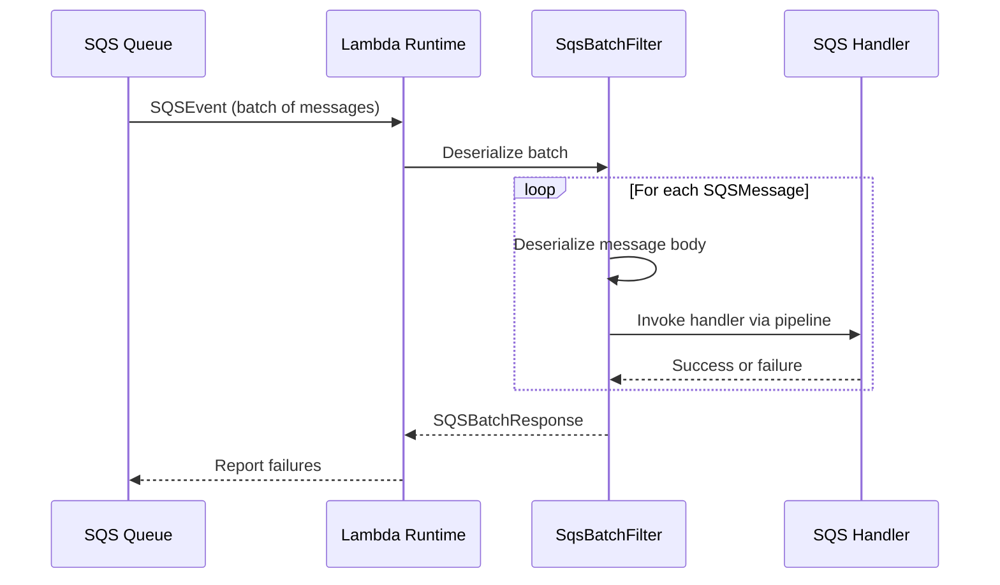

# SQS Batch Processing

The SQS runtime (`Hardened.Amz.Function.Sqs.Runtime`) enables you to process SQS message batches in a Lambda function using the Hardened execution pipeline. The runtime handles batch iteration, message deserialization, and partial failure reporting via `SQSBatchResponse`.

---

## Setup

Add the Lambda source generator and SQS runtime:

```bash
dotnet add package Hardened.Amz.Function.Lambda.SourceGenerator --prerelease
dotnet add package Hardened.Amz.Function.Sqs.Runtime --prerelease
```

---

## Application Module

Apply `[SqsLambda.Module]` alongside `[HardenedModule]`:

```csharp title="Application.cs"
using Hardened.Shared.Runtime.Attributes;
using Hardened.Amz.Function.Sqs.Runtime;

[HardenedModule]
[SqsLambda.Module]
public partial class Application { }
```

The `[SqsLambda.Module]` attribute registers the SQS-specific batch execution filter and exception handling infrastructure.

---

## Defining an SQS Handler

An SQS handler is a class with a `[HardenedFunction]` method. The method parameter is the deserialized message body -- each SQS message is individually deserialized from JSON into your model type:

```csharp title="Handlers/OrderProcessor.cs"
using Hardened.Requests.Abstract.Attributes;

public class OrderProcessor
{
    private readonly IOrderService _orderService;

    public OrderProcessor(IOrderService orderService)
    {
        _orderService = orderService;
    }

    [HardenedFunction]
    public async Task Process(OrderMessage message)
    {
        await _orderService.ProcessOrder(message.OrderId, message.Amount);
    }
}
```

```csharp title="Models/OrderMessage.cs"
public class OrderMessage
{
    public string OrderId { get; set; } = string.Empty;
    public decimal Amount { get; set; }
    public string CustomerId { get; set; } = string.Empty;
}
```

The handler method is called once per SQS message in the batch. The runtime takes care of:

1. Deserializing the `SQSEvent` from the Lambda invocation payload
2. Iterating over `SQSEvent.Records`
3. Deserializing each record's `Body` (JSON string) into your model type (`OrderMessage`)
4. Invoking the handler for each message through a forked execution chain
5. Collecting results and producing an `SQSBatchResponse`

---

## How Batch Processing Works



The `SqsBatchFilter` extends `BaseBatchExecutionFilter<SQSEvent, SQSEvent.SQSMessage>` and:

- Extracts the `Body` string from each `SQSEvent.SQSMessage`
- Writes it to an input stream for the handler pipeline to deserialize
- Tracks success/failure per message
- Builds an `SQSBatchResponse` with `BatchItemFailure` entries for failed messages

---

## Partial Failure Handling

The runtime automatically tracks which messages succeed and which fail. When a handler throws an exception or returns a failure status, the corresponding message ID is added to the `SQSBatchResponse.BatchItemFailures` list. SQS will then retry only the failed messages.

To enable partial batch failure reporting, configure your Lambda event source mapping:

```json
{
  "FunctionResponseTypes": ["ReportBatchItemFailures"]
}
```

!!! note
    Without `ReportBatchItemFailures`, SQS treats the entire batch as failed if any single message fails, causing all messages to be retried.

---

## Custom Exception Handling

The default `ISqsExceptionHandler` logs the exception and marks the message as failed. You can override this behavior:

```csharp
using Amazon.Lambda.SQSEvents;
using Hardened.Amz.Function.Sqs.Runtime;
using Hardened.Requests.Abstract.Execution;
using Hardened.Shared.Runtime.Attributes;

[Expose]
[Singleton]
public class CustomSqsExceptionHandler : ISqsExceptionHandler
{
    private readonly ILogger<CustomSqsExceptionHandler> _logger;

    public CustomSqsExceptionHandler(ILogger<CustomSqsExceptionHandler> logger)
    {
        _logger = logger;
    }

    public ValueTask<bool> HandleException(
        IExecutionChain chain,
        SQSEvent.SQSMessage message,
        Exception exception)
    {
        _logger.LogError(exception, "Failed to process SQS message {MessageId}", message.MessageId);

        // Return true to mark as success (skip message), false to mark as failure (retry)
        return new ValueTask<bool>(false);
    }
}
```

---

## Execution Filters

SQS handlers run through the Hardened execution pipeline, so `IExecutionFilter` implementations apply to each message invocation:

```csharp
using Hardened.Requests.Abstract.Execution;
using Hardened.Shared.Runtime.Attributes;

[Expose]
[Singleton]
public class MessageTimingFilter : IExecutionFilter
{
    private readonly ILogger<MessageTimingFilter> _logger;

    public MessageTimingFilter(ILogger<MessageTimingFilter> logger)
    {
        _logger = logger;
    }

    public async Task Execute(IExecutionChain chain)
    {
        var start = DateTime.UtcNow;

        await chain.Next();

        var elapsed = DateTime.UtcNow - start;
        _logger.LogInformation("Message processed in {Elapsed}ms", elapsed.TotalMilliseconds);
    }
}
```

---

## Complete Example

```csharp title="Application.cs"
using Hardened.Shared.Runtime.Attributes;
using Hardened.Amz.Function.Sqs.Runtime;

[HardenedModule]
[SqsLambda.Module]
public partial class Application { }
```

```csharp title="Models/NotificationMessage.cs"
public class NotificationMessage
{
    public string UserId { get; set; } = string.Empty;
    public string Subject { get; set; } = string.Empty;
    public string Body { get; set; } = string.Empty;
    public string Channel { get; set; } = string.Empty;
}
```

```csharp title="Services/NotificationService.cs"
using Hardened.Shared.Runtime.Attributes;

[Expose]
public class NotificationService : INotificationService
{
    private readonly ILogger<NotificationService> _logger;

    public NotificationService(ILogger<NotificationService> logger)
    {
        _logger = logger;
    }

    public async Task Send(NotificationMessage message)
    {
        _logger.LogInformation(
            "Sending {Channel} notification to {UserId}: {Subject}",
            message.Channel, message.UserId, message.Subject);

        // Send via email, SMS, push, etc.
        await Task.CompletedTask;
    }
}
```

```csharp title="Handlers/NotificationHandler.cs"
using Hardened.Requests.Abstract.Attributes;

public class NotificationHandler
{
    private readonly INotificationService _notificationService;

    public NotificationHandler(INotificationService notificationService)
    {
        _notificationService = notificationService;
    }

    [HardenedFunction]
    public async Task Process(NotificationMessage message)
    {
        await _notificationService.Send(message);
    }
}
```

---

## Next Steps

- [SQS Testing](testing.md) -- test SQS handlers with `TestSqsApp`
- [Function Runtime](function-runtime.md) -- build request/response Lambda functions
- [DDB Stream Processing](ddb-stream.md) -- process DynamoDB Streams events
- [SQS Client](../clients/sqs.md) -- send SQS messages with `ISqsClient`
