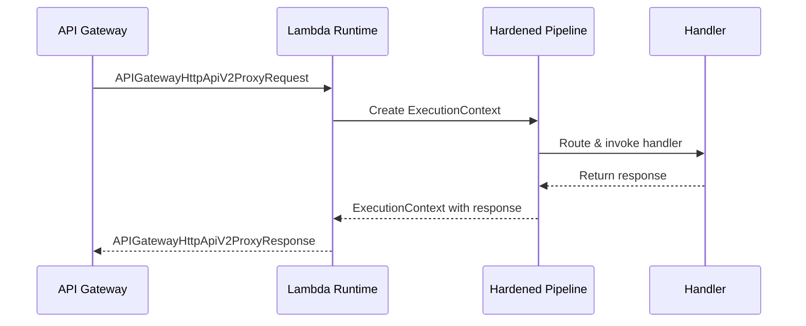

# Lambda Web Runtime

The Lambda web runtime (`Hardened.Amz.Web.Lambda.Runtime`) lets you deploy Hardened web applications as AWS Lambda functions behind API Gateway. You write standard `[Get]`, `[Post]`, `[Put]`, `[Delete]` routes exactly as you would for an ASP.NET Core application, and the web runtime translates API Gateway proxy events into the Hardened request pipeline.

---

## Setup

Add the web Lambda source generator:

```bash
dotnet add package Hardened.Amz.Web.Lambda.SourceGenerator --prerelease
```

This pulls in the web Lambda runtime and all framework dependencies.

---

## Application Module

The `Application.cs` for a Lambda web project uses the `[LambdaWebApplication]` attribute alongside `[HardenedModule]`:

```csharp title="Application.cs"
using Hardened.Shared.Runtime.Attributes;
using Hardened.Amz.Web.Lambda.Runtime;

[HardenedModule]
[LambdaWebApplication(Version = ProxyIntegrationType.HttpApiV2)]
public partial class Application { }
```

The `[LambdaWebApplication]` attribute tells the source generator to produce a Lambda handler that processes API Gateway proxy events and routes them through the Hardened web request pipeline.

---

## Proxy Integration Types

The `Version` property on `[LambdaWebApplication]` determines which API Gateway event format the runtime expects:

| Value | API Gateway Type | Event Format |
|---|---|---|
| `ProxyIntegrationType.HttpApiV2` | HTTP API (API Gateway v2) | `APIGatewayHttpApiV2ProxyRequest` |
| `ProxyIntegrationType.ApiGateway` | REST API (API Gateway v1) | `APIGatewayProxyRequest` |

```csharp
// HTTP API v2 (recommended for new projects)
[LambdaWebApplication(Version = ProxyIntegrationType.HttpApiV2)]

// REST API v1 (legacy)
[LambdaWebApplication(Version = ProxyIntegrationType.ApiGateway)]
```

!!! tip
    Use `HttpApiV2` for new projects. HTTP APIs are faster, cheaper, and support the simplified payload format. Use `ApiGateway` only when you need REST API features like request validation, API keys, or usage plans.

---

## Defining Routes

Routes use the same attributes as regular Hardened web applications. If you already have a Hardened web API, you can deploy it as a Lambda function by changing only the `Application.cs` module.

```csharp title="Handlers/BookController.cs"
using Hardened.Web.Runtime.Attributes;

[BasePath("/api/books")]
public class BookController
{
    private readonly IBookService _bookService;

    public BookController(IBookService bookService)
    {
        _bookService = bookService;
    }

    [Get("/{author}/{name}")]
    public async Task<BookResponse> GetBook(string author, string name)
    {
        return await _bookService.GetBook(author, name);
    }

    [Get("/")]
    public async Task<IReadOnlyList<BookResponse>> ListBooks()
    {
        return await _bookService.ListAll();
    }

    [Post("/")]
    public async Task<BookResponse> CreateBook(CreateBookRequest request)
    {
        return await _bookService.Create(request);
    }

    [Put("/{id}")]
    public async Task<BookResponse> UpdateBook(string id, UpdateBookRequest request)
    {
        return await _bookService.Update(id, request);
    }

    [Delete("/{id}")]
    public async Task DeleteBook(string id)
    {
        await _bookService.Delete(id);
    }
}
```

### Parameter Binding

Parameter binding works identically to the standard web runtime:

- **Path parameters** -- matched by name from the route template (`{author}`, `{name}`)
- **Body parameters** -- complex types are deserialized from the request body (JSON)
- **Query parameters** -- primitive types not matched by path are bound from the query string

---

## Request and Response Handling

The web Lambda runtime translates between API Gateway events and the Hardened execution model:



The runtime handles:

- Parsing headers, query strings, and path parameters from the proxy event
- Converting the request body (including Base64-encoded binary payloads)
- Setting response status codes, headers, and cookies
- Encoding the response body back into the proxy response format

---

## Accessing API Gateway Context

You can inject `IProxyRequestContextAccessor` to access API Gateway-specific request context:

```csharp
using Hardened.Amz.Web.Lambda.Runtime;

public class AuthController
{
    private readonly IProxyRequestContextAccessor _contextAccessor;

    public AuthController(IProxyRequestContextAccessor contextAccessor)
    {
        _contextAccessor = contextAccessor;
    }

    [Get("/api/whoami")]
    public object WhoAmI()
    {
        var requestContext = _contextAccessor.ProxyRequestContext;
        return new
        {
            AccountId = requestContext.AccountId,
            RequestId = requestContext.RequestId,
            Stage = requestContext.Stage
        };
    }
}
```

---

## Execution Filters

Because the web Lambda runtime uses the same Hardened execution pipeline, all `IExecutionFilter` implementations work without modification. Filters for authentication, logging, metrics, and error handling apply to Lambda web applications just as they do to ASP.NET Core applications.

```csharp
using Hardened.Requests.Abstract.Execution;
using Hardened.Shared.Runtime.Attributes;

[Expose]
[Singleton]
public class CorsFilter : IExecutionFilter
{
    public async Task Execute(IExecutionChain chain)
    {
        await chain.Next();

        chain.Context.Response.Headers["Access-Control-Allow-Origin"] = "*";
    }
}
```

---

## Portability Between Web and Lambda

One of the key advantages of the web Lambda runtime is code portability. You can share route handlers, services, and filters between an ASP.NET Core deployment and a Lambda deployment by changing only the `Application.cs` module:

=== "ASP.NET Core"

    ```csharp title="Application.cs"
    [HardenedModule]
    [AspNetCoreRuntime.Module]
    public partial class Application { }
    ```

=== "Lambda Web"

    ```csharp title="Application.cs"
    [HardenedModule]
    [LambdaWebApplication(Version = ProxyIntegrationType.HttpApiV2)]
    public partial class Application { }
    ```

All controllers, services, and filters remain identical.

---

## Testing

Lambda web applications can be tested using the standard `ITestWebApp` from `Hardened.Web.Testing`:

```csharp title="Bootstrap.cs"
using Hardened.Shared.Runtime.Attributes;
using Hardened.Web.Testing;

[assembly: WebTesting]
[assembly: HardenedTestEntryPoint(typeof(Application))]
```

```csharp title="BookControllerTests.cs"
using Hardened.Shared.Runtime.Attributes;
using Hardened.Web.Testing;

public class BookControllerTests
{
    [HardenedTest]
    public async Task GetBook_ReturnsBook(ITestWebApp testWebApp)
    {
        var response = await testWebApp.Get("/api/books/tolkien/hobbit");

        response.Assert.Ok();

        var book = response.Deserialize<BookResponse>();
        Assert.Equal("tolkien", book.Author);
    }

    [HardenedTest]
    public async Task CreateBook_ReturnsCreated(ITestWebApp testWebApp)
    {
        var response = await testWebApp.Post("/api/books/", new CreateBookRequest
        {
            Title = "The Hobbit",
            Author = "tolkien"
        });

        response.Assert.Ok();
    }
}
```

Because the web testing infrastructure exercises the same Hardened request pipeline, tests are portable between ASP.NET Core and Lambda deployments.

---

## Next Steps

- [Function Runtime](function-runtime.md) -- build request/response Lambda functions
- [DDB Stream Processing](ddb-stream.md) -- process DynamoDB Streams events
- [SQS Processing](sqs-processing.md) -- consume SQS message batches
- [Lambda Testing](testing.md) -- advanced testing patterns
