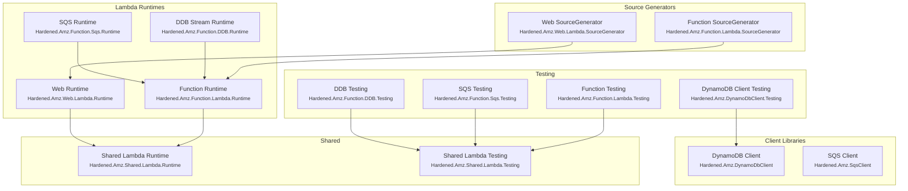

# AWS Overview

Hardened provides first-class support for AWS Lambda through the `Hardened.Amz` package family. These packages bring the same compile-time source generation, dependency injection, and request pipeline patterns from the core framework into the Lambda execution model -- enabling fast cold starts, minimal boilerplate, and consistent testing patterns across all Lambda trigger types.

---

## Package Hierarchy

The AWS packages are organized into three layers: **Lambda runtimes**, **shared infrastructure**, and **client libraries**.



---

## Which Packages Do I Need?

Choose the runtime packages based on your Lambda trigger type, then add the corresponding testing packages for your test project.

### By Use Case

| Use case | Runtime package | Source generator | Testing package |
|---|---|---|---|
| Lambda function (request/response) | `Hardened.Amz.Function.Lambda.Runtime` | `Hardened.Amz.Function.Lambda.SourceGenerator` | `Hardened.Amz.Function.Lambda.Testing` |
| Lambda web API (API Gateway) | `Hardened.Amz.Web.Lambda.Runtime` | `Hardened.Amz.Web.Lambda.SourceGenerator` | `Hardened.Web.Testing` |
| DynamoDB Streams processor | `Hardened.Amz.Function.DDB.Runtime` | `Hardened.Amz.Function.Lambda.SourceGenerator` | `Hardened.Amz.Function.DDB.Testing` |
| SQS batch processor | `Hardened.Amz.Function.Sqs.Runtime` | `Hardened.Amz.Function.Lambda.SourceGenerator` | `Hardened.Amz.Function.Sqs.Testing` |
| DynamoDB data access | `Hardened.Amz.DynamoDbClient` | -- | `Hardened.Amz.DynamoDbClient.Testing` |
| SQS messaging | `Hardened.Amz.SqsClient` | -- | -- |

!!! tip
    When installing, you typically only need to add the **source generator** package explicitly. It pulls in the corresponding runtime package as a transitive dependency.

### Installation

=== "Function Lambda"

    ```bash
    dotnet add package Hardened.Amz.Function.Lambda.SourceGenerator --prerelease
    ```

=== "Web Lambda (API Gateway)"

    ```bash
    dotnet add package Hardened.Amz.Web.Lambda.SourceGenerator --prerelease
    ```

=== "DDB Stream Lambda"

    ```bash
    dotnet add package Hardened.Amz.Function.Lambda.SourceGenerator --prerelease
    dotnet add package Hardened.Amz.Function.DDB.Runtime --prerelease
    ```

=== "SQS Lambda"

    ```bash
    dotnet add package Hardened.Amz.Function.Lambda.SourceGenerator --prerelease
    dotnet add package Hardened.Amz.Function.Sqs.Runtime --prerelease
    ```

---

## Core Concepts

### Application Module

Every Hardened Lambda starts with an `Application.cs` file that declares the module and, for specialized triggers, the runtime module:

```csharp
[HardenedModule]
public partial class Application { }
```

For specialized runtimes (SQS, DDB Streams, Web), you also apply a module attribute:

```csharp
[HardenedModule]
[SqsLambda.Module]           // SQS processing
public partial class Application { }
```

### Handler Pattern

Lambda handlers are plain C# classes with constructor injection. The `[HardenedFunction]` attribute marks the entry point method:

```csharp
public class OrderHandler
{
    private readonly IOrderService _orderService;

    public OrderHandler(IOrderService orderService)
    {
        _orderService = orderService;
    }

    [HardenedFunction("process-order")]
    public async Task<OrderResponse> Process(OrderRequest request)
    {
        return await _orderService.ProcessOrder(request);
    }
}
```

The source generator discovers handlers at compile time, generates the Lambda bootstrap, handles serialization/deserialization, and wires up DI -- no reflection at runtime.

### Execution Pipeline

All Lambda types run through the same Hardened execution pipeline used by web applications. This means `IExecutionFilter` implementations, middleware ordering, and cross-cutting concerns work identically across Lambda functions and web APIs.

---

## Architecture Comparison

| Feature | Function Runtime | Web Runtime | DDB Stream | SQS |
|---|---|---|---|---|
| Trigger | Direct invoke | API Gateway | DynamoDB Streams | SQS queue |
| Input | Custom payload | HTTP request | Stream records | SQS messages |
| Output | Custom response | HTTP response | `StreamsEventResponse` | `SQSBatchResponse` |
| Routing | `[HardenedFunction]` name | `[Get]`, `[Post]`, etc. | Single handler | Single handler |
| Batch processing | No | No | Yes (per-record) | Yes (per-message) |
| Partial failure | N/A | N/A | `BatchItemFailure` | `BatchItemFailure` |

---

## Next Steps

- [Function Runtime](lambda/function-runtime.md) -- build request/response Lambda functions
- [Web Runtime](lambda/web-runtime.md) -- deploy Hardened web APIs behind API Gateway
- [DDB Stream Processing](lambda/ddb-stream.md) -- process DynamoDB Streams events
- [SQS Processing](lambda/sqs-processing.md) -- consume SQS message batches
- [Lambda Testing](lambda/testing.md) -- test all Lambda types with `LambdaTestApp` and friends
- [DynamoDB Client](clients/dynamodb.md) -- access DynamoDB with `IDynamoDbClientProvider`
- [SQS Client](clients/sqs.md) -- send SQS messages with `ISqsClient`
