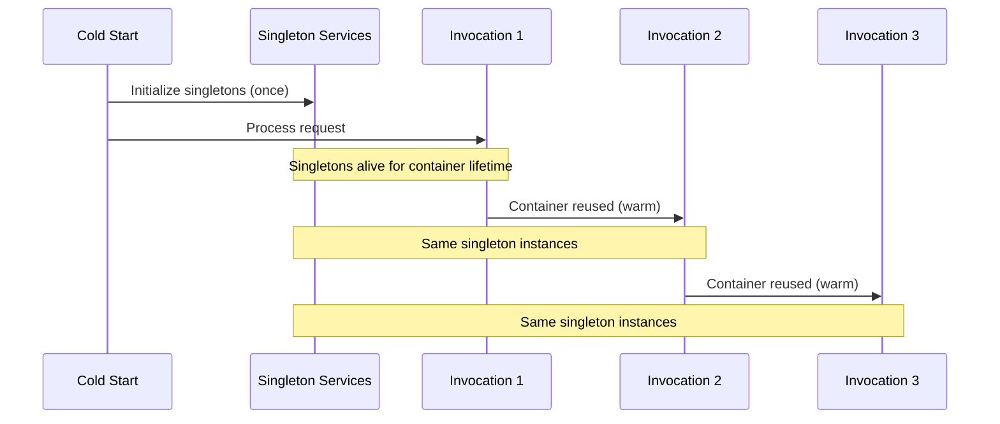

# Lambda Performance

AWS Lambda cold starts are the primary performance concern for serverless applications. Hardened's compile-time approach eliminates entire categories of cold-start overhead, but there are still choices that significantly impact startup time, memory usage, and invocation latency. This page covers opinionated recommendations for getting the best performance from Hardened Lambda functions.

---

## Why Hardened Is Fast on Lambda

Traditional .NET Lambda functions pay a cold-start tax for runtime reflection: assembly scanning, attribute discovery, DI container building, and route table construction. Hardened eliminates all of this.

| Operation | Traditional Framework | Hardened |
|---|---|---|
| DI registration | Runtime assembly scan | Pre-compiled method calls |
| Route discovery | Reflection over controllers | Compile-time route table |
| Configuration binding | Runtime property mapping | Generated implementation classes |
| Module composition | Convention-based discovery | Explicit generated `ConfigureModule` |

The result is that a Hardened Lambda function's cold start consists almost entirely of .NET runtime initialization and your actual service setup -- not framework overhead.

!!! info "Measured Impact"
    In typical workloads, eliminating reflection-based DI and routing shaves 100-300ms off cold start compared to equivalent ASP.NET Core Minimal API setups on Lambda. The exact savings depend on the number of services and routes.

---

## Source Generator Advantages

### No Reflection at Runtime

Every `[Expose]`, `[Get]`, `[ConfigurationModel]`, and `[HardenedFunction]` attribute is consumed at build time. The generated code is plain C# method calls:

```csharp
// What the source generator produces (conceptually):
services.AddSingleton<IOrderRepository, DynamoDbOrderRepository>();
services.AddTransient<IOrderValidator, OrderValidator>();
```

There is no `Assembly.GetTypes()`, no `Type.GetCustomAttributes()`, no `Activator.CreateInstance()`. This means:

- Faster cold start (no reflection overhead)
- Smaller working set (no reflection metadata cached in memory)
- AOT-friendly code (compatible with Native AOT when available)

### Smaller Binary Size

Source generators produce only the code your application needs. There is no generic DI container framework, no route matching engine, and no configuration binding library bundled into the deployment package. Smaller packages mean faster Lambda cold starts because the .NET runtime loads fewer assemblies.

### Tree-Shaking Friendly

Because all registrations are explicit method calls, the .NET linker can identify and remove unused code paths. This further reduces deployment size when publishing with trimming enabled.

---

## Singleton vs. Scoped vs. Transient in Lambda

Lifecycle choices have a direct impact on Lambda performance. Lambda reuses the same container instance across warm invocations, which makes the distinction between singleton and scoped particularly important.

### Lambda Container Lifecycle



- **Singletons** are created once when the Lambda container starts and live for the container's lifetime (potentially hours across many invocations).
- **Scoped** services are created once per invocation and disposed after the invocation completes.
- **Transient** services are created every time they are requested within an invocation.

### Performance Recommendations

| Service Type | Recommended Lifecycle | Rationale |
|---|---|---|
| AWS SDK clients (`IAmazonDynamoDB`, `IAmazonSQS`) | **Singleton** | Connection pooling, credential caching |
| `HttpClient` | **Singleton** | Socket reuse, DNS caching |
| DynamoDB repository | **Singleton** | Reuses the singleton SDK client |
| Configuration models | **Singleton** | Values do not change between invocations |
| Stateless validators | **Transient** | Cheap to create, no shared state |
| Per-request context | **Scoped** | Fresh state per invocation |
| Loggers | **Singleton** | Thread-safe, reusable |

!!! tip "Default to Singleton for AWS Clients"
    AWS SDK clients (`AmazonDynamoDBClient`, `AmazonSQSClient`, etc.) are thread-safe and maintain internal connection pools. Always register them as singletons to avoid re-establishing connections on every invocation.

---

## Connection Reuse

Connection establishment is one of the most expensive operations during a Lambda invocation. Reuse connections aggressively.

### DynamoDB Client as Singleton

```csharp
[Expose(typeof(IDynamoDbClientProvider))]
[Singleton]
public class DynamoDbClientProvider : IDynamoDbClientProvider
{
    private readonly IAmazonDynamoDB _client;

    public DynamoDbClientProvider()
    {
        _client = new AmazonDynamoDBClient();
    }

    public IAmazonDynamoDB GetClient() => _client;
}
```

!!! note "Hardened.Amz.DynamoDbClient"
    The `Hardened.Amz.DynamoDbClient` package already provides a singleton `IDynamoDbClientProvider`. You do not need to register it manually -- the package's source generator handles this. The example above illustrates the pattern for custom clients.

### SQS Client as Singleton

```csharp
[Expose(typeof(ISqsClient))]
[Singleton]
public class SqsClientWrapper : ISqsClient
{
    private readonly IAmazonSQS _client;

    public SqsClientWrapper()
    {
        _client = new AmazonSQSClient();
    }

    // ...
}
```

### HttpClient as Singleton

```csharp
[Expose(typeof(IApiClient))]
[Singleton]
public class ApiClient : IApiClient
{
    private static readonly HttpClient _httpClient = new()
    {
        Timeout = TimeSpan.FromSeconds(30)
    };

    public async Task<string> Get(string url)
    {
        var response = await _httpClient.GetAsync(url);
        response.EnsureSuccessStatusCode();
        return await response.Content.ReadAsStringAsync();
    }
}
```

!!! warning "Never Create HttpClient Per Request"
    Creating a new `HttpClient` for each invocation causes socket exhaustion under load. Always reuse a single `HttpClient` instance via singleton registration or a `static` field.

---

## Startup Optimization with IStartupService

`IStartupService` runs async initialization logic once during cold start. Use it for operations that must complete before the first invocation:

```csharp
[Expose(typeof(IStartupService))]
[Singleton]
public class CacheWarmupService : IStartupService
{
    private readonly IDynamoDbClientProvider _dbProvider;

    public CacheWarmupService(IDynamoDbClientProvider dbProvider)
    {
        _dbProvider = dbProvider;
    }

    public async Task StartAsync()
    {
        // Pre-warm the DynamoDB connection
        var client = _dbProvider.GetClient();
        await client.DescribeTableAsync("MyTable");
    }
}
```

### Startup Guidelines

1. **Keep startup fast.** Every millisecond in `StartAsync` adds to cold-start latency. Only perform essential initialization.
2. **Pre-warm connections.** A simple `DescribeTable` or `GetQueueUrl` call forces the SDK to establish a connection, so the first real request does not pay the connection cost.
3. **Do not load large datasets.** If you need reference data, load it lazily on first access rather than blocking startup.

---

## Memory Configuration

Lambda memory allocation directly affects CPU allocation and cold-start speed. More memory means more CPU, which means faster .NET JIT compilation during cold start.

### Recommended Settings

| Workload | Recommended Memory | Notes |
|---|---|---|
| Simple API handler | 256-512 MB | Sufficient for most request/response functions |
| DynamoDB + business logic | 512-1024 MB | More CPU helps with serialization |
| Complex data processing | 1024-2048 MB | Heavy computation benefits from more CPU |
| Canary functions | 256-512 MB | Canaries are lightweight by design |

!!! tip "Profile Before Optimizing"
    Use CloudWatch metrics and Lambda Power Tuning to find the optimal memory setting for your function. Increasing memory from 256 MB to 512 MB often reduces cold start by 30-50% while only doubling cost per invocation (which is offset by the shorter duration).

### Measuring Cold Start

Add a filter to measure cold-start duration:

```csharp
[Expose]
[Singleton]
public class ColdStartMetricsFilter : IExecutionFilter
{
    private static bool _isColdStart = true;

    public int Order => ExecutionFilterOrder.Init;

    public async Task Execute(IExecutionChain chain)
    {
        if (_isColdStart)
        {
            _isColdStart = false;
            var logger = chain.Context.Services
                .GetRequiredService<ILogger<ColdStartMetricsFilter>>();
            logger.LogInformation("Cold start invocation");
        }

        await chain.Next();
    }
}
```

---

## Binary Size Optimization

Smaller deployment packages load faster on Lambda. Hardened's compile-time approach already produces lean binaries, but you can go further.

### Publish with Trimming

```xml title=".csproj"
<PropertyGroup>
  <PublishTrimmed>true</PublishTrimmed>
  <TrimMode>link</TrimMode>
</PropertyGroup>
```

Because Hardened generates explicit code (no reflection), trimming is safe for the framework itself. However, test with trimming enabled -- third-party libraries may use reflection that trimming breaks.

### Exclude Debug Symbols

```xml title=".csproj"
<PropertyGroup>
  <DebugType>none</DebugType>
  <DebugSymbols>false</DebugSymbols>
</PropertyGroup>
```

### Avoid Unnecessary Package References

Every NuGet package adds assemblies to the deployment. Audit your dependencies regularly:

```bash
dotnet list package
```

Remove packages that are no longer used. Replace heavyweight libraries with lightweight alternatives when possible.

---

## Multi-Handler Routing

A single Lambda function can host multiple route handlers using the web Lambda runtime. This reduces cold-start frequency by keeping a single container warm for related endpoints.

### Shared Container Pattern

```csharp title="Application.cs"
[HardenedModule]
[WebLambda.Module]
public partial class Application { }
```

```csharp title="Controllers/OrderController.cs"
[BasePath("/orders")]
public class OrderController
{
    [Get("/{orderId}")]
    public async Task<OrderResponse> GetOrder(string orderId) { }

    [Post("/")]
    public async Task<OrderResponse> CreateOrder(OrderRequest request) { }

    [Delete("/{orderId}")]
    public async Task DeleteOrder(string orderId) { }
}

[BasePath("/products")]
public class ProductController
{
    [Get("/{productId}")]
    public async Task<ProductResponse> GetProduct(string productId) { }

    [Get("/")]
    public async Task<IReadOnlyList<ProductResponse>> ListProducts() { }
}
```

Both controllers share a single Lambda function behind API Gateway. Warm invocations to `/orders` keep the container alive for `/products` requests as well.

### When to Use Multi-Handler vs. Single-Handler

| Approach | Use When |
|---|---|
| **Multi-handler** (web Lambda) | Related API endpoints that share DI registrations and are called together |
| **Single-handler** (function Lambda) | Event processors (SQS, DynamoDB Streams), cron jobs, or handlers with very different dependency profiles |

!!! tip "Consolidate Related Endpoints"
    If you have five microservices that all share the same DynamoDB table and service layer, consider consolidating them into one web Lambda function with multiple controllers. This reduces the number of cold starts your users experience and simplifies deployment.

---

## Avoid Runtime Reflection

This is the single most impactful recommendation for Lambda performance. Hardened's architecture makes it easy to follow, but be vigilant about third-party libraries and custom code that introduce reflection.

### Red Flags

- `Assembly.GetTypes()` or `Assembly.GetExportedTypes()`
- `Type.GetCustomAttributes()`
- `Activator.CreateInstance()`
- `Expression.Compile()` on first invocation
- Libraries that use "convention-based" discovery

### Alternatives

| Instead of | Use |
|---|---|
| Runtime assembly scanning | Hardened's `[Expose]` attributes (compile-time) |
| `Activator.CreateInstance` | Constructor injection via DI |
| Runtime configuration binding | `[ConfigurationModel]` with source-generated implementation |
| Dynamic route registration | `[Get]`, `[Post]`, `[Put]`, `[Delete]` attributes |
| `System.Text.Json` source generation | Use `[JsonSerializable]` context for AOT-friendly serialization |

---

## Summary Checklist

Use this checklist when reviewing a Hardened Lambda function for performance:

- [ ] AWS SDK clients registered as singletons
- [ ] `HttpClient` reused via singleton or static field
- [ ] No `new HttpClient()` per invocation
- [ ] Configuration models registered as singletons
- [ ] `IStartupService` used for connection pre-warming (if needed)
- [ ] No runtime reflection in hot paths
- [ ] Lambda memory set appropriately (not the 128 MB default)
- [ ] Deployment package trimmed for production
- [ ] Debug symbols excluded from production builds
- [ ] Related endpoints consolidated into multi-handler functions where appropriate
- [ ] Unnecessary package references removed

---

## Next Steps

- [Dependency Injection Best Practices](dependency-injection.md) -- lifecycle decisions that affect performance
- [Testing Strategy](testing-strategy.md) -- test Lambda functions locally before deployment
- [Project Organization](project-organization.md) -- structure Lambda projects for maintainability
