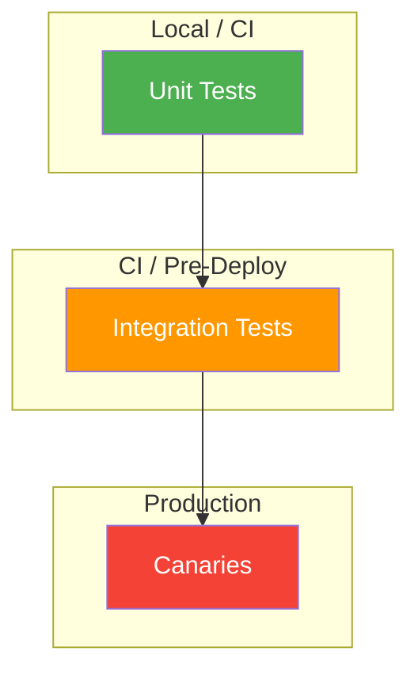
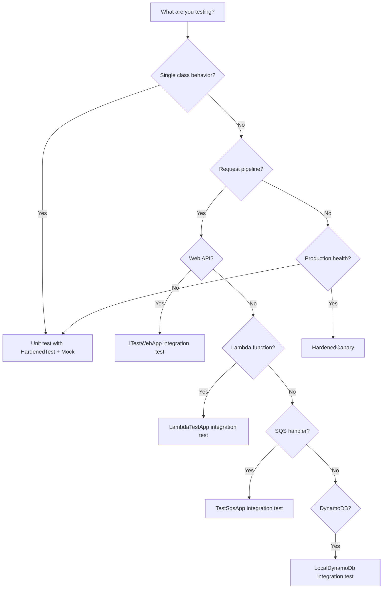

# Testing Strategy

Hardened provides a layered testing system that mirrors the testing pyramid: fast unit tests at the base, integration tests in the middle, and canary tests at the top. Each layer uses purpose-built tooling that integrates with the compile-time DI system.

---

## The Testing Pyramid



| Layer | Purpose | Speed | Infrastructure | When to Run |
|---|---|---|---|---|
| **Unit tests** | Verify individual services in isolation | Fast (ms) | None | Every build, every commit |
| **Integration tests** | Verify services working together, including real DI and HTTP/Lambda pipelines | Moderate (seconds) | Testcontainers (DynamoDB) | CI pipeline |
| **Canaries** | Verify production health from the outside | Slow (seconds) | Real AWS services | Continuously in production |

!!! tip "Invest Most in Unit Tests"
    Unit tests are the cheapest to write, fastest to run, and easiest to debug. If a behavior can be tested with a unit test, test it there. Reserve integration tests for verifying that components wire together correctly, and canaries for verifying production health.

---

## Unit Tests with [HardenedTest] + [Mock]

Unit tests verify a single class in isolation by mocking its dependencies. Hardened's test framework uses NSubstitute under the hood.

### Basic Pattern

```csharp
public class OrderServiceTests
{
    [HardenedTest]
    public async Task CreateOrder_SavesAndReturnsResponse(
        IOrderService orderService,
        [Mock] IOrderRepository mockRepository)
    {
        // Arrange
        var request = new OrderRequest
        {
            CustomerId = "CUST-123",
            Amount = 99.99m
        };

        // Act
        var response = await orderService.CreateOrder(request);

        // Assert
        Assert.Equal("CUST-123", response.CustomerId);
        await mockRepository.Received(1).Save(Arg.Any<Order>());
    }
}
```

**How it works:**

1. `[HardenedTest]` extends xUnit's `[Fact]` and activates the Hardened test framework
2. `IOrderService` is resolved from the DI container with its real implementation
3. `[Mock] IOrderRepository` is replaced with an NSubstitute mock -- the mock is injected everywhere `IOrderRepository` is needed
4. The test method parameters are injected automatically

### When to Use [Mock]

Mock dependencies that:

- Talk to external systems (databases, APIs, message queues)
- Are slow or non-deterministic (timers, random generators)
- You want to verify interactions with (calls received, arguments passed)

Do **not** mock:

- The class under test -- test real behavior
- Simple value objects or DTOs
- Lightweight, stateless services that can run as-is

### Configuring Mock Behavior

Since mocks are NSubstitute instances, use the standard NSubstitute API:

```csharp
[HardenedTest]
public async Task GetOrder_ReturnsNull_WhenNotFound(
    IOrderService orderService,
    [Mock] IOrderRepository mockRepository)
{
    // Arrange
    mockRepository.GetById("missing-id")
        .Returns(Task.FromResult<Order?>(null));

    // Act & Assert
    await Assert.ThrowsAsync<NotFoundException>(
        () => orderService.GetOrder("missing-id"));
}
```

### Testing with Configuration Models

You can mock configuration models the same way you mock any interface:

```csharp
[HardenedTest]
public async Task Service_UsesConfiguredTimeout(
    IMyService service,
    [Mock] IApiConfig mockConfig)
{
    mockConfig.TimeoutMs.Returns(5000);

    var result = await service.CallApi();

    Assert.True(result.Success);
}
```

---

## Integration Tests with ITestWebApp

Integration tests verify that the full request pipeline works end-to-end -- routing, parameter binding, filters, DI resolution, and response serialization.

### Web API Integration Tests

```csharp
public class OrderControllerIntegrationTests
{
    [HardenedTest]
    public async Task CreateOrder_ReturnsCreatedOrder(ITestWebApp testWebApp)
    {
        var request = new OrderRequest
        {
            CustomerId = "CUST-123",
            Amount = 49.99m
        };

        var response = await testWebApp.Post("/orders", request);

        response.Assert.Ok();
        var order = response.Deserialize<OrderResponse>();
        Assert.Equal("CUST-123", order.CustomerId);
        Assert.NotNull(order.OrderId);
    }

    [HardenedTest]
    public async Task GetOrder_Returns404_WhenNotFound(ITestWebApp testWebApp)
    {
        var response = await testWebApp.Get("/orders/nonexistent");

        response.Assert.NotFound();
    }
}
```

`ITestWebApp` simulates the full ASP.NET Core pipeline in-process. No real HTTP server is started -- requests are dispatched directly through the Hardened middleware chain.

### Bootstrap for Web Tests

```csharp title="Bootstrap.cs"
using Hardened.Web.Testing;
using Hardened.Shared.Runtime.Attributes;

[assembly: WebTesting]
[assembly: HardenedTestEntryPoint(typeof(Application))]
```

### Mixing Mocks and Integration

You can combine `ITestWebApp` with `[Mock]` to test the full pipeline while stubbing external dependencies:

```csharp
[HardenedTest]
public async Task CreateOrder_CallsPaymentGateway(
    ITestWebApp testWebApp,
    [Mock] IPaymentGateway mockPayment)
{
    mockPayment.Charge(Arg.Any<decimal>(), Arg.Any<string>())
        .Returns(Task.FromResult(new PaymentResult { Success = true }));

    var response = await testWebApp.Post("/orders", new OrderRequest
    {
        CustomerId = "CUST-123",
        Amount = 49.99m
    });

    response.Assert.Ok();
    await mockPayment.Received(1).Charge(49.99m, Arg.Any<string>());
}
```

---

## Lambda Integration Tests with LambdaTestApp

`LambdaTestApp` provides the Lambda equivalent of `ITestWebApp`. It simulates the Lambda runtime, including deserialization, DI resolution, and the execution pipeline.

### Basic Lambda Test

```csharp
public class OrderHandlerTests
{
    [HardenedTest]
    public async Task Process_ReturnsProcessedOrder(LambdaTestApp testApp)
    {
        var request = new OrderRequest
        {
            OrderId = "ORD-001",
            CustomerId = "CUST-123",
            Amount = 99.99m
        };

        var response = await testApp.Invoke<OrderRequest, OrderResponse>(request);

        Assert.Equal("ORD-001", response.OrderId);
        Assert.Equal("Processed", response.Status);
    }
}
```

### Bootstrap for Lambda Tests

```csharp title="Bootstrap.cs"
using Hardened.Shared.Runtime.Attributes;

[assembly: HardenedTestEntryPoint(typeof(Application))]
```

### Lambda Tests with Mocks

```csharp
[HardenedTest]
public async Task Process_SavesToDynamoDb(
    LambdaTestApp testApp,
    [Mock] IOrderRepository mockRepository)
{
    var request = new OrderRequest { OrderId = "ORD-001" };

    await testApp.Invoke<OrderRequest, OrderResponse>(request);

    await mockRepository.Received(1).Save(
        Arg.Is<Order>(o => o.OrderId == "ORD-001"));
}
```

---

## SQS Integration Tests with TestSqsApp

`TestSqsApp` simulates the SQS Lambda runtime, including batch processing and message deserialization.

```csharp
public class OrderEventHandlerTests
{
    [HardenedTest]
    public async Task ProcessMessage_HandlesOrderEvent(TestSqsApp testSqsApp)
    {
        var orderEvent = new OrderEvent
        {
            OrderId = "ORD-001",
            Action = "Created"
        };

        await testSqsApp.SendMessage(orderEvent);

        // Assert side effects via mocks or test doubles
    }

    [HardenedTest]
    public async Task ProcessBatch_HandlesMultipleMessages(
        TestSqsApp testSqsApp,
        [Mock] IOrderProcessor mockProcessor)
    {
        var events = new[]
        {
            new OrderEvent { OrderId = "ORD-001", Action = "Created" },
            new OrderEvent { OrderId = "ORD-002", Action = "Updated" }
        };

        foreach (var evt in events)
        {
            await testSqsApp.SendMessage(evt);
        }

        await mockProcessor.Received(2).Process(Arg.Any<OrderEvent>());
    }
}
```

---

## DynamoDB Integration Tests with [LocalDynamoDb]

For tests that need a real DynamoDB instance, use the `[LocalDynamoDb]` attribute with Testcontainers. This spins up a local DynamoDB container for the test run.

```csharp
public class OrderRepositoryTests
{
    [HardenedTest]
    [LocalDynamoDb]
    public async Task Save_And_Retrieve_Order(
        IOrderRepository repository,
        IDynamoDbClientProvider dbProvider)
    {
        // Create the table
        var client = dbProvider.GetClient();
        await client.CreateTableAsync(new CreateTableRequest
        {
            TableName = "Orders",
            KeySchema = new List<KeySchemaElement>
            {
                new("OrderId", KeyType.HASH)
            },
            AttributeDefinitions = new List<AttributeDefinition>
            {
                new("OrderId", ScalarAttributeType.S)
            },
            BillingMode = BillingMode.PAY_PER_REQUEST
        });

        // Test
        var order = new Order { OrderId = "ORD-001", CustomerId = "CUST-123" };
        await repository.Save(order);

        var retrieved = await repository.GetById("ORD-001");
        Assert.NotNull(retrieved);
        Assert.Equal("CUST-123", retrieved.CustomerId);
    }
}
```

### Prerequisites

- Docker must be running on the machine executing the tests
- The `Hardened.Amz.DynamoDbClient.Testing` package must be referenced

!!! warning "DynamoDB Tests Are Slower"
    Testcontainers starts a Docker container, which adds several seconds of overhead. Use `[LocalDynamoDb]` only for tests that genuinely need DynamoDB -- mock the repository interface for everything else.

### Table Setup Pattern

Create a shared helper for table provisioning to avoid duplicating `CreateTableAsync` calls across tests:

```csharp
public static class TestTableHelper
{
    public static async Task CreateOrdersTable(IDynamoDbClientProvider dbProvider)
    {
        var client = dbProvider.GetClient();
        await client.CreateTableAsync(new CreateTableRequest
        {
            TableName = "Orders",
            KeySchema = new List<KeySchemaElement>
            {
                new("OrderId", KeyType.HASH)
            },
            AttributeDefinitions = new List<AttributeDefinition>
            {
                new("OrderId", ScalarAttributeType.S)
            },
            BillingMode = BillingMode.PAY_PER_REQUEST
        });
    }
}
```

---

## Canary Tests with [HardenedCanary]

Canaries are production health checks that run as Lambda functions on a schedule. Because `[HardenedCanary]` extends xUnit's `[Fact]`, you can run them locally as standard tests during development.

### Canary Structure

```csharp
public class ApiHealthCanary
{
    private readonly IApiClient _apiClient;

    public ApiHealthCanary(IApiClient apiClient)
    {
        _apiClient = apiClient;
    }

    [HardenedCanary(Frequency = 5, Unit = CanaryFrequencyUnit.Minute)]
    public async Task CheckApiHealth(ITestContext context)
    {
        await context.Step(async () =>
        {
            var response = await _apiClient.GetHealth();
            response.EnsureSuccessStatusCode();
        }, "Call health endpoint");

        await context.Step(async () =>
        {
            var response = await _apiClient.GetOrders();
            response.EnsureSuccessStatusCode();
        }, "Verify orders endpoint");
    }
}
```

### Canary Design Guidelines

1. **Test from the outside.** Canaries should make real HTTP calls to your production APIs, not resolve internal services. They represent a user's perspective.

2. **Use steps for granularity.** Each `context.Step()` is reported independently to CloudWatch. Break multi-step workflows into named steps so failures pinpoint the exact problem.

3. **Keep canaries fast.** A canary that takes 30 seconds to run is expensive at a 5-minute frequency. Design for efficiency -- check critical paths, not exhaustive scenarios.

4. **Use configuration for endpoints.** Do not hardcode URLs. Use `[ConfigurationModel]` with `[FromEnvironmentVariable]` so the same canary code works across environments:

    ```csharp
    [ConfigurationModel]
    public interface ICanaryConfig
    {
        [FromEnvironmentVariable("API_BASE_URL")]
        string ApiBaseUrl { get; }
    }
    ```

5. **Clean up test data.** If a canary creates resources (test orders, test users), delete them in a final step or use a dedicated test account that is cleaned up separately.

---

## Test Organization Patterns

### Mirror Source Structure

Organize test files to mirror the source project. This makes it trivial to navigate between a class and its tests:

```
MyService/
  Controllers/
    OrderController.cs
  Services/
    OrderService.cs
MyService.Tests/
  Controllers/
    OrderControllerTests.cs
  Services/
    OrderServiceTests.cs
```

### One Test Class Per Source Class

Each source class should have one corresponding test class. Within the test class, organize methods by the method being tested:

```csharp
public class OrderServiceTests
{
    // --- CreateOrder ---

    [HardenedTest]
    public async Task CreateOrder_SavesOrder(/* ... */) { }

    [HardenedTest]
    public async Task CreateOrder_ValidatesInput(/* ... */) { }

    [HardenedTest]
    public async Task CreateOrder_ReturnsResponse(/* ... */) { }

    // --- GetOrder ---

    [HardenedTest]
    public async Task GetOrder_ReturnsOrder_WhenExists(/* ... */) { }

    [HardenedTest]
    public async Task GetOrder_ThrowsNotFound_WhenMissing(/* ... */) { }
}
```

### Test Naming Convention

Use the pattern `MethodName_ExpectedBehavior` or `MethodName_ExpectedBehavior_WhenCondition`:

```
CreateOrder_SavesOrder
CreateOrder_ThrowsValidationException_WhenAmountIsNegative
GetOrder_ReturnsNull_WhenNotFound
```

---

## Choosing the Right Test Layer

Use this decision tree to decide where to test a behavior:



### Summary Table

| What to Test | Tool | Speed | Mocks? |
|---|---|---|---|
| Service logic in isolation | `[HardenedTest]` + `[Mock]` | Fast | Yes |
| Web API routes end-to-end | `ITestWebApp` | Fast | Optional |
| Lambda function invocations | `LambdaTestApp` | Fast | Optional |
| SQS message processing | `TestSqsApp` | Fast | Optional |
| DynamoDB read/write operations | `[LocalDynamoDb]` | Slow (Docker) | No |
| Production endpoint health | `[HardenedCanary]` | Slow (real HTTP) | No |

---

## Bootstrap Patterns

Every test project requires a `Bootstrap.cs` file. The attributes tell the test framework which Application module to use and what runtime features to enable.

=== "Web API Tests"

    ```csharp title="Bootstrap.cs"
    using Hardened.Web.Testing;
    using Hardened.Shared.Runtime.Attributes;

    [assembly: WebTesting]
    [assembly: HardenedTestEntryPoint(typeof(Application))]
    ```

=== "Lambda Tests"

    ```csharp title="Bootstrap.cs"
    using Hardened.Shared.Runtime.Attributes;

    [assembly: HardenedTestEntryPoint(typeof(Application))]
    ```

=== "Canary Tests (Local)"

    ```csharp title="Bootstrap.cs"
    using Hardened.Shared.Runtime.Attributes;

    [assembly: HardenedTestEntryPoint(typeof(Application))]
    ```

!!! note "One Bootstrap Per Test Project"
    Each test project has exactly one `Bootstrap.cs` file. If your solution has multiple host projects, create a separate test project (and bootstrap) for each.

---

## Anti-Patterns to Avoid

### Testing Implementation Details

```csharp
// BAD: Testing that a private method was called
[HardenedTest]
public async Task CreateOrder_CallsPrivateValidateMethod(/* ... */)
{
    // You can't and shouldn't mock private methods
}
```

Test observable behavior (return values, state changes, interactions with dependencies), not internal implementation details.

### Over-Mocking

```csharp
// BAD: Mocking everything, testing nothing
[HardenedTest]
public async Task CreateOrder_Works(
    [Mock] IOrderService mockService)
{
    mockService.CreateOrder(Arg.Any<OrderRequest>())
        .Returns(new OrderResponse { Status = "Created" });

    var result = await mockService.CreateOrder(new OrderRequest());

    Assert.Equal("Created", result.Status); // You're testing NSubstitute, not your code
}
```

Mock dependencies of the class under test, not the class itself.

### Skipping Integration Tests

Unit tests alone cannot catch wiring issues -- a misconfigured route, a missing DI registration, or a broken filter chain. Always have at least one integration test per endpoint or handler that exercises the full pipeline.

---

## Next Steps

- [Dependency Injection Best Practices](dependency-injection.md) -- DI patterns that make testing easier
- [Lambda Performance](lambda-performance.md) -- performance considerations that affect test design
- [Project Organization](project-organization.md) -- structure test projects alongside source
