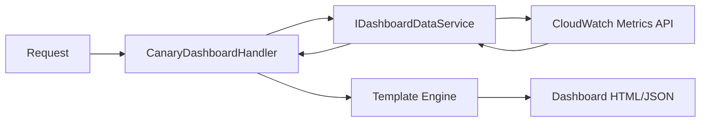

# CloudWatch Integration

The canary system integrates with Amazon CloudWatch for metrics reporting and dashboard visualization. When a canary runs, its result is published as a CloudWatch metric. The dashboard handler generates visual summaries from these metrics using a template engine.

---

## Metrics reporting

By default, every canary reports metrics to CloudWatch after each execution. The `ReportMetric` property on `[HardenedCanary]` controls this behavior.

```csharp
// Metrics enabled (default)
[HardenedCanary(Frequency = 5, Unit = CanaryFrequencyUnit.Minute)]
public async Task MonitoredCheck(ITestContext context) { ... }

// Metrics disabled
[HardenedCanary(Frequency = 5, Unit = CanaryFrequencyUnit.Minute, ReportMetric = false)]
public async Task UnmonitoredCheck(ITestContext context) { ... }
```

### What gets reported

Each canary execution publishes metrics that capture the outcome and performance of the run:

| Metric | Description |
|---|---|
| Success/Failure | Whether the canary passed or threw an exception |
| Duration | Execution time of the canary method |
| Step durations | Individual timing for each `context.Step()` call |

Metrics are published with dimensions that identify the specific canary, making it possible to filter and aggregate across your canary fleet.

### Metric dimensions

Metrics are tagged with dimensions that allow filtering in CloudWatch:

- **Canary name** -- the `Name` property from the attribute (or method name if not specified)
- **Canary class** -- the fully qualified class name containing the canary

These dimensions let you build dashboards and alarms scoped to individual canaries, canary groups, or the entire fleet.

---

## CanaryDashboardHandler

The `CanaryDashboardHandler` is a Lambda function that generates CloudWatch dashboards for your canaries.

```
Lambda: canary-cloud-watch-dashboard
Entry:  CanaryDashboardHandler
Trigger: API Gateway or direct Lambda invocation
```

### How it works

The dashboard handler uses `IDashboardDataService` and a template engine to produce dashboard output:



1. The handler receives a request (via API Gateway or direct invocation)
2. `IDashboardDataService` queries CloudWatch for canary metric data
3. The metric data is passed to the template engine
4. The template engine renders an HTML or JSON dashboard

### Output formats

The dashboard handler can produce:

- **HTML** -- a self-contained dashboard page suitable for embedding or standalone viewing
- **JSON** -- CloudWatch dashboard body JSON that can be used with the CloudWatch Dashboard API

---

## Dashboard templates

Dashboards are generated using Hardened's template engine. Templates define the layout and widgets that display canary metrics.

### Template structure

Dashboard templates use the Mustache-style template syntax provided by `Hardened.Templates.Runtime`. The template receives canary metric data as its context and renders the appropriate widgets.

A dashboard typically includes:

- **Status summary** -- overall pass/fail counts across all canaries
- **Individual canary status** -- per-canary success rate over a time window
- **Duration charts** -- execution time trends for each canary
- **Failure details** -- recent failure messages and timestamps

### Customizing dashboards

You can customize dashboard output by providing your own templates. The template engine supports the standard Hardened template features including helpers and partials.

!!! tip
    Use the `[TemplatePackage]` and `[TemplateHelper]` attributes from `Hardened.Templates.Abstract` to register custom template packages and helpers for your dashboard templates.

---

## Setting up CloudWatch alarms

While the canary system publishes metrics automatically, you need to configure CloudWatch alarms separately to get notified of failures. Alarms can be set up through the AWS Console, CLI, CDK, or CloudFormation.

### Alarm on canary failure

Create an alarm that triggers when a canary fails:

```yaml title="CloudFormation example"
CanaryFailureAlarm:
  Type: AWS::CloudWatch::Alarm
  Properties:
    AlarmName: canary-api-health-failure
    AlarmDescription: API health canary is failing
    Namespace: Hardened/Canaries
    MetricName: CanaryFailure
    Dimensions:
      - Name: CanaryName
        Value: CheckApiHealth
    Statistic: Sum
    Period: 300
    EvaluationPeriods: 1
    Threshold: 1
    ComparisonOperator: GreaterThanOrEqualToThreshold
    AlarmActions:
      - !Ref AlertSNSTopic
```

### Alarm on canary duration

Create an alarm that triggers when a canary takes too long:

```yaml title="CloudFormation example"
CanaryDurationAlarm:
  Type: AWS::CloudWatch::Alarm
  Properties:
    AlarmName: canary-api-health-slow
    AlarmDescription: API health canary is running slowly
    Namespace: Hardened/Canaries
    MetricName: CanaryDuration
    Dimensions:
      - Name: CanaryName
        Value: CheckApiHealth
    Statistic: Average
    Period: 300
    EvaluationPeriods: 3
    Threshold: 30000
    ComparisonOperator: GreaterThanThreshold
    AlarmActions:
      - !Ref AlertSNSTopic
```

### Alarm on missing data

Detect when a canary stops running entirely (the scheduler or invoke handler may be broken):

```yaml title="CloudFormation example"
CanaryMissingAlarm:
  Type: AWS::CloudWatch::Alarm
  Properties:
    AlarmName: canary-api-health-missing
    AlarmDescription: API health canary has stopped reporting
    Namespace: Hardened/Canaries
    MetricName: CanarySuccess
    Dimensions:
      - Name: CanaryName
        Value: CheckApiHealth
    Statistic: SampleCount
    Period: 900
    EvaluationPeriods: 1
    Threshold: 1
    ComparisonOperator: LessThanThreshold
    TreatMissingData: breaching
    AlarmActions:
      - !Ref AlertSNSTopic
```

!!! warning
    Always configure a "missing data" alarm for critical canaries. A canary that stops running silently is worse than one that fails loudly.

---

## CDK integration

If you use the `Hardened.Amz.Cdk` package, you can define canary alarms programmatically alongside your canary infrastructure:

```csharp title="CDK Stack example"
// After defining your canary Lambda functions...

var failureAlarm = new Alarm(this, "CanaryFailureAlarm", new AlarmProps
{
    AlarmName = "canary-api-health-failure",
    Metric = new Metric(new MetricProps
    {
        Namespace = "Hardened/Canaries",
        MetricName = "CanaryFailure",
        DimensionsMap = new Dictionary<string, string>
        {
            ["CanaryName"] = "CheckApiHealth"
        },
        Statistic = "Sum",
        Period = Duration.Minutes(5)
    }),
    Threshold = 1,
    EvaluationPeriods = 1,
    ComparisonOperator = ComparisonOperator.GREATER_THAN_OR_EQUAL_TO_THRESHOLD
});

failureAlarm.AddAlarmAction(new SnsAction(alertTopic));
```

---

## Monitoring best practices

### Tiered alerting

Not all canaries warrant the same urgency. Organize your alarms into tiers:

| Tier | Canary type | Alert channel | Example |
|---|---|---|---|
| Critical | Core API health, authentication | PagerDuty / phone | `CheckApiHealth`, `CheckAuthService` |
| High | Database connectivity, payment processing | Slack + email | `CheckDatabaseHealth`, `CheckPaymentGateway` |
| Medium | Non-critical integrations, background jobs | Slack | `CheckReportGeneration`, `CheckEmailDelivery` |
| Low | Informational checks | Dashboard only | `CheckCacheHitRate`, `CheckQueueDepth` |

### Dashboard organization

Group related canaries on the same dashboard:

- **Service dashboard** -- all canaries for a single service
- **Tier dashboard** -- all critical canaries across services
- **Overview dashboard** -- aggregate pass/fail rates for the entire fleet

### Retention and analysis

CloudWatch metrics are retained according to the standard CloudWatch retention schedule. For long-term trend analysis, consider:

- Exporting metrics to S3 via CloudWatch Metric Streams
- Setting up CloudWatch Contributor Insights rules
- Using CloudWatch Anomaly Detection on canary duration metrics to automatically baseline normal performance

---

## Disabling metrics for development

When running canaries locally with `dotnet test`, the CloudWatch integration is not active. Metrics are only published when canaries execute within the Lambda runtime. You do not need to set `ReportMetric = false` for local development -- the runtime environment handles this automatically.

---

## Next steps

- [Defining Canaries](defining-canaries.md) -- learn how to write canary methods
- [Flight Control](flight-control.md) -- understand the scheduling system
- [Overview](overview.md) -- return to the canary system overview
