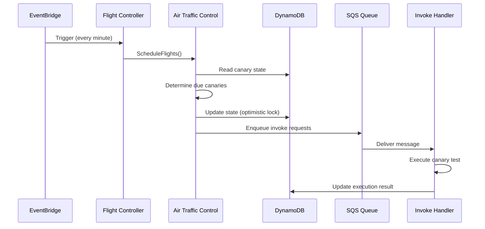
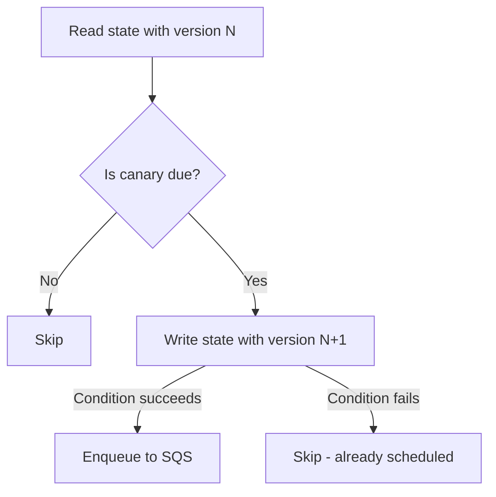

# Flight Control

Flight control is the scheduling layer of the canary system. It determines which canaries are due to run, manages execution state in DynamoDB, and enqueues canary invocations via SQS. The aviation-themed naming reflects the system's role: flight control clears canaries for takeoff, air traffic control manages the airspace, and each canary execution is a "flight."

---

## How scheduling works

The scheduling pipeline runs on a recurring EventBridge schedule (typically every minute):



---

## CanaryFlightControl handler

The `CanaryFlightControl` class is the Lambda handler that kicks off scheduling. It runs as the `canary-flight-controller` Lambda function.

```
Lambda: canary-flight-controller
Entry:  CanaryFlightControl.FlightController()
Trigger: EventBridge scheduled rule
```

When invoked, the flight controller:

1. Calls `ICanaryAirTrafficControlService.ScheduleFlights()`
2. The air traffic control service discovers all `[HardenedCanary]` methods in the assembly
3. For each canary, it checks the DynamoDB state to determine if the canary is due to run
4. Due canaries are enqueued as SQS messages for the invoke handler

The flight controller itself does not execute any canary code. It only manages the schedule-to-queue pipeline.

---

## ICanaryAirTrafficControlService

This is the core scheduling service. It owns the decision logic for which canaries should fly.

### ScheduleFlights()

`ScheduleFlights()` is the primary method called by the flight controller. For each discovered canary, it:

1. **Reads the canary's state** from DynamoDB (last run time, execution status, lock version)
2. **Evaluates the frequency** -- compares the current time against the last run time plus the canary's `CanaryFrequency.Duration`
3. **Checks concurrent execution** -- if `AllowConcurrentExecution = false` (the default), skips canaries that are currently running
4. **Acquires an optimistic lock** -- updates the DynamoDB record with a new version to claim the scheduling slot
5. **Enqueues an invoke request** -- sends an SQS message to the canary invoke queue

---

## DynamoDB state management

Each canary has a corresponding record in DynamoDB that tracks its execution lifecycle.

### State record fields

| Field | Description |
|---|---|
| Canary identifier | Unique key derived from the class and method name |
| Last run time | Timestamp of the most recent execution start |
| Execution status | Current state (idle, running, succeeded, failed) |
| Lock version | Monotonically increasing version for optimistic locking |
| Last result | Outcome of the most recent execution |

### Optimistic locking

The scheduling system uses optimistic locking to prevent duplicate scheduling when multiple flight controller instances run concurrently (e.g., during Lambda scaling events or overlapping EventBridge triggers).

The locking flow:

1. Read the canary state, including its current lock version
2. Evaluate whether the canary should be scheduled
3. Write the updated state with a condition: the lock version must still match what was read
4. If the condition fails (another instance already updated the record), skip this canary



This guarantees that each canary is scheduled at most once per frequency window, even under concurrent execution of the flight controller.

!!! note
    Optimistic locking is lightweight -- it uses DynamoDB conditional writes rather than distributed locks, so there is no lock contention or deadlock risk.

---

## Concurrent execution control

By default, `AllowConcurrentExecution` is `false`. This means the scheduler will not enqueue a new invocation for a canary that is already running.

```csharp
// Will not be scheduled again if a previous run is still in progress
[HardenedCanary(
    Frequency = 1,
    Unit = CanaryFrequencyUnit.Minute,
    AllowConcurrentExecution = false)]
public async Task SlowCheck(ITestContext context) { ... }

// Can have multiple instances running simultaneously
[HardenedCanary(
    Frequency = 30,
    Unit = CanaryFrequencyUnit.Second,
    AllowConcurrentExecution = true)]
public async Task FastCheck(ITestContext context) { ... }
```

### When to allow concurrent execution

Most canaries should keep the default (`false`). Enable concurrent execution only when:

- The canary is stateless and idempotent
- You need high-frequency checks where occasional overlaps are acceptable
- The canary targets a system that can handle concurrent probe requests

!!! warning
    Enabling concurrent execution on a slow canary with a high frequency can lead to resource accumulation -- many Lambda instances running the same check simultaneously. Monitor your concurrency carefully.

---

## CanaryInvokeHandler

The invoke handler is the Lambda function that actually runs canary test methods. It processes messages from the SQS queue.

```
Lambda: canary-invoke-handler
Entry:  CanaryInvokeHandler
Trigger: SQS queue
```

When a message arrives:

1. The handler deserializes the canary invoke request from the SQS message body
2. It resolves the target canary class and method using `IXUnitInvokeService`
3. The canary method executes within a fresh DI scope
4. On completion (success or failure), the handler updates the DynamoDB state record
5. If `ReportMetric = true`, metrics are published to CloudWatch

### IXUnitInvokeService

This service bridges the canary runtime with xUnit's test execution infrastructure. It:

- Resolves the canary class from the DI container
- Injects `ITestContext` and any constructor dependencies
- Invokes the test method
- Captures the result (pass, fail, skip) and any exceptions

---

## Scheduling frequency vs. flight controller frequency

The flight controller runs on its own schedule (typically every minute). Individual canaries have their own frequencies. The flight controller evaluates all canaries on each run, but only enqueues those whose frequency window has elapsed.

| Flight controller schedule | Canary frequency | Effective behavior |
|---|---|---|
| Every 1 minute | Every 30 seconds | Canary runs approximately every minute (limited by controller frequency) |
| Every 1 minute | Every 5 minutes | Canary runs every 5 minutes |
| Every 1 minute | Every 1 hour | Canary runs every hour |

!!! tip
    If you need sub-minute canary resolution, you must also increase the flight controller's EventBridge schedule frequency. A canary cannot run more frequently than the flight controller checks for it.

---

## Error handling

The scheduling system is designed to be resilient:

- **Flight controller failures** -- if the Lambda invocation fails, EventBridge triggers again on the next schedule. No canaries are lost; they simply wait for the next evaluation cycle.
- **SQS delivery failures** -- SQS provides at-least-once delivery. Duplicate messages are handled by the optimistic locking in DynamoDB -- the second invocation sees the canary is already running and skips.
- **Canary execution failures** -- a failed canary updates DynamoDB with a failure status and reports a failure metric. It does not block future scheduling; the canary will be evaluated again on the next cycle.
- **DynamoDB throttling** -- the optimistic locking pattern naturally handles throttling. A throttled write is treated like a lock conflict and the canary is skipped for this cycle.

---

## Next steps

- [Defining Canaries](defining-canaries.md) -- learn how to write canary methods
- [CloudWatch Integration](cloudwatch-integration.md) -- set up monitoring for your canaries
- [Overview](overview.md) -- return to the canary system overview
