# Canaries Overview

Canaries are automated health checks that run on a schedule in your production environment. Built on AWS Lambda and xUnit, the Hardened canary system lets you define production monitors using the same test patterns you already know -- write a test method, decorate it with `[HardenedCanary]`, and the framework handles scheduling, invocation, and monitoring.

---

## Why canaries?

Traditional monitoring tells you when something is already broken. Canaries proactively exercise your system from the outside, catching problems before your users do:

- **API health checks** -- verify endpoints return expected responses
- **Database connectivity** -- confirm reads and writes succeed
- **Third-party integrations** -- detect upstream service degradation
- **End-to-end workflows** -- validate multi-step business processes
- **Latency monitoring** -- catch performance regressions early

Because canaries are xUnit tests, you can run them locally during development and then deploy the same code to Lambda for continuous production monitoring.

---

## Architecture

The canary system follows a four-stage pipeline:


### Discovery

Canaries are discovered at compile time through xUnit's test discovery mechanism. The `[HardenedCanary]` attribute extends `FactAttribute`, so each canary method is a standard xUnit test case. The source generator and `HardenedTestDiscoverer` work together to enumerate all canary methods in the assembly.

### Schedule (Flight Control)

The `CanaryFlightControl` Lambda handler runs on a recurring schedule (e.g., every minute via EventBridge). It calls `ICanaryAirTrafficControlService.ScheduleFlights()` to determine which canaries are due to run based on their configured frequency. DynamoDB stores execution state with optimistic locking to prevent duplicate scheduling in concurrent environments.

### Invoke

When a canary is scheduled, a message is placed on an SQS queue. The `CanaryInvokeHandler` Lambda picks up the message, deserializes the canary invoke request, and uses `IXUnitInvokeService` to execute the specific test method. Each canary runs in isolation with its own DI scope.

### Monitor (Dashboard)

Results flow into CloudWatch as metrics (when `ReportMetric = true`). The `CanaryDashboardHandler` generates CloudWatch dashboards from templates, giving you a centralized view of canary health across your system.

---

## Lambda handlers

The canary runtime deploys three Lambda functions:

| Handler | Entry Point | Trigger | Purpose |
|---|---|---|---|
| `canary-flight-controller` | `CanaryFlightControl.FlightController()` | EventBridge schedule | Checks DynamoDB state and enqueues canaries that are due |
| `canary-invoke-handler` | `CanaryInvokeHandler` | SQS queue | Executes individual canary test methods |
| `canary-cloud-watch-dashboard` | `CanaryDashboardHandler` | API Gateway / direct invoke | Generates dashboard HTML and JSON |

---

## Package

The canary system is contained in a single runtime package:

| Package | Description |
|---|---|
| `Hardened.Amz.Canaries.Runtime` | Attributes, handlers, models, and services for canary execution |

```bash
dotnet add package Hardened.Amz.Canaries.Runtime --prerelease
```

This package includes:

- **Attributes** -- `[HardenedCanary]` and supporting types
- **Handlers** -- `CanaryFlightControl`, `CanaryInvokeHandler`, `CanaryDashboardHandler`
- **Models** -- Flight, Request, and Dashboard data structures
- **Services** -- `ICanaryAirTrafficControlService`, `IXUnitInvokeService`, `IDashboardDataService`

---

## Quick example

```csharp
public class ApiHealthCanary
{
    [HardenedCanary(
        Frequency = 5,
        Unit = CanaryFrequencyUnit.Minute,
        FlightStyle = CanaryFlightStyle.Loose)]
    public async Task CheckApiHealth(ITestContext context)
    {
        await context.Step(async () =>
        {
            using var client = new HttpClient();
            var response = await client.GetAsync("https://api.example.com/health");
            response.EnsureSuccessStatusCode();
        }, "Call health endpoint");
    }
}
```

This canary runs every 5 minutes, calls a health endpoint, and reports success/failure metrics to CloudWatch. If the endpoint returns a non-success status code, the canary fails and the failure is recorded.

---

## Infrastructure flow

```mermaid
graph TD
    EB[EventBridge Schedule] -->|every minute| FC[Flight Controller Lambda]
    FC -->|query state| DDB[(DynamoDB)]
    FC -->|enqueue due canaries| SQS[SQS Queue]
    SQS --> IH[Invoke Handler Lambda]
    IH -->|execute test| Canary[Canary Test Method]
    IH -->|update state| DDB
    Canary -->|report| CW[CloudWatch Metrics]
    DH[Dashboard Handler Lambda] -->|read| CW
    DH -->|generate| Dashboard[CloudWatch Dashboard]
```



---

## Next steps

- [Defining Canaries](defining-canaries.md) -- learn how to write canary test methods with `[HardenedCanary]`
- [Flight Control](flight-control.md) -- understand the scheduling system and DynamoDB state management
- [CloudWatch Integration](cloudwatch-integration.md) -- set up metrics, dashboards, and alerting
