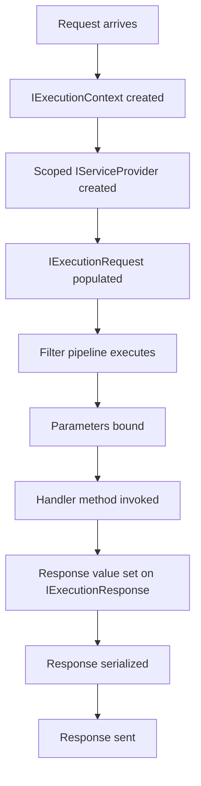

# Execution Model

The execution model is the core of Hardened's request processing pipeline. Every request -- whether an HTTP call, a Lambda invocation, or a test -- flows through the same abstractions: `IExecutionContext`, `IExecutionRequest`, and `IExecutionResponse`.

**Package:** `Hardened.Requests.Abstract` (namespace `Hardened.Requests.Abstract.Execution`, `Hardened.Requests.Abstract.Attributes`)

---

## IExecutionContext

`IExecutionContext` is the central object that holds everything related to a single request execution. It is created at the start of each request and flows through the entire filter pipeline.

### Definition

```csharp
namespace Hardened.Requests.Abstract.Execution;

public delegate Task DefaultOutputFunc(IExecutionContext executionContext);

public interface IExecutionContext {
    IExecutionContext Clone(
        IExecutionRequest? request = null,
        IExecutionResponse? response = null,
        IServiceProvider? serviceProvider = null,
        IMetricLogger? metricLogger = null);

    IServiceProvider RootServiceProvider { get; }
    IKnownServices KnownServices { get; }
    IServiceProvider RequestServices { get; }
    IExecutionRequest Request { get; }
    IExecutionResponse Response { get; }
    object? HandlerInstance { get; set; }
    IExecutionRequestHandlerInfo? HandlerInfo { get; set; }
    DefaultOutputFunc? DefaultOutput { get; set; }
    IMetricLogger RequestMetrics { get; }
    MachineTimestamp StartTime { get; }
    CancellationToken CancellationToken { get; }
}
```

### Key Members

| Member | Description |
|---|---|
| `Request` | The incoming request (method, path, headers, body, etc.) |
| `Response` | The outgoing response (status, body, headers, etc.) |
| `RequestServices` | Scoped DI container for this request's lifetime |
| `RootServiceProvider` | The application-level (singleton) service provider |
| `HandlerInstance` | The handler object that will process the request |
| `HandlerInfo` | Metadata about the handler (method info, filters, etc.) |
| `DefaultOutput` | Optional function for default output processing (e.g., template rendering) |
| `RequestMetrics` | Metric logger for recording request-level metrics |
| `StartTime` | High-resolution timestamp of when the request started |
| `CancellationToken` | Token for cooperative cancellation |
| `KnownServices` | Fast-path access to commonly used services |

### Clone

The `Clone()` method creates a copy of the context, optionally replacing specific parts. This is used by the retry filter and the `Fork` mechanism on `IExecutionChain`:

```csharp
// Clone with a modified request
var newContext = context.Clone(
    request: context.Request.Clone(path: "/new-path")
);
```

---

## IExecutionRequest

`IExecutionRequest` represents the incoming request data. It is transport-agnostic -- the same interface works for HTTP requests, Lambda events, and test requests.

### Definition

```csharp
namespace Hardened.Requests.Abstract.Execution;

public interface IExecutionRequest {
    IExecutionRequest Clone(
        string? method = null,
        string? path = null,
        IDictionary<string, StringValues>? headers = null,
        IQueryStringCollection? queryString = null,
        IReadOnlyList<string>? cookies = null);

    string Method { get; }
    string Path { get; }
    string? ContentType { get; }
    string? Accept { get; }
    IExecutionRequestParameters? Parameters { get; set; }
    Stream Body { get; set; }
    IDictionary<string, StringValues> Headers { get; }
    IQueryStringCollection QueryString { get; }
    IPathTokenCollection PathTokens { get; set; }
    IReadOnlyList<string> Cookies { get; }
}
```

### Key Members

| Member | Description |
|---|---|
| `Method` | HTTP method (GET, POST, etc.) or function name |
| `Path` | Request path (e.g., `/api/orders/123`) |
| `ContentType` | Content type of the request body |
| `Accept` | Accepted response content types |
| `Body` | Request body as a `Stream` |
| `Headers` | Request headers dictionary |
| `QueryString` | Parsed query string parameters |
| `PathTokens` | Parsed path tokens from route parameters (e.g., `{id}`) |
| `Cookies` | Request cookies |
| `Parameters` | Pre-bound parameters (set by the parameter binding filter) |

---

## IExecutionResponse

`IExecutionResponse` represents the outgoing response. Filters and handlers write to this object during request processing.

### Definition

```csharp
namespace Hardened.Requests.Abstract.Execution;

public interface IExecutionResponse {
    IExecutionResponse Clone(IHeaderCollection? headerCollection = null);

    string? ContentType { get; set; }
    object? ResponseValue { get; set; }
    string? TemplateName { get; set; }
    int? Status { get; set; }
    bool ShouldCompress { get; set; }
    Stream Body { get; set; }
    IDictionary<string, StringValues> Headers { get; }
    Exception? ExceptionValue { get; set; }
    bool ResponseStarted { get; }
    bool IsBinary { get; set; }
    ICookieSetCollection Cookies { get; }
    bool ShouldSerialize { get; set; }
}
```

### Key Members

| Member | Description |
|---|---|
| `Status` | HTTP status code (e.g., 200, 404, 500) |
| `ResponseValue` | The return value from the handler method |
| `ContentType` | Response content type |
| `Body` | Response body stream |
| `Headers` | Response headers |
| `TemplateName` | Name of the template to render (if using templates) |
| `ExceptionValue` | Exception that occurred during processing |
| `ResponseStarted` | Whether the response has already been sent to the client |
| `IsBinary` | Whether the response body is binary data |
| `Cookies` | Response cookies to set |
| `ShouldSerialize` | Whether the response value should be serialized (e.g., to JSON) |
| `ShouldCompress` | Whether the response should be compressed |

---

## [HardenedFunction]

The `[HardenedFunction]` attribute marks a method as a request handler in non-web contexts (Lambda functions, console applications, etc.). For web applications, use the HTTP method attributes (`[Get]`, `[Post]`, etc.) instead.

### Definition

```csharp
namespace Hardened.Requests.Abstract.Attributes;

public class HardenedFunctionAttribute : Attribute {
    public HardenedFunctionAttribute(string? functionName = null) {
        FunctionName = functionName;
    }

    public string? FunctionName { get; }
}
```

### Usage

```csharp
public class OrderFunctions {
    [HardenedFunction("process-order")]
    public async Task<OrderResult> ProcessOrder(
        Order order,
        IOrderService orderService) {
        return await orderService.Process(order);
    }

    [HardenedFunction]
    public async Task CleanupExpiredOrders(IOrderRepository repo) {
        await repo.DeleteExpired(DateTime.UtcNow);
    }
}
```

When `functionName` is omitted, the method name is used as the function name.

!!! note
    `[HardenedFunction]` is the base-level handler attribute. In web projects, `[Get]`, `[Post]`, etc. build on this concept by adding HTTP method and path routing.

---

## Request Flow

The execution model processes requests through a well-defined pipeline:



### Working with the Context in Filters

Filters receive the context through `IExecutionChain.Context`:

```csharp
using Hardened.Requests.Abstract.Execution;
using Hardened.Shared.Runtime.Attributes;

[Expose(typeof(IExecutionFilter))]
public class RequestLoggingFilter : IExecutionFilter {
    private readonly ILogger<RequestLoggingFilter> _logger;

    public RequestLoggingFilter(ILogger<RequestLoggingFilter> logger) {
        _logger = logger;
    }

    public async Task Execute(IExecutionChain chain) {
        var context = chain.Context;
        _logger.LogInformation(
            "Request: {Method} {Path}",
            context.Request.Method,
            context.Request.Path);

        await chain.Next();

        _logger.LogInformation(
            "Response: {Status} for {Method} {Path}",
            context.Response.Status,
            context.Request.Method,
            context.Request.Path);
    }
}
```

### Working with the Context in Handlers

Handler methods do not directly receive `IExecutionContext`. Instead, parameters are automatically bound from the request (see [Parameter Binding](parameter-binding.md)). If you need the raw context, inject it as a parameter:

```csharp
[Get("/api/info")]
public object GetInfo(IExecutionContext context) {
    return new {
        Method = context.Request.Method,
        Path = context.Request.Path,
        StartTime = context.StartTime
    };
}
```

---

## Related Pages

- [Filters](filters.md) -- the filter pipeline that processes each request
- [Parameter Binding](parameter-binding.md) -- how handler parameters are populated
- [Routing](../web/routing.md) -- HTTP routing attributes that build on `[HardenedFunction]`
- [Architecture: Execution Pipeline](../../architecture/execution-pipeline.md) -- high-level pipeline architecture
