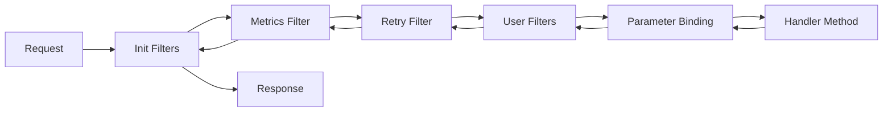

# Filters

Filters are the middleware mechanism in Hardened's execution pipeline. Every request passes through a chain of filters before reaching the handler method. Filters can perform cross-cutting concerns such as logging, authentication, error handling, retries, and metrics.

**Package:** `Hardened.Requests.Abstract` (namespace `Hardened.Requests.Abstract.Execution`)

---

## IExecutionFilter

The core filter interface. Implement this to create custom filters that participate in the request pipeline.

### Definition

```csharp
namespace Hardened.Requests.Abstract.Execution;

public interface IExecutionFilter {
    Task Execute(IExecutionChain chain);
}
```

### Basic Filter

A filter receives an `IExecutionChain` and must call `chain.Next()` to pass control to the next filter in the chain. Code before `Next()` runs on the way in; code after runs on the way out.

```csharp
using Hardened.Requests.Abstract.Execution;
using DependencyModules.Runtime.Attributes;

[TransientService(As = typeof(IExecutionFilter))]
public class TimingFilter : IExecutionFilter {
    private readonly ILogger<TimingFilter> _logger;

    public TimingFilter(ILogger<TimingFilter> logger) {
        _logger = logger;
    }

    public async Task Execute(IExecutionChain chain) {
        var stopwatch = Stopwatch.StartNew();

        await chain.Next();

        stopwatch.Stop();
        _logger.LogInformation(
            "{Method} {Path} completed in {Elapsed}ms",
            chain.Context.Request.Method,
            chain.Context.Request.Path,
            stopwatch.ElapsedMilliseconds);
    }
}
```

!!! warning
    If you do not call `chain.Next()`, the remaining filters and the handler method will not execute. This is useful for short-circuiting (e.g., returning an unauthorized response), but be intentional about it.

---

## IExecutionChain

The execution chain manages the ordered sequence of filters and provides access to the current execution context.

### Definition

```csharp
namespace Hardened.Requests.Abstract.Execution;

public interface IExecutionChain {
    Task Next();
    IExecutionContext Context { get; }
    IExecutionChain Fork(IExecutionContext context);
    bool IsLastFilter { get; }
}
```

### Members

| Member | Description |
|---|---|
| `Next()` | Invokes the next filter in the chain |
| `Context` | The current `IExecutionContext` with request, response, and services |
| `Fork(context)` | Creates a copy of the remaining chain with a new (or cloned) context |
| `IsLastFilter` | `true` if the current filter is the last one before the handler |

### Fork -- Re-executing the Pipeline

`Fork` creates a copy of the execution chain from the current point forward. This enables patterns like retry:

```csharp
public async Task Execute(IExecutionChain chain) {
    for (int attempt = 0; attempt < 3; attempt++) {
        try {
            // Fork the chain so it can be re-executed
            var forkedChain = chain.Fork(
                chain.Context.Clone());

            await forkedChain.Next();

            // Copy the response back
            chain.Context.Response.Status = forkedChain.Context.Response.Status;
            chain.Context.Response.ResponseValue = forkedChain.Context.Response.ResponseValue;
            return;
        } catch (Exception) when (attempt < 2) {
            await Task.Delay(100 * (attempt + 1));
        }
    }
}
```

---

## ExecutionFilterOrder

Filters execute in a defined order. The `ExecutionFilterOrder` enum provides well-known ordering positions:

### Definition

```csharp
namespace Hardened.Requests.Abstract.Execution;

public enum ExecutionFilterOrder {
    Init          = -10000,
    FullRequestMetrics = -7000,
    RetryFilter   = -5000,
    BeforeSerialize = -1,
    BindParameters = 0,
    First         = 1,
    Second        = 2,
    Third         = 3,
    Normal        = 100,
    Last          = int.MaxValue,
}
```

### Order Positions

| Position | Value | Purpose |
|---|---|---|
| `Init` | -10000 | Initialization, runs first |
| `FullRequestMetrics` | -7000 | Full request timing and metrics |
| `RetryFilter` | -5000 | Retry logic (wraps everything after it) |
| `BeforeSerialize` | -1 | Runs just before parameter binding |
| `BindParameters` | 0 | Parameter binding (built-in) |
| `First` | 1 | First user-defined filter position |
| `Second` | 2 | Second user-defined filter position |
| `Third` | 3 | Third user-defined filter position |
| `Normal` | 100 | Default position for user filters |
| `Last` | int.MaxValue | Runs last, just before the handler |

Filters with lower order values execute first (outer layer), and filters with higher order values execute closer to the handler (inner layer).

---

## Registering Filters

### Global Filters

Register a filter for all requests by exposing it as `IExecutionFilter`:

```csharp
[TransientService(As = typeof(IExecutionFilter))]
public class AuthenticationFilter : IExecutionFilter {
    public async Task Execute(IExecutionChain chain) {
        var authHeader = chain.Context.Request.Headers
            .GetValueOrDefault("Authorization");

        if (string.IsNullOrEmpty(authHeader)) {
            chain.Context.Response.Status = 401;
            return; // Short-circuit -- do not call Next()
        }

        // Validate token, set user context, etc.
        await chain.Next();
    }
}
```

### Handler-Level Filters via IRequestFilterProvider

Implement `IRequestFilterProvider` on an attribute to attach filters to specific handlers:

```csharp
using Hardened.Requests.Abstract.RequestFilter;
using Hardened.Requests.Abstract.Execution;

public class RequireRoleAttribute : Attribute, IRequestFilterProvider {
    private readonly string _role;

    public RequireRoleAttribute(string role) {
        _role = role;
    }

    public IEnumerable<RequestFilterInfo> GetFilters(
        IExecutionRequestHandlerInfo handlerInfo) {
        yield return new RequestFilterInfo(
            context => new RoleFilter(
                _role,
                context.RequestServices.GetRequiredService<IUserContext>()),
            FilterOrder.DefaultValue);
    }
}

public class RoleFilter : IExecutionFilter {
    private readonly string _role;
    private readonly IUserContext _userContext;

    public RoleFilter(string role, IUserContext userContext) {
        _role = role;
        _userContext = userContext;
    }

    public async Task Execute(IExecutionChain chain) {
        if (!_userContext.HasRole(_role)) {
            chain.Context.Response.Status = 403;
            return;
        }
        await chain.Next();
    }
}
```

Apply it to a handler:

```csharp
[RequireRole("admin")]
[Get("/api/admin/users")]
public Task<IReadOnlyList<User>> ListUsers(IUserRepository repo) {
    return repo.GetAll();
}
```

---

## Built-in: [Retry] Attribute

Hardened includes a built-in retry filter that automatically retries failed requests.

### Definition

```csharp
namespace Hardened.Requests.Runtime.Filters;

public class RetryAttribute : Attribute, IRequestFilterProvider {
    public int Retries { get; set; } = 3;
    public int SleepTime { get; set; } = 500;
}
```

### Usage

```csharp
[Retry(Retries = 4, SleepTime = 1000)]
[HardenedFunction("sync-inventory")]
public async Task<SyncResult> SyncInventory(
    IInventoryService inventory) {
    return await inventory.SyncFromExternalApi();
}
```

The retry filter uses `Fork` to re-execute the chain on failure. It runs at `FilterOrder.HandlerCreation - 10`, which is early in the pipeline so that parameter binding and the handler are retried.

### Properties

| Property | Default | Description |
|---|---|---|
| `Retries` | 3 | Maximum number of retry attempts |
| `SleepTime` | 500 | Milliseconds to wait between retries |

---

## Custom Filter Example: Error Handling

Here is a complete example of a custom error-handling filter:

```csharp
using Hardened.Requests.Abstract.Execution;
using DependencyModules.Runtime.Attributes;

[TransientService(As = typeof(IExecutionFilter))]
public class ErrorHandlingFilter : IExecutionFilter {
    private readonly ILogger<ErrorHandlingFilter> _logger;

    public ErrorHandlingFilter(ILogger<ErrorHandlingFilter> logger) {
        _logger = logger;
    }

    public async Task Execute(IExecutionChain chain) {
        try {
            await chain.Next();
        } catch (NotFoundException ex) {
            chain.Context.Response.Status = 404;
            chain.Context.Response.ResponseValue = new {
                Error = ex.Message
            };
        } catch (ValidationException ex) {
            chain.Context.Response.Status = 400;
            chain.Context.Response.ResponseValue = new {
                Error = ex.Message,
                Details = ex.Errors
            };
        } catch (Exception ex) {
            _logger.LogError(ex, "Unhandled exception for {Path}",
                chain.Context.Request.Path);

            chain.Context.Response.Status = 500;
            chain.Context.Response.ResponseValue = new {
                Error = "An internal error occurred"
            };
        }
    }
}
```

---

## Filter Pipeline Visualization



Each filter wraps the next, forming a Russian-doll pattern. This gives every filter access to both the incoming request (before `Next()`) and the outgoing response (after `Next()`).

---

## Related Pages

- [Execution Model](execution-model.md) -- `IExecutionContext`, `IExecutionRequest`, `IExecutionResponse`
- [Parameter Binding](parameter-binding.md) -- how handler parameters are bound
- [Recipes: Custom Execution Filter](../../recipes/custom-execution-filter.md) -- step-by-step filter recipe
