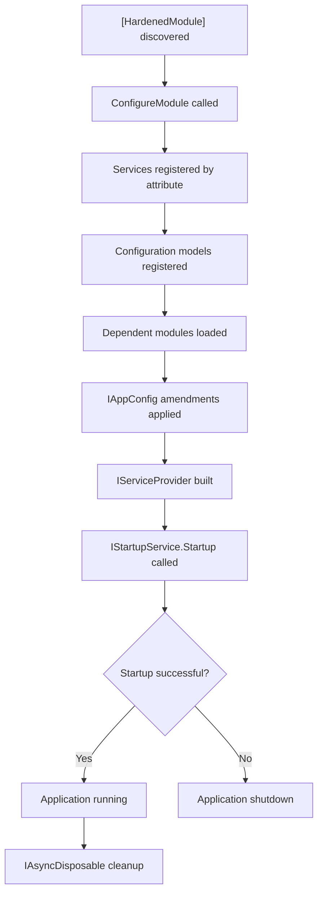

# Application Lifecycle

Hardened applications follow a structured lifecycle: module discovery, service registration, configuration, startup, and execution. This page covers the core interfaces and attributes that drive this lifecycle.

**Package:** `Hardened.Shared.Runtime` (namespace `Hardened.Shared.Runtime.Application`, `Hardened.Shared.Runtime.Attributes`)

---

## [HardenedModule]

The `[HardenedModule]` attribute marks a partial class as the application or module entry point. The source generator uses this attribute to generate the `ConfigureModule` implementation, which wires up DI registrations, configuration, and module dependencies.

### Definition

```csharp
namespace Hardened.Shared.Runtime.Attributes;

public class HardenedModuleAttribute : Attribute { }
```

### Usage -- Application Entry Point

For a web application, `[HardenedModule]` is combined with a runtime-specific module attribute:

```csharp
using Hardened.Shared.Runtime.Attributes;

[HardenedModule]
[AspNetCoreRuntime.Module]
public partial class Application { }
```

For a library or reusable module:

```csharp
[HardenedModule]
public partial class MyLibraryModule { }
```

The source generator produces the full `ConfigureModule` implementation by scanning the assembly for registration attributes, `[ConfigurationModel]`, and the rest. The partial class is completed with all the registration code at compile time.

!!! note
    The class must be declared `partial` so the source generator can extend it with the generated code.

---

## IApplicationModule

`IApplicationModule` is the interface that all Hardened modules implement. The source generator makes your `[HardenedModule]` class implement this interface automatically.

### Definition

```csharp
using Microsoft.Extensions.DependencyInjection;

namespace Hardened.Shared.Runtime.Application;

public interface IApplicationModule {
    void ConfigureModule(
        IHardenedEnvironment environment,
        IServiceCollection serviceCollection);
}
```

### How It Works

When your application starts, the framework calls `ConfigureModule` on the root module. This triggers a chain of operations:

1. The module registers all registered services found in its assembly
2. It processes `[ConfigurationModel]` interfaces and registers their generated implementations
3. It loads dependent modules (other `IApplicationModule` implementations) and calls their `ConfigureModule`
4. It applies `[IfEnvironment]` filtering based on the current `IHardenedEnvironment`

You generally do not need to implement `IApplicationModule` manually -- the source generator handles it. However, you can add custom logic to your partial class:

```csharp
[HardenedModule]
public partial class Application {
    // Called by the generated ConfigureModule as part of setup
    private static void ConfigureApplication(IAppConfig appConfig) {
        appConfig.Amend<DatabaseConfig>(config => {
            config.MaxPoolSize = 25;
        });
    }
}
```

---

## IApplicationRoot

`IApplicationRoot` represents a running application instance. It provides access to the root `IServiceProvider` and supports async disposal for graceful shutdown.

### Definition

```csharp
namespace Hardened.Shared.Runtime.Application;

public interface IApplicationRoot : IAsyncDisposable {
    IServiceProvider Provider { get; }
}
```

### Usage

In most cases, you interact with `IApplicationRoot` indirectly through the framework. However, it is available when you need direct access to the root service provider:

```csharp
await using var app = Application.Create(args);

// Access root services
var processor = app.Provider.GetRequiredService<IOrderProcessor>();
await processor.RunAll();
```

The `IAsyncDisposable` implementation ensures all singleton disposable services are cleaned up when the application shuts down:

```csharp
await using var app = Application.Create(args);
try {
    await RunApplication(app.Provider);
} finally {
    // Disposal happens automatically via 'await using'
    // All IAsyncDisposable and IDisposable singletons are cleaned up
}
```

---

## IStartupService

`IStartupService` provides an async startup hook that runs after the DI container is built but before the application begins processing requests. This is useful for initializing resources, warming caches, or performing health checks.

### Definition

```csharp
namespace Hardened.Shared.Runtime.Application;

public interface IStartupService {
    Task<bool> Startup(IServiceProvider rootProvider);
}
```

The return value indicates whether startup was successful:

- `true` -- startup succeeded, the application continues
- `false` -- startup failed, the application should not start

### Usage

```csharp
using DependencyModules.Runtime.Attributes;
using Hardened.Shared.Runtime.Application;

[SingletonService(As = typeof(IStartupService))]
public class DatabaseMigrationStartup : IStartupService {
    public async Task<bool> Startup(IServiceProvider rootProvider) {
        var dbContext = rootProvider.GetRequiredService<IDbContext>();

        try {
            await dbContext.MigrateAsync();
            return true;
        } catch (Exception ex) {
            var logger = rootProvider.GetRequiredService<ILogger<DatabaseMigrationStartup>>();
            logger.LogError(ex, "Database migration failed");
            return false;
        }
    }
}
```

Multiple startup services can be registered. They are executed in registration order:

```csharp
[SingletonService(As = typeof(IStartupService))]
public class CacheWarmupStartup : IStartupService {
    public async Task<bool> Startup(IServiceProvider rootProvider) {
        var cache = rootProvider.GetRequiredService<ICacheService>();
        await cache.WarmUp();
        return true;
    }
}
```

!!! warning
    Startup services receive the **root** `IServiceProvider`, not a scoped provider. Be careful with scoped services -- create a scope manually if needed.

---

## Lifecycle Flow

The complete application lifecycle follows this sequence:



### Detailed Steps

1. **Module Discovery** -- The source generator finds the `[HardenedModule]` class and generates `ConfigureModule`
2. **Service Registration** -- All attributed classes are registered in the `IServiceCollection`
3. **Configuration** -- `[ConfigurationModel]` interfaces get their generated implementations registered
4. **Module Composition** -- Dependent modules are discovered and their `ConfigureModule` methods are called
5. **Configuration Amendments** -- `IAppConfig.ProvideValue` and `IAppConfig.Amend` calls are processed
6. **Container Build** -- The `IServiceProvider` is constructed from the finalized `IServiceCollection`
7. **Startup** -- All `IStartupService` implementations are executed
8. **Running** -- The application processes requests
9. **Shutdown** -- `IAsyncDisposable` is invoked, cleaning up all resources

---

## Module Composition

Applications can be composed from multiple modules. Each module is a `[HardenedModule]` partial class in its own assembly:

```csharp
// In MyLibrary assembly
[HardenedModule]
public partial class MyLibraryModule { }

// In the main application assembly
[HardenedModule]
[AspNetCoreRuntime.Module]
public partial class Application { }
```

When the main application references `MyLibrary`, the source generator detects `MyLibraryModule` and includes it in the startup chain. The library's services, configuration models, and filters are all registered automatically.

!!! tip
    Module composition is the recommended way to organize large applications. Each module encapsulates a bounded context with its own services and configuration.

---

## Related Pages

- [Dependency Injection](dependency-injection.md) -- lifetime attributes and registration
- [Configuration](configuration.md) -- `[ConfigurationModel]` and `IAppConfig`
- [Environment](environment.md) -- `IHardenedEnvironment` and environment-specific behavior
- [Architecture: Module System](../../architecture/module-system.md) -- high-level module architecture
