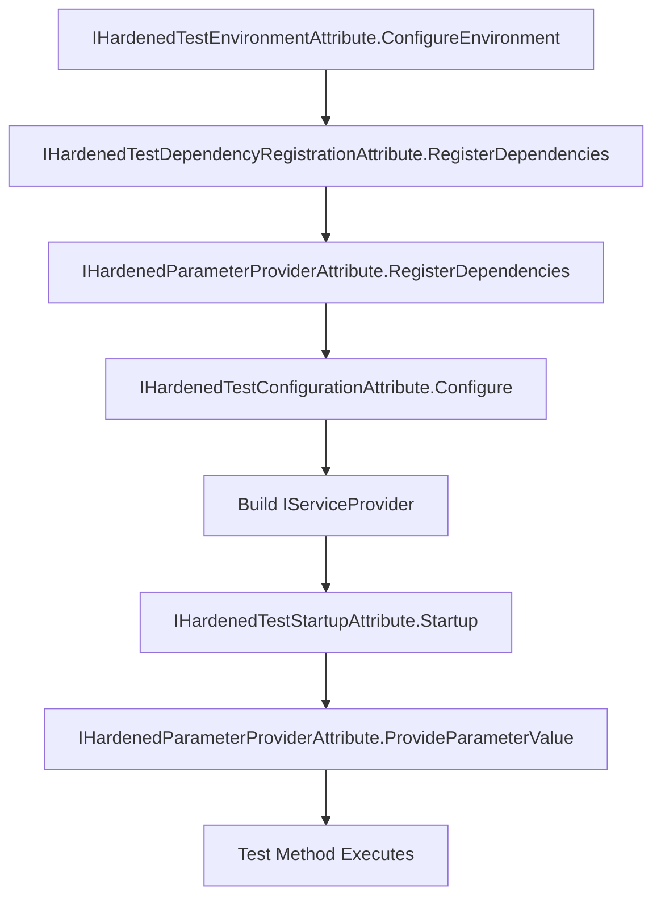

# Custom Test Attributes

Hardened's test framework is extensible through a set of attribute interfaces. You can create custom attributes that hook into the test lifecycle to register dependencies, configure the environment, provide parameter values, and control execution order.

**Package:** `Hardened.Shared.Testing` (namespace `Hardened.Shared.Testing.Attributes`)

---

## Attribute Interfaces Overview

| Interface | Purpose | Applied To |
|---|---|---|
| `IHardenedTestStartupAttribute` | Run async startup logic after DI is built | Method, Class, Assembly |
| `IHardenedTestDependencyRegistrationAttribute` | Register services in the DI container | Method, Class, Assembly |
| `IHardenedTestConfigurationAttribute` | Configure `IAppConfig` for the test | Method, Class, Assembly |
| `IHardenedTestEnvironmentAttribute` | Set environment name and values | Method, Class, Assembly |
| `IHardenedParameterProviderAttribute` | Provide values for test method parameters | Parameters |
| `IHardenedOrderedAttribute` | Control execution order of attributes | All |

---

## IHardenedOrderedAttribute

The base interface for controlling the order in which attributes are processed. All other test attribute interfaces extend this.

### Definition

```csharp
namespace Hardened.Shared.Testing.Attributes;

public interface IHardenedOrderedAttribute {
    int Order => 10;
}
```

The default `Order` is `10`. Lower values run first.

---

## IHardenedTestDependencyRegistrationAttribute

Register additional services in the DI container before the test runs. This is useful for adding test doubles, fakes, or supplementary services.

### Definition

```csharp
namespace Hardened.Shared.Testing.Attributes;

public interface IHardenedTestDependencyRegistrationAttribute
    : IHardenedOrderedAttribute {
    void RegisterDependencies(
        AttributeCollection attributeCollection,
        MethodInfo methodInfo,
        IHardenedEnvironment environment,
        IServiceCollection serviceCollection);
}
```

### Example -- Registering a Test Database

```csharp
using System.Reflection;
using Hardened.Shared.Runtime.Application;
using Hardened.Shared.Testing.Attributes;
using Microsoft.Extensions.DependencyInjection;

[AttributeUsage(AttributeTargets.Method | AttributeTargets.Class)]
public class UseInMemoryDatabaseAttribute
    : Attribute, IHardenedTestDependencyRegistrationAttribute {

    public void RegisterDependencies(
        AttributeCollection attributeCollection,
        MethodInfo methodInfo,
        IHardenedEnvironment environment,
        IServiceCollection serviceCollection) {
        // Replace the real database with an in-memory implementation
        serviceCollection.AddSingleton<IDatabase, InMemoryDatabase>();
    }
}
```

Usage:

```csharp
[UseInMemoryDatabase]
public class OrderRepositoryTests {
    [HardenedTest]
    public async Task SaveAndLoad(IOrderRepository repo) {
        var order = new Order { Id = "ord-1", CustomerId = "cust-1" };
        await repo.Save(order);

        var loaded = await repo.GetById("ord-1");
        Assert.NotNull(loaded);
        Assert.Equal("cust-1", loaded.CustomerId);
    }
}
```

---

## IHardenedTestConfigurationAttribute

Modify `IAppConfig` for the test. This runs after dependencies are registered but before the DI container is built.

### Definition

```csharp
namespace Hardened.Shared.Testing.Attributes;

public interface IHardenedTestConfigurationAttribute
    : IHardenedOrderedAttribute {
    void Configure(
        AttributeCollection attributeCollection,
        MethodInfo methodInfo,
        IHardenedEnvironment environment,
        IAppConfig appConfig);
}
```

### Example -- Setting Test Configuration

```csharp
using System.Reflection;
using Hardened.Shared.Runtime.Application;
using Hardened.Shared.Runtime.Configuration;
using Hardened.Shared.Testing.Attributes;

[AttributeUsage(AttributeTargets.Method | AttributeTargets.Class)]
public class WithApiTimeoutAttribute : Attribute, IHardenedTestConfigurationAttribute {
    private readonly int _timeoutMs;

    public WithApiTimeoutAttribute(int timeoutMs = 5000) {
        _timeoutMs = timeoutMs;
    }

    public void Configure(
        AttributeCollection attributeCollection,
        MethodInfo methodInfo,
        IHardenedEnvironment environment,
        IAppConfig appConfig) {
        appConfig.Amend<ApiConfig>(config => {
            config.TimeoutMs = _timeoutMs;
        });
    }
}
```

Usage:

```csharp
[HardenedTest]
[WithApiTimeout(1000)]
public async Task FastTimeout_ThrowsOnSlowCall(IApiClient client) {
    await Assert.ThrowsAsync<TimeoutException>(
        () => client.Call("/slow-endpoint"));
}
```

---

## IHardenedTestEnvironmentAttribute

Configure the test environment name and custom values. This runs before dependency registration, so `[ForEnvironment]`-filtered services are affected.

### Definition

```csharp
namespace Hardened.Shared.Testing.Attributes;

public interface IHardenedTestEnvironmentAttribute
    : IHardenedOrderedAttribute {
    void ConfigureEnvironment(
        AttributeCollection attributeCollection,
        MethodInfo methodInfo,
        string environmentName,
        IDictionary<string, object> environment);
}
```

### Example -- Setting the Environment

```csharp
using System.Reflection;
using Hardened.Shared.Testing.Attributes;

[AttributeUsage(AttributeTargets.Method | AttributeTargets.Class)]
public class ProductionEnvironmentAttribute
    : Attribute, IHardenedTestEnvironmentAttribute {

    public void ConfigureEnvironment(
        AttributeCollection attributeCollection,
        MethodInfo methodInfo,
        string environmentName,
        IDictionary<string, object> environment) {
        // Set environment values that will be available
        // through IHardenedEnvironment.Value<T>()
        environment["AWS_REGION"] = "us-east-1";
        environment["LOG_LEVEL"] = "Warning";
    }
}
```

!!! note
    The built-in `[EnvironmentName]` and `[EnvironmentValue]` attributes in `Hardened.Shared.Testing.Attributes` provide simpler ways to set the environment name and values for common cases.

### Built-in Environment Attributes

Hardened provides two built-in attributes for common environment configuration:

```csharp
// Set the environment name
[EnvironmentName("Production")]
[HardenedTest]
public void TestProductionBehavior(IMyService service) {
    // Runs with environment name "Production"
}

// Set environment values
[EnvironmentValue("API_KEY", "test-key")]
[HardenedTest]
public void TestWithApiKey(IMyService service) {
    // IHardenedEnvironment.Value<string>("API_KEY") returns "test-key"
}
```

---

## IHardenedTestStartupAttribute

Run async startup logic after the DI container is built. This is the last hook before the test method executes.

### Definition

```csharp
namespace Hardened.Shared.Testing.Attributes;

public interface IHardenedTestStartupAttribute
    : IHardenedOrderedAttribute {
    Task Startup(
        AttributeCollection attributeCollection,
        MethodInfo methodInfo,
        IHardenedEnvironment environment,
        IServiceProvider serviceProvider);
}
```

### Example -- Seeding Test Data

```csharp
using System.Reflection;
using Hardened.Shared.Runtime.Application;
using Hardened.Shared.Testing.Attributes;
using Microsoft.Extensions.DependencyInjection;

[AttributeUsage(AttributeTargets.Method | AttributeTargets.Class)]
public class SeedProductsAttribute
    : Attribute, IHardenedTestStartupAttribute {

    public async Task Startup(
        AttributeCollection attributeCollection,
        MethodInfo methodInfo,
        IHardenedEnvironment environment,
        IServiceProvider serviceProvider) {
        var repo = serviceProvider.GetRequiredService<IProductRepository>();

        await repo.Save(new Product {
            Id = "prod-1", Name = "Widget", Price = 9.99m });
        await repo.Save(new Product {
            Id = "prod-2", Name = "Gadget", Price = 29.99m });
    }
}
```

Usage:

```csharp
[SeedProducts]
public class ProductApiTests {
    [HardenedTest]
    public async Task ListProducts_ReturnsSeedData(ITestWebApp app) {
        var response = await app.Get("/api/products");
        response.Assert.Ok();

        var products = response.Deserialize<List<Product>>();
        Assert.Equal(2, products.Count);
    }
}
```

---

## IHardenedParameterProviderAttribute

Provide custom values for test method parameters. This is the interface that `[Mock]` implements.

### Definition

```csharp
namespace Hardened.Shared.Testing.Attributes;

public interface IHardenedParameterProviderAttribute
    : IHardenedOrderedAttribute {
    void RegisterDependencies(
        AttributeCollection attributeCollection,
        MethodInfo methodInfo,
        ParameterInfo? parameterInfo,
        IHardenedEnvironment environment,
        IServiceCollection serviceCollection);

    object? ProvideParameterValue(
        MethodInfo methodInfo,
        ParameterInfo parameterInfo,
        IApplicationRoot applicationRoot);
}
```

### Example -- Fixture Provider

```csharp
using System.Reflection;
using Hardened.Shared.Runtime.Application;
using Hardened.Shared.Testing.Attributes;
using Microsoft.Extensions.DependencyInjection;

[AttributeUsage(AttributeTargets.Parameter)]
public class FixtureAttribute : Attribute, IHardenedParameterProviderAttribute {
    private readonly string _fixturePath;

    public FixtureAttribute(string fixturePath) {
        _fixturePath = fixturePath;
    }

    public void RegisterDependencies(
        AttributeCollection attributeCollection,
        MethodInfo methodInfo,
        ParameterInfo? parameterInfo,
        IHardenedEnvironment environment,
        IServiceCollection serviceCollection) {
        // No additional DI registrations needed
    }

    public object? ProvideParameterValue(
        MethodInfo methodInfo,
        ParameterInfo parameterInfo,
        IApplicationRoot applicationRoot) {
        var json = File.ReadAllText(_fixturePath);
        return JsonSerializer.Deserialize(
            json,
            parameterInfo.ParameterType,
            new JsonSerializerOptions(JsonSerializerDefaults.Web));
    }
}
```

Usage:

```csharp
[HardenedTest]
public async Task ImportOrders_ProcessesFixture(
    IOrderImporter importer,
    [Fixture("testdata/orders.json")] List<Order> orders) {

    var result = await importer.Import(orders);
    Assert.Equal(orders.Count, result.ProcessedCount);
}
```

---

## Attribute Execution Order

Custom attributes execute in this lifecycle order:



Within each phase, attributes with lower `Order` values run first.

---

## Composing Multiple Attributes

You can combine multiple custom attributes on a single test:

```csharp
[SeedProducts]
[UseInMemoryDatabase]
[WithApiTimeout(2000)]
public class IntegrationTests {
    [HardenedTest]
    public async Task FullWorkflow(ITestWebApp app) {
        var response = await app.Post(
            new { productId = "prod-1", quantity = 3 },
            "/api/orders");
        response.Assert.Ok();
    }
}
```

Each attribute hooks into its corresponding lifecycle phase, and they compose cleanly.

---

## Related Pages

- [HardenedTest](hardened-test.md) -- test attribute and DI bootstrap
- [Mocking](mocking.md) -- `[Mock]` attribute (implements `IHardenedParameterProviderAttribute`)
- [Web Testing](web-testing.md) -- `[WebTesting]` attribute (implements `IHardenedTestStartupAttribute` and `IHardenedParameterProviderAttribute`)
- [Test Context](test-context.md) -- `ITestContext` utilities
