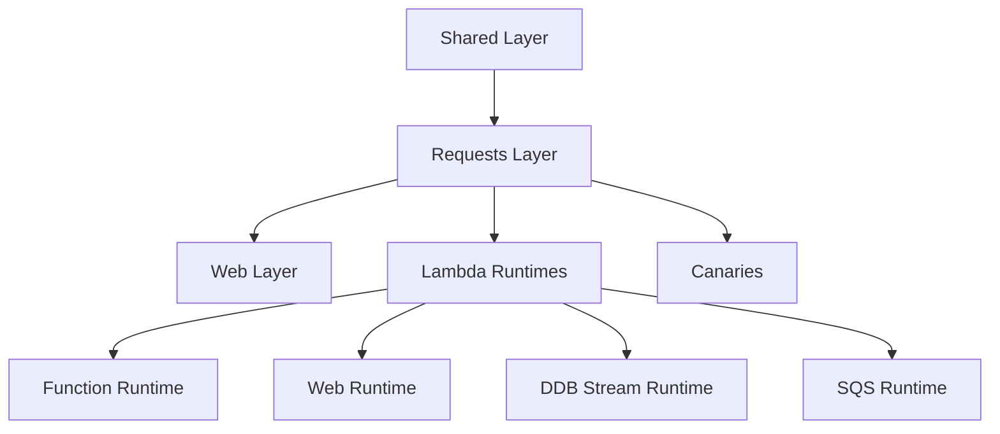

# Hardened

**A compile-time, source-generated .NET framework for building web APIs, AWS Lambda functions, and canary tests.**

Hardened uses C# source generators to wire up dependency injection, request routing, configuration, and more at compile time — eliminating runtime reflection and delivering fast startup, small binaries, and strong type safety.

---

## Quick Start

```csharp
using Hardened.Shared.Runtime.Attributes;
using Hardened.Web.Runtime.Attributes;

[HardenedModule]
[AspNetCoreRuntime.Module]
public partial class Application { }

public class HelloController {
    [Get("/hello/{name}")]
    public string Hello(string name) {
        return $"Hello, {name}!";
    }
}
```

```csharp
// Program.cs
var builder = Application.CreateBuilder(args);
var app = builder.Build();
app.UseHardened();
app.Run();
```

That's it — no `[ApiController]`, no `ControllerBase`, no `AddControllers()`. The source generator discovers your routes, wires up DI, and binds parameters automatically.

---

## Package Overview

The Hardened ecosystem spans three repositories organized into layers:

### Framework (`Hardened.Framework`)

The core framework providing DI, request handling, web routing, templates, and testing.

| Package | Description |
|---|---|
| `Hardened.Shared.Runtime` | Core: DI attributes, configuration, environment, application lifecycle |
| `Hardened.Shared.Testing` | Test framework: `[HardenedTest]`, `[Mock]`, `ITestContext` |
| `Hardened.Requests.Abstract` | Request/response abstractions, execution pipeline interfaces |
| `Hardened.Requests.Runtime` | Execution pipeline implementation, filters |
| `Hardened.Requests.Testing` | Request testing utilities |
| `Hardened.Web.Runtime` | Web routing: `[Get]`, `[Post]`, `[Put]`, `[Delete]`, `[BasePath]` |
| `Hardened.Web.AspNetCore.Runtime` | ASP.NET Core integration bridge |
| `Hardened.Web.Testing` | `ITestWebApp`, `TestWebRequest`, `TestWebResponse` |
| `Hardened.Templates.Abstract` | Template abstractions: `[TemplatePackage]`, `[TemplateHelper]` |
| `Hardened.Templates.Runtime` | Mustache-style template engine |
| `Hardened.SourceGenerator` | Shared generator source library (not referenced directly) |
| `Hardened.DependencyModules.SourceGenerator` | Module wiring and DI source generator |
| `Hardened.Web.SourceGenerator` | Web routing source generator |
| `Hardened.Library.SourceGenerator` | Library/module source generator |
| `Hardened.Templates.SourceGenerator` | Template compilation source generator |
| `Hardened.Console.SourceGenerator` | Console application source generator |

### AWS (`Hardened.Amz`)

AWS Lambda runtimes, DynamoDB and SQS client libraries, and CDK support.

| Package | Description |
|---|---|
| `Hardened.Amz.Function.Lambda.Runtime` | Lambda function runtime |
| `Hardened.Amz.Function.Lambda.Testing` | `LambdaTestApp` for testing Lambda functions |
| `Hardened.Amz.Function.Lambda.SourceGenerator` | Lambda function source generator |
| `Hardened.Amz.Web.Lambda.Runtime` | Lambda web runtime (API Gateway) |
| `Hardened.Amz.Web.Lambda.SourceGenerator` | Lambda web source generator |
| `Hardened.Amz.Function.DDB.Runtime` | DynamoDB Streams Lambda runtime |
| `Hardened.Amz.Function.DDB.Testing` | DynamoDB Streams testing utilities |
| `Hardened.Amz.Function.Sqs.Runtime` | SQS batch processing Lambda runtime |
| `Hardened.Amz.Function.Sqs.Testing` | `TestSqsApp` for testing SQS processors |
| `Hardened.Amz.Shared.Lambda.Runtime` | Shared Lambda utilities |
| `Hardened.Amz.Shared.Lambda.Testing` | Shared Lambda testing utilities |
| `Hardened.Amz.DynamoDbClient` | `IDynamoDbClientProvider`, DynamoDB extensions |
| `Hardened.Amz.DynamoDbClient.Testing` | `[LocalDynamoDb]` with Testcontainers |
| `Hardened.Amz.SqsClient` | `ISqsClient` for SQS messaging |
| `Hardened.Amz.CloudWatch.Dashboards` | CloudWatch dashboard support |
| `Hardened.Amz.Cdk` | AWS CDK constructs |

### Canaries (`Hardened.Canaries`)

Automated canary testing framework that runs as AWS Lambda functions.

| Package | Description |
|---|---|
| `Hardened.Amz.Canaries.Runtime` | Canary framework: `[HardenedCanary]`, flight control, scheduling |

---

## Key Features

- **Compile-time DI** — `[Expose]`, `[Singleton]`, `[Scoped]` attributes generate registration code at build time
- **Source-generated routing** — `[Get]`, `[Post]`, `[Put]`, `[Delete]` with automatic parameter binding
- **Execution pipeline** — `IExecutionFilter` chain with ordering for cross-cutting concerns
- **Configuration system** — `[ConfigurationModel]` interfaces with `[FromEnvironmentVariable]` binding
- **Module system** — `[HardenedModule]` partial classes compose applications from reusable modules
- **Built-in testing** — `[HardenedTest]` with DI, `[Mock]` via NSubstitute, `ITestWebApp` for HTTP testing
- **AWS Lambda support** — Function, Web (API Gateway), DynamoDB Streams, and SQS runtimes
- **Canary testing** — `[HardenedCanary]` for automated production health checks
- **Template engine** — Compile-time Mustache template compilation with custom helpers

---

## Getting Started

New to Hardened? Start here:

1. [Set up NuGet](getting-started/nuget-setup.md) to access packages from GitHub Packages
2. [Install packages](getting-started/installation.md) for your use case
3. Follow a tutorial:
    - [Build a web API](getting-started/your-first-web-app.md)
    - [Build a Lambda function](getting-started/your-first-lambda.md)
    - [Build a canary](getting-started/your-first-canary.md)

---

## Architecture

Hardened is organized in layers — each higher layer builds on the one below:



Learn more in the [Architecture Overview](architecture/overview.md).
