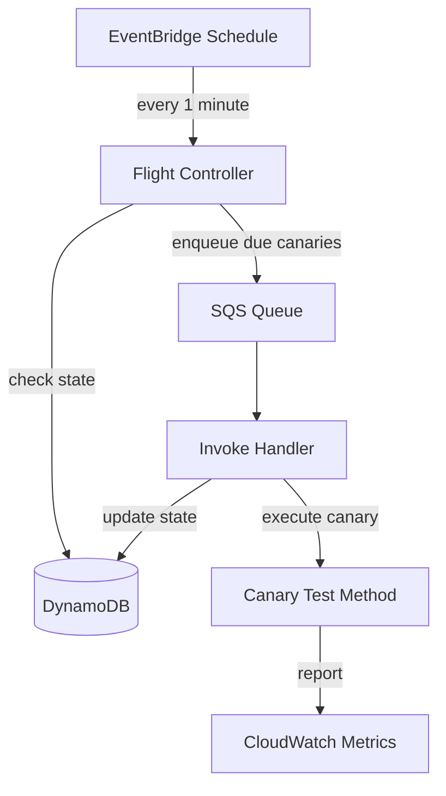

# Recipe: Canary Testing

Build a comprehensive canary test suite that monitors your production services with scheduled health checks, multi-step workflows, and retry-based polling.

**What you will build:**

- Multiple canary methods with different frequencies
- Multi-step canaries using `ITestContext.Step()`
- Polling with `IRetryEngine` for eventual consistency checks
- HTTP health checks against production endpoints
- Different flight styles for scheduling control

---

## Prerequisites

- [.NET 8 SDK](https://dotnet.microsoft.com/download/dotnet/8.0) or later
- [NuGet configured for GitHub Packages](../getting-started/nuget-setup.md)

---

## Project Setup

```bash
dotnet new classlib -n ServiceCanary
cd ServiceCanary
dotnet add package Hardened.Amz.Canaries.Runtime --prerelease
```

---

## Complete Code

### Configuration

```csharp title="Config/ICanaryConfig.cs"
using Hardened.Shared.Runtime.Attributes;

[ConfigurationModel]
public interface ICanaryConfig
{
    [FromEnvironmentVariable("API_BASE_URL")]
    string ApiBaseUrl { get; }

    [FromEnvironmentVariable("AUTH_TOKEN")]
    string AuthToken { get; }
}
```

### HTTP Client Service

```csharp title="Services/IApiClient.cs"
public interface IApiClient
{
    Task<HttpResponseMessage> GetAsync(string path);
    Task<HttpResponseMessage> PostAsync(string path, HttpContent content);
}
```

```csharp title="Services/ApiClient.cs"
using DependencyModules.Runtime.Attributes;

[SingletonService]
public class ApiClient : IApiClient
{
    private readonly HttpClient _httpClient;
    private readonly ICanaryConfig _config;

    public ApiClient(ICanaryConfig config)
    {
        _config = config;
        _httpClient = new HttpClient
        {
            BaseAddress = new Uri(config.ApiBaseUrl)
        };
        _httpClient.DefaultRequestHeaders.Add(
            "Authorization", $"Bearer {config.AuthToken}");
    }

    public Task<HttpResponseMessage> GetAsync(string path)
    {
        return _httpClient.GetAsync(path);
    }

    public Task<HttpResponseMessage> PostAsync(
        string path, HttpContent content)
    {
        return _httpClient.PostAsync(path, content);
    }
}
```

### Application Module

```csharp title="Application.cs"
using Hardened.Shared.Runtime.Attributes;

[HardenedModule]
public partial class Application { }
```

### Basic Health Check Canary

```csharp title="Canaries/HealthCheckCanary.cs"
using Hardened.Amz.Canaries.Runtime.Attributes;
using Hardened.Amz.Canaries.Runtime;

public class HealthCheckCanary
{
    private readonly IApiClient _apiClient;

    public HealthCheckCanary(IApiClient apiClient)
    {
        _apiClient = apiClient;
    }

    [HardenedCanary(
        Frequency = 1,
        Unit = CanaryFrequencyUnit.Minute,
        FlightStyle = CanaryFlightStyle.Strict)]
    public async Task CheckApiHealth(ITestContext context)
    {
        await context.Step(async () =>
        {
            var response = await _apiClient.GetAsync("/health");
            response.EnsureSuccessStatusCode();
        }, "Verify health endpoint returns 200");

        await context.Step(async () =>
        {
            var response = await _apiClient.GetAsync("/health");
            var body = await response.Content.ReadAsStringAsync();

            if (!body.Contains("\"status\":\"healthy\""))
            {
                throw new Exception(
                    $"Unexpected health response: {body}");
            }
        }, "Verify health response body contains healthy status");
    }
}
```

### End-to-End Workflow Canary

```csharp title="Canaries/OrderWorkflowCanary.cs"
using System.Net.Http.Json;
using System.Text;
using System.Text.Json;
using Hardened.Amz.Canaries.Runtime.Attributes;
using Hardened.Amz.Canaries.Runtime;

public class OrderWorkflowCanary
{
    private readonly IApiClient _apiClient;

    public OrderWorkflowCanary(IApiClient apiClient)
    {
        _apiClient = apiClient;
    }

    [HardenedCanary(
        Frequency = 5,
        Unit = CanaryFrequencyUnit.Minute,
        FlightStyle = CanaryFlightStyle.Loose)]
    public async Task VerifyOrderCreationFlow(ITestContext context)
    {
        string orderId = string.Empty;

        // Step 1: Create an order
        await context.Step(async () =>
        {
            var payload = JsonSerializer.Serialize(new
            {
                customerId = "canary-test-customer",
                items = new[]
                {
                    new { productId = "TEST-PROD", quantity = 1 }
                }
            });

            var content = new StringContent(
                payload, Encoding.UTF8, "application/json");

            var response = await _apiClient.PostAsync("/api/orders", content);
            response.EnsureSuccessStatusCode();

            var responseBody = await response.Content
                .ReadFromJsonAsync<JsonElement>();
            orderId = responseBody.GetProperty("orderId").GetString()
                ?? throw new Exception("OrderId not found in response");
        }, "Create test order");

        // Step 2: Verify the order can be retrieved
        await context.Step(async () =>
        {
            var response = await _apiClient.GetAsync(
                $"/api/orders/{orderId}");
            response.EnsureSuccessStatusCode();

            var body = await response.Content
                .ReadFromJsonAsync<JsonElement>();
            var status = body.GetProperty("status").GetString();

            if (status != "Pending" && status != "Processing")
            {
                throw new Exception(
                    $"Unexpected order status: {status}");
            }
        }, "Retrieve created order and verify status");

        // Step 3: Verify the order appears in the list
        await context.Step(async () =>
        {
            var response = await _apiClient.GetAsync(
                "/api/orders?customerId=canary-test-customer");
            response.EnsureSuccessStatusCode();

            var body = await response.Content.ReadAsStringAsync();

            if (!body.Contains(orderId))
            {
                throw new Exception(
                    "Created order not found in customer order list");
            }
        }, "Verify order appears in customer order list");
    }
}
```

### Canary with Retry Polling

```csharp title="Canaries/EventualConsistencyCanary.cs"
using System.Net.Http.Json;
using System.Text;
using System.Text.Json;
using Hardened.Amz.Canaries.Runtime.Attributes;
using Hardened.Amz.Canaries.Runtime;

public class EventualConsistencyCanary
{
    private readonly IApiClient _apiClient;
    private readonly IRetryEngine _retryEngine;

    public EventualConsistencyCanary(
        IApiClient apiClient,
        IRetryEngine retryEngine)
    {
        _apiClient = apiClient;
        _retryEngine = retryEngine;
    }

    [HardenedCanary(
        Frequency = 15,
        Unit = CanaryFrequencyUnit.Minute,
        FlightStyle = CanaryFlightStyle.Loose)]
    public async Task VerifyAsyncProcessing(ITestContext context)
    {
        string itemId = string.Empty;

        // Step 1: Submit an async processing request
        await context.Step(async () =>
        {
            var payload = JsonSerializer.Serialize(new
            {
                data = "canary-test-data",
                timestamp = DateTime.UtcNow
            });

            var content = new StringContent(
                payload, Encoding.UTF8, "application/json");

            var response = await _apiClient.PostAsync(
                "/api/process", content);
            response.EnsureSuccessStatusCode();

            var body = await response.Content
                .ReadFromJsonAsync<JsonElement>();
            itemId = body.GetProperty("itemId").GetString()
                ?? throw new Exception("ItemId not found in response");
        }, "Submit async processing request");

        // Step 2: Poll until processing completes
        await context.Step(async () =>
        {
            await _retryEngine.Retry(async () =>
            {
                var response = await _apiClient.GetAsync(
                    $"/api/process/{itemId}/status");
                response.EnsureSuccessStatusCode();

                var body = await response.Content
                    .ReadFromJsonAsync<JsonElement>();
                var status = body.GetProperty("status").GetString();

                if (status != "Completed")
                {
                    throw new Exception(
                        $"Processing not yet complete. " +
                        $"Current status: {status}");
                }
            },
            maxAttempts: 10,
            delayMs: 2000);
        }, "Wait for async processing to complete");
    }
}
```

### Multi-Endpoint Monitoring Canary

```csharp title="Canaries/EndpointMonitorCanary.cs"
using Hardened.Amz.Canaries.Runtime.Attributes;
using Hardened.Amz.Canaries.Runtime;

public class EndpointMonitorCanary
{
    private readonly IApiClient _apiClient;

    public EndpointMonitorCanary(IApiClient apiClient)
    {
        _apiClient = apiClient;
    }

    [HardenedCanary(
        Frequency = 1,
        Unit = CanaryFrequencyUnit.Minute,
        FlightStyle = CanaryFlightStyle.Strict)]
    public async Task MonitorCriticalEndpoints(ITestContext context)
    {
        var endpoints = new[]
        {
            ("/health", "Health"),
            ("/api/products", "Products"),
            ("/api/orders", "Orders"),
            ("/api/users/me", "User Profile")
        };

        foreach (var (path, name) in endpoints)
        {
            await context.Step(async () =>
            {
                var response = await _apiClient.GetAsync(path);
                response.EnsureSuccessStatusCode();
            }, $"Check {name} endpoint ({path})");
        }
    }

    [HardenedCanary(
        Frequency = 1,
        Unit = CanaryFrequencyUnit.Hour,
        FlightStyle = CanaryFlightStyle.Loose)]
    public async Task CheckDatabaseConnectivity(ITestContext context)
    {
        await context.Step(async () =>
        {
            var response = await _apiClient.GetAsync("/health/database");
            response.EnsureSuccessStatusCode();
        }, "Verify database health endpoint");

        await context.Step(async () =>
        {
            var response = await _apiClient.GetAsync("/health/cache");
            response.EnsureSuccessStatusCode();
        }, "Verify cache health endpoint");
    }
}
```

---

## Explanation

### Flight Styles

The `FlightStyle` property controls how the canary scheduler handles timing:

| Style | Behavior |
|---|---|
| `CanaryFlightStyle.Strict` | Runs on a fixed schedule. If a canary takes longer than its frequency, the next run is skipped rather than queued. Best for high-frequency health checks where you want consistent timing. |
| `CanaryFlightStyle.Loose` | Runs at least every N minutes/hours, but allows some flexibility in scheduling. Better for longer-running canaries where exact timing is less important. |
| `CanaryFlightStyle.Heartbeat` | Default. Runs on a fixed heartbeat schedule. |

!!! tip
    Use `Strict` for critical, fast health checks (1-minute frequency). Use `Loose` for longer end-to-end workflows (5-15 minute frequency) where slight scheduling variation is acceptable.

### Test Steps with `ITestContext.Step()`

Each call to `context.Step()` creates a named, independently monitored checkpoint within your canary:

- **Structured reporting** -- Each step is reported individually to CloudWatch, so you can see exactly which step failed.
- **Failure isolation** -- If step 2 of 4 fails, you know the first step succeeded and steps 3-4 were not executed.
- **Metrics per step** -- Each step generates its own duration metric, helping you identify latency regressions in specific operations.

### Retry Engine

`IRetryEngine` provides a polling mechanism for testing eventually consistent systems:

```csharp
await _retryEngine.Retry(
    async () =>
    {
        // This lambda is called repeatedly until it succeeds
        // (does not throw) or max attempts are exhausted.
        var status = await CheckStatus();
        if (status != "Complete")
            throw new Exception("Not ready yet");
    },
    maxAttempts: 10,    // Maximum number of attempts
    delayMs: 2000       // Delay between attempts in milliseconds
);
```

If all attempts are exhausted without success, the last exception is thrown, failing the canary step.

### Configuration with Environment Variables

The `[ConfigurationModel]` interface generates a concrete implementation that reads from environment variables. In production, set these variables in your Lambda configuration:

```bash
API_BASE_URL=https://api.myservice.com
AUTH_TOKEN=your-production-token
```

During local testing with `dotnet test`, set them in your environment or use a `.env` file.

---

## Testing Locally

Since `[HardenedCanary]` extends xUnit's `[Fact]`, you can run canaries as standard unit tests:

```bash
# Set required environment variables
export API_BASE_URL=https://staging.myservice.com
export AUTH_TOKEN=test-token

# Run all canaries as tests
dotnet test
```

!!! note
    When running locally, canaries execute as standard xUnit tests -- there is no scheduling involved. This makes it easy to validate your canary logic during development before deploying to Lambda.

---

## Infrastructure

The canary system deploys as three Lambda functions:



Each canary's frequency is stored in DynamoDB. The flight controller runs every minute, checks which canaries are due, and enqueues them for execution. This architecture ensures canaries run independently and a slow canary does not block others.

---

## CloudWatch Metrics

When `ReportMetric = true` (the default), each canary step publishes metrics to CloudWatch:

| Metric | Description |
|---|---|
| `CanarySuccess` | 1 if the canary passed, 0 if it failed |
| `CanaryDuration` | Execution time in milliseconds |
| `CanaryStepDuration` | Per-step execution time |

You can create CloudWatch Alarms on these metrics to receive notifications when canaries fail:

```
Metric: CanarySuccess
Statistic: Minimum
Period: 5 minutes
Threshold: < 1
Action: SNS notification
```

---

## Next Steps

- [Defining Canaries](../canaries/defining-canaries.md) -- advanced canary patterns
- [Flight Control](../canaries/flight-control.md) -- scheduling and state management
- [CloudWatch Integration](../canaries/cloudwatch-integration.md) -- dashboards and alerting
