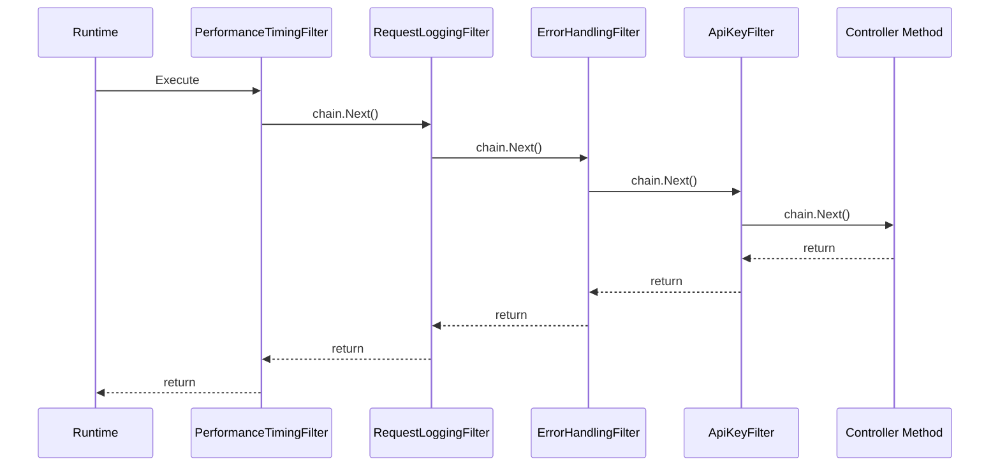

# Recipe: Custom Execution Filter

Build custom execution filters that add cross-cutting concerns -- logging, timing, error handling, and request validation -- to your Hardened request pipeline.

**What you will build:**

- A request logging filter
- A performance timing filter
- An error handling filter with structured responses
- An API key validation filter
- Proper filter ordering with `ExecutionFilterOrder`

---

## Prerequisites

- [.NET 8 SDK](https://dotnet.microsoft.com/download/dotnet/8.0) or later
- [NuGet configured for GitHub Packages](../getting-started/nuget-setup.md)
- A Hardened web API project (see [Web API CRUD](web-api-crud.md))

---

## Project Setup

If starting from an existing web API project, no additional packages are needed. The filter interfaces are included in `Hardened.Requests.Runtime`, which is pulled in by the web source generator.

---

## Complete Code

### Request Logging Filter

This filter logs details about every incoming request and outgoing response.

```csharp title="Filters/RequestLoggingFilter.cs"
using Hardened.Requests.Abstract.Execution;
using Hardened.Shared.Runtime.Attributes;
using Microsoft.Extensions.Logging;

[Expose]
public class RequestLoggingFilter : IExecutionFilter
{
    private readonly ILogger<RequestLoggingFilter> _logger;

    public RequestLoggingFilter(ILogger<RequestLoggingFilter> logger)
    {
        _logger = logger;
    }

    public ExecutionFilterOrder Order => ExecutionFilterOrder.Normal;

    public async Task Execute(IExecutionChain chain)
    {
        var context = chain.Context;
        var request = context.Request;

        _logger.LogInformation(
            "Request started: {Method} {Path}",
            request.Method, request.Path);

        // Call the next filter in the chain (or the handler if this is last)
        await chain.Next();

        var response = context.Response;

        _logger.LogInformation(
            "Request completed: {Method} {Path} -> {StatusCode}",
            request.Method, request.Path, response.StatusCode);
    }
}
```

### Performance Timing Filter

This filter measures how long each request takes and logs slow requests as warnings.

```csharp title="Filters/PerformanceTimingFilter.cs"
using System.Diagnostics;
using Hardened.Requests.Abstract.Execution;
using Hardened.Shared.Runtime.Attributes;
using Microsoft.Extensions.Logging;

[Expose]
public class PerformanceTimingFilter : IExecutionFilter
{
    private readonly ILogger<PerformanceTimingFilter> _logger;
    private const int SlowRequestThresholdMs = 500;

    public PerformanceTimingFilter(
        ILogger<PerformanceTimingFilter> logger)
    {
        _logger = logger;
    }

    public ExecutionFilterOrder Order =>
        ExecutionFilterOrder.FullRequestMetrics;

    public async Task Execute(IExecutionChain chain)
    {
        var stopwatch = Stopwatch.StartNew();

        await chain.Next();

        stopwatch.Stop();

        var context = chain.Context;
        var elapsedMs = stopwatch.ElapsedMilliseconds;

        if (elapsedMs > SlowRequestThresholdMs)
        {
            _logger.LogWarning(
                "Slow request: {Method} {Path} took {ElapsedMs}ms",
                context.Request.Method,
                context.Request.Path,
                elapsedMs);
        }
        else
        {
            _logger.LogDebug(
                "Request {Method} {Path} completed in {ElapsedMs}ms",
                context.Request.Method,
                context.Request.Path,
                elapsedMs);
        }
    }
}
```

### Error Handling Filter

This filter catches unhandled exceptions and returns structured error responses instead of raw 500 errors.

```csharp title="Models/ErrorResponse.cs"
public class ErrorResponse
{
    public string Error { get; set; } = string.Empty;
    public string? Message { get; set; }
    public string? TraceId { get; set; }
}
```

```csharp title="Filters/ErrorHandlingFilter.cs"
using Hardened.Requests.Abstract.Execution;
using Hardened.Shared.Runtime.Attributes;
using Microsoft.Extensions.Logging;

[Expose]
public class ErrorHandlingFilter : IExecutionFilter
{
    private readonly ILogger<ErrorHandlingFilter> _logger;

    public ErrorHandlingFilter(ILogger<ErrorHandlingFilter> logger)
    {
        _logger = logger;
    }

    public ExecutionFilterOrder Order => ExecutionFilterOrder.Normal - 100;

    public async Task Execute(IExecutionChain chain)
    {
        try
        {
            await chain.Next();
        }
        catch (ArgumentException ex)
        {
            _logger.LogWarning(ex,
                "Bad request: {Message}", ex.Message);

            var context = chain.Context;
            context.Response.StatusCode = 400;
            context.Response.SetResponseValue(new ErrorResponse
            {
                Error = "BadRequest",
                Message = ex.Message,
                TraceId = context.Request.Path
            });
        }
        catch (KeyNotFoundException ex)
        {
            _logger.LogWarning(ex,
                "Resource not found: {Message}", ex.Message);

            var context = chain.Context;
            context.Response.StatusCode = 404;
            context.Response.SetResponseValue(new ErrorResponse
            {
                Error = "NotFound",
                Message = ex.Message,
                TraceId = context.Request.Path
            });
        }
        catch (Exception ex)
        {
            _logger.LogError(ex,
                "Unhandled exception on {Method} {Path}",
                chain.Context.Request.Method,
                chain.Context.Request.Path);

            var context = chain.Context;
            context.Response.StatusCode = 500;
            context.Response.SetResponseValue(new ErrorResponse
            {
                Error = "InternalServerError",
                Message = "An unexpected error occurred.",
                TraceId = context.Request.Path
            });
        }
    }
}
```

### API Key Validation Filter

This filter validates an API key header before allowing the request to proceed.

```csharp title="Filters/ApiKeyFilter.cs"
using Hardened.Requests.Abstract.Execution;
using Hardened.Shared.Runtime.Attributes;

[Expose]
public class ApiKeyFilter : IExecutionFilter
{
    private const string ApiKeyHeader = "X-API-Key";
    private const string ExpectedApiKey = "your-api-key-here";

    public ExecutionFilterOrder Order =>
        ExecutionFilterOrder.BindParameters - 50;

    public async Task Execute(IExecutionChain chain)
    {
        var context = chain.Context;
        var apiKey = context.Request.GetHeader(ApiKeyHeader);

        if (string.IsNullOrEmpty(apiKey) || apiKey != ExpectedApiKey)
        {
            context.Response.StatusCode = 401;
            context.Response.SetResponseValue(new ErrorResponse
            {
                Error = "Unauthorized",
                Message = "Invalid or missing API key."
            });

            // Do NOT call chain.Next() -- short-circuit the pipeline
            return;
        }

        // API key is valid, continue the pipeline
        await chain.Next();
    }
}
```

### Application Module

```csharp title="Application.cs"
using Hardened.Shared.Runtime.Attributes;

[HardenedModule]
[AspNetCoreRuntime.Module]
public partial class Application
{
    public static WebApplicationBuilder CreateBuilder(string[] args)
    {
        var hardenedApp = new Application();
        var environment = new EnvironmentImpl(arguments: args);

        var builder = WebApplication.CreateBuilder(args);
        builder.Services.AddTransient<IHardenedEnvironment>(_ => environment);
        hardenedApp.ConfigureModule(environment, builder.Services);

        return builder;
    }
}
```

---

## Explanation

### The Filter Chain Pattern

Execution filters wrap around the handler method in a chain-of-responsibility pattern. Each filter decides whether to:

1. **Call `chain.Next()`** -- pass execution to the next filter (or the handler)
2. **Short-circuit** -- set a response and return without calling `chain.Next()`
3. **Wrap `chain.Next()`** -- execute logic before and/or after the rest of the chain



### Filter Ordering with `ExecutionFilterOrder`

The `ExecutionFilterOrder` enum controls the execution order of filters. Filters with lower order values run first (outermost in the chain):

| Order | Purpose |
|---|---|
| `ExecutionFilterOrder.Init` | Framework initialization (outermost) |
| `ExecutionFilterOrder.FullRequestMetrics` | Full request timing and metrics |
| `ExecutionFilterOrder.BindParameters` | Parameter binding |
| `ExecutionFilterOrder.Normal` | Default for user filters |

You can use arithmetic to position your filters relative to the built-in ordering points:

```csharp
// Runs just before parameter binding
public ExecutionFilterOrder Order =>
    ExecutionFilterOrder.BindParameters - 50;

// Runs after normal filters (closer to the handler)
public ExecutionFilterOrder Order =>
    ExecutionFilterOrder.Normal + 100;

// Runs before other normal filters (further from the handler)
public ExecutionFilterOrder Order =>
    ExecutionFilterOrder.Normal - 100;
```

!!! note
    Filters with lower order values are outermost in the chain. This means they execute first on the way in and last on the way out. The performance timing filter uses `FullRequestMetrics` so it wraps the entire request lifecycle, capturing the total time including parameter binding and other filters.

### Short-Circuiting

When a filter sets a response and returns without calling `chain.Next()`, the rest of the pipeline is skipped. This is how the API key filter rejects unauthorized requests without ever reaching the handler:

```csharp
if (apiKey != ExpectedApiKey)
{
    context.Response.StatusCode = 401;
    context.Response.SetResponseValue(new ErrorResponse { ... });
    return; // No chain.Next() -- pipeline stops here
}
```

### Accessing the Execution Context

The `IExecutionChain.Context` property provides access to the full request context:

| Property | Type | Description |
|---|---|---|
| `Context.Request` | `IExecutionRequest` | The incoming request (method, path, headers, body) |
| `Context.Response` | `IExecutionResponse` | The outgoing response (status code, body) |
| `Context.ServiceProvider` | `IServiceProvider` | Scoped DI container for the current request |
| `Context.HandlerInstance` | `object?` | The controller/handler instance (available after binding) |

### Registration

Filters are registered automatically. The `[Expose]` attribute on each filter class registers it with the DI container. The framework discovers all `IExecutionFilter` implementations and adds them to the pipeline in the order specified by their `Order` property.

No manual registration code is needed -- the source generator handles it all.

---

## Testing

```csharp title="FilterTests.cs"
using Hardened.Shared.Runtime.Attributes;
using Hardened.Web.Testing;

public class FilterTests
{
    [HardenedTest]
    public async Task ApiKeyFilter_RejectsUnauthorized(
        ITestWebApp testWebApp)
    {
        // Request without API key header
        var response = await testWebApp.Get("/api/todos");

        response.Assert.StatusCode(401);

        var error = response.Deserialize<ErrorResponse>();
        Assert.Equal("Unauthorized", error.Error);
    }

    [HardenedTest]
    public async Task ApiKeyFilter_AcceptsValidKey(
        ITestWebApp testWebApp)
    {
        var response = await testWebApp
            .Get("/api/todos")
            .WithHeader("X-API-Key", "your-api-key-here");

        response.Assert.Ok();
    }

    [HardenedTest]
    public async Task ErrorHandling_ReturnsBadRequest(
        ITestWebApp testWebApp)
    {
        // Assuming a handler throws ArgumentException for invalid input
        var response = await testWebApp
            .Post("/api/todos", new { })
            .WithHeader("X-API-Key", "your-api-key-here");

        // The error handling filter catches the exception
        // and returns a structured error response
        var statusCode = response.StatusCode;
        Assert.True(
            statusCode == 400 || statusCode == 201,
            "Should return 400 for invalid input or 201 for valid");
    }
}
```

---

## Combining Filters

When multiple filters are registered, they form a nested chain. The execution order for the filters in this recipe:

```
1. PerformanceTimingFilter  (Order = FullRequestMetrics)
   2. RequestLoggingFilter  (Order = Normal)
      3. ErrorHandlingFilter  (Order = Normal - 100)
         4. ApiKeyFilter  (Order = BindParameters - 50)
            5. [Parameter Binding]  (Order = BindParameters)
               6. Handler Method
```

!!! tip
    Keep the number of filters manageable. Each filter adds a small amount of overhead to every request. Group related concerns into a single filter when possible.

---

## Next Steps

- [Filters](../framework/requests/filters.md) -- deep dive into the filter system
- [Execution Pipeline](../architecture/execution-pipeline.md) -- understand the full request lifecycle
- [Web API CRUD](web-api-crud.md) -- build the API that these filters protect
