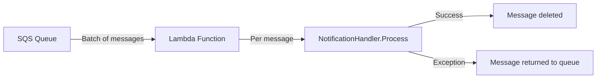

# Recipe: SQS Consumer

Build a Lambda function that processes SQS messages in batches, with proper partial failure handling so only failed messages are retried.

**What you will build:**

- An SQS batch consumer using `[SqsLambda.Module]`
- A message handler with typed deserialization
- Partial failure handling with `SQSBatchResponse`
- A notification service with DI
- Tests using `TestSqsApp`

---

## Prerequisites

- [.NET 8 SDK](https://dotnet.microsoft.com/download/dotnet/8.0) or later
- [NuGet configured for GitHub Packages](../getting-started/nuget-setup.md)

---

## Project Setup

```bash
dotnet new classlib -n NotificationProcessor
cd NotificationProcessor
dotnet add package Hardened.Amz.Function.Lambda.SourceGenerator --prerelease
dotnet add package Hardened.Amz.Function.Sqs.Runtime --prerelease
```

---

## Complete Code

### Models

```csharp title="Models/NotificationMessage.cs"
public class NotificationMessage
{
    public string NotificationId { get; set; } = string.Empty;
    public string RecipientEmail { get; set; } = string.Empty;
    public string Subject { get; set; } = string.Empty;
    public string Body { get; set; } = string.Empty;
    public NotificationType Type { get; set; }
    public Dictionary<string, string> Metadata { get; set; } = new();
}

public enum NotificationType
{
    Email,
    Sms,
    Push
}
```

```csharp title="Models/NotificationResult.cs"
public class NotificationResult
{
    public string NotificationId { get; set; } = string.Empty;
    public bool Success { get; set; }
    public string? ErrorMessage { get; set; }
}
```

### Services

```csharp title="Services/INotificationService.cs"
public interface INotificationService
{
    Task<NotificationResult> SendNotification(NotificationMessage message);
}
```

```csharp title="Services/NotificationService.cs"
using DependencyModules.Runtime.Attributes;
using Microsoft.Extensions.Logging;

[TransientService]
public class NotificationService : INotificationService
{
    private readonly ILogger<NotificationService> _logger;

    public NotificationService(ILogger<NotificationService> logger)
    {
        _logger = logger;
    }

    public async Task<NotificationResult> SendNotification(
        NotificationMessage message)
    {
        _logger.LogInformation(
            "Sending {Type} notification {NotificationId} to {Recipient}",
            message.Type, message.NotificationId, message.RecipientEmail);

        try
        {
            // Simulate sending notification based on type
            switch (message.Type)
            {
                case NotificationType.Email:
                    await SendEmail(message);
                    break;
                case NotificationType.Sms:
                    await SendSms(message);
                    break;
                case NotificationType.Push:
                    await SendPush(message);
                    break;
            }

            _logger.LogInformation(
                "Notification {NotificationId} sent successfully",
                message.NotificationId);

            return new NotificationResult
            {
                NotificationId = message.NotificationId,
                Success = true
            };
        }
        catch (Exception ex)
        {
            _logger.LogError(ex,
                "Failed to send notification {NotificationId}",
                message.NotificationId);

            return new NotificationResult
            {
                NotificationId = message.NotificationId,
                Success = false,
                ErrorMessage = ex.Message
            };
        }
    }

    private Task SendEmail(NotificationMessage message)
    {
        // Integrate with SES, SendGrid, etc.
        return Task.CompletedTask;
    }

    private Task SendSms(NotificationMessage message)
    {
        // Integrate with SNS, Twilio, etc.
        return Task.CompletedTask;
    }

    private Task SendPush(NotificationMessage message)
    {
        // Integrate with SNS, Firebase, etc.
        return Task.CompletedTask;
    }
}
```

### Handler

```csharp title="Handlers/NotificationHandler.cs"
using Hardened.Amz.Function.Lambda.Runtime.Attributes;
using Microsoft.Extensions.Logging;

public class NotificationHandler
{
    private readonly INotificationService _notificationService;
    private readonly ILogger<NotificationHandler> _logger;

    public NotificationHandler(
        INotificationService notificationService,
        ILogger<NotificationHandler> logger)
    {
        _notificationService = notificationService;
        _logger = logger;
    }

    [HardenedFunction]
    public async Task Process(NotificationMessage message)
    {
        _logger.LogInformation(
            "Processing SQS message for notification {NotificationId}",
            message.NotificationId);

        var result = await _notificationService.SendNotification(message);

        if (!result.Success)
        {
            // Throwing an exception signals that this individual message
            // failed. With partial batch failure reporting enabled,
            // only this message will be returned to the queue for retry.
            throw new Exception(
                $"Failed to process notification {result.NotificationId}: " +
                result.ErrorMessage);
        }
    }
}
```

### Application Module

```csharp title="Application.cs"
using Hardened.Shared.Runtime.Attributes;

[HardenedModule]
[SqsLambda.Module]
public partial class Application { }
```

---

## Explanation

### SQS Batch Processing

The `[SqsLambda.Module]` attribute configures the application as an SQS batch processor. When Lambda receives a batch of SQS messages, the runtime:

1. Deserializes each message body into your handler's parameter type (`NotificationMessage`)
2. Invokes the handler method once per message
3. Tracks which messages succeeded and which failed
4. Returns an `SQSBatchResponse` with the failed message IDs



### Partial Failure Handling

By default, if any message in a batch fails, the entire batch is retried. With partial batch failure reporting, only the failed messages are returned to the queue. The SQS Lambda runtime handles this automatically:

- If your handler **completes normally**, the message is considered successful and is deleted from the queue.
- If your handler **throws an exception**, the message is considered failed and is returned to the queue for retry.

!!! note
    For partial batch failure reporting to work, your Lambda function must be configured with `FunctionResponseTypes: ["ReportBatchItemFailures"]` in your infrastructure template. The Hardened SQS runtime generates the correct `SQSBatchResponse` format automatically.

### Message Retry Strategy

When a message fails, SQS returns it to the queue after the visibility timeout expires. Configure your queue with:

| Setting | Recommended Value | Purpose |
|---|---|---|
| Visibility Timeout | 6x Lambda timeout | Prevents duplicate processing during retries |
| Max Receive Count | 3-5 | Limits retry attempts before dead-letter |
| Dead Letter Queue | Enabled | Catches permanently failed messages |

!!! warning
    Always configure a dead-letter queue (DLQ) for your SQS queue. Without a DLQ, permanently failing messages will be retried indefinitely, consuming Lambda invocations and potentially blocking other messages.

### Handler Design

The handler method receives a single deserialized message. The SQS runtime calls the handler once for each message in the batch. Keep your handler focused on processing a single message -- the runtime manages batch iteration and failure tracking.

```csharp
// The runtime calls this once per message in the batch
[HardenedFunction]
public async Task Process(NotificationMessage message)
{
    // Process a single message
    // Throw to signal failure for this specific message
}
```

---

## Testing

Create a test project:

```bash
cd ..
dotnet new xunit -n NotificationProcessor.Tests
cd NotificationProcessor.Tests
dotnet add reference ../NotificationProcessor/NotificationProcessor.csproj
dotnet add package Hardened.Amz.Function.Sqs.Testing --prerelease
```

### Bootstrap

```csharp title="Bootstrap.cs"
using Hardened.Shared.Runtime.Attributes;

[assembly: HardenedTestEntryPoint(typeof(Application))]
```

### Tests

```csharp title="NotificationHandlerTests.cs"
using Hardened.Shared.Runtime.Attributes;
using Hardened.Amz.Function.Sqs.Testing;

public class NotificationHandlerTests
{
    [HardenedTest]
    public async Task Process_ValidEmailNotification_Succeeds(
        TestSqsApp testApp)
    {
        var message = new NotificationMessage
        {
            NotificationId = "NOTIF-001",
            RecipientEmail = "user@example.com",
            Subject = "Order Confirmation",
            Body = "Your order has been placed.",
            Type = NotificationType.Email
        };

        // Process a single message -- should complete without exceptions
        await testApp.InvokeMessage(message);
    }

    [HardenedTest]
    public async Task Process_BatchOfMessages_ProcessesAll(
        TestSqsApp testApp)
    {
        var messages = new List<NotificationMessage>
        {
            new NotificationMessage
            {
                NotificationId = "NOTIF-001",
                RecipientEmail = "alice@example.com",
                Subject = "Welcome",
                Body = "Welcome to our platform!",
                Type = NotificationType.Email
            },
            new NotificationMessage
            {
                NotificationId = "NOTIF-002",
                RecipientEmail = "bob@example.com",
                Subject = "Order Shipped",
                Body = "Your order is on its way.",
                Type = NotificationType.Email
            },
            new NotificationMessage
            {
                NotificationId = "NOTIF-003",
                RecipientEmail = "carol@example.com",
                Subject = "New Login",
                Body = "A new device logged into your account.",
                Type = NotificationType.Push
            }
        };

        // Process a batch of messages
        var response = await testApp.InvokeBatch(messages);

        // Verify no failures in the batch
        Assert.Empty(response.BatchItemFailures);
    }

    [HardenedTest]
    public async Task Process_WithMetadata_PassesMetadataToService(
        TestSqsApp testApp)
    {
        var message = new NotificationMessage
        {
            NotificationId = "NOTIF-004",
            RecipientEmail = "user@example.com",
            Subject = "Password Reset",
            Body = "Click here to reset your password.",
            Type = NotificationType.Email,
            Metadata = new Dictionary<string, string>
            {
                ["resetToken"] = "abc123",
                ["expiresIn"] = "3600"
            }
        };

        await testApp.InvokeMessage(message);
    }
}
```

!!! tip
    `TestSqsApp.InvokeBatch` simulates the full SQS Lambda batch processing flow, including partial failure reporting. The returned `SQSBatchResponse` contains the list of `BatchItemFailures`, which you can assert against to verify error handling behavior.

Run the tests:

```bash
dotnet test
```

---

## Infrastructure

Here is an example AWS CDK snippet for deploying the SQS consumer:

```csharp
// Dead letter queue for failed messages
var dlq = new Queue(this, "NotificationDLQ", new QueueProps
{
    RetentionPeriod = Duration.Days(14)
});

// Main queue with dead letter configuration
var queue = new Queue(this, "NotificationQueue", new QueueProps
{
    VisibilityTimeout = Duration.Seconds(180),
    DeadLetterQueue = new DeadLetterQueue
    {
        MaxReceiveCount = 3,
        Queue = dlq
    }
});

// Lambda function
var function = new Function(this, "NotificationProcessor", new FunctionProps
{
    Runtime = Runtime.DOTNET_8,
    Handler = "NotificationProcessor",
    Code = Code.FromAsset("./publish"),
    Timeout = Duration.Seconds(30),
    MemorySize = 256
});

// SQS event source with partial batch failure reporting
function.AddEventSource(new SqsEventSource(queue, new SqsEventSourceProps
{
    BatchSize = 10,
    MaxBatchingWindow = Duration.Seconds(5),
    ReportBatchItemFailures = true
}));
```

---

## Next Steps

- [SQS Processing](../aws/lambda/sqs-processing.md) -- advanced SQS patterns
- [Lambda Function](lambda-function.md) -- simple request/response Lambda functions
- [Custom Execution Filter](custom-execution-filter.md) -- add cross-cutting concerns to message processing
